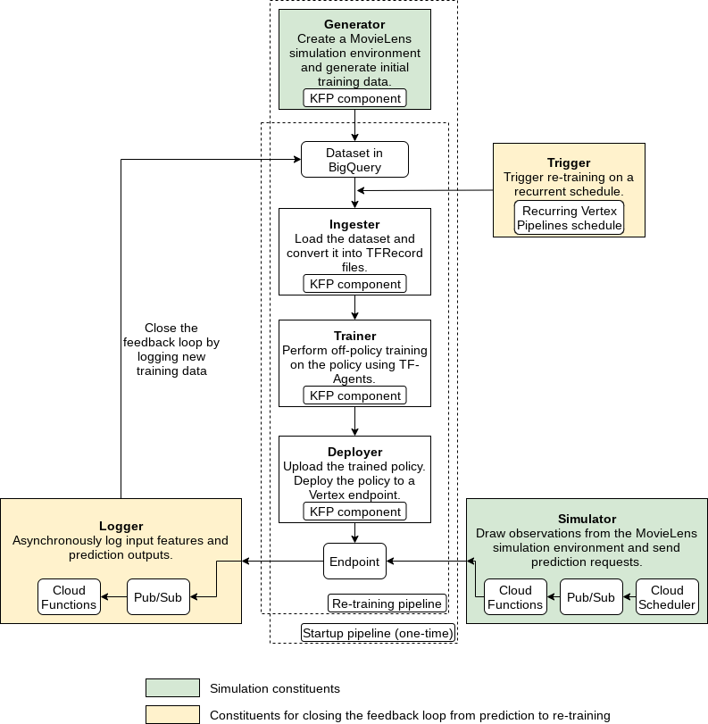

# End-to-End MLOps Pipeline Demo

This demo showcase how to build a RL-specific MLOps pipeline using
[Kubeflow Pipelines (KFP)](https://www.kubeflow.org/docs/components/pipelines/overview/pipelines-overview/)
and [Vertex Pipelines](https://cloud.google.com/vertex-ai/docs/pipelines), as
well as additional [Vertex AI](https://cloud.google.com/vertex-ai) and GCP
services such as [BigQuery](https://cloud.google.com/bigquery),
[Cloud Functions](https://cloud.google.com/functions),
[Cloud Scheduler](https://cloud.google.com/scheduler),
[Pub/Sub](https://cloud.google.com/pubsub). We implement the RL training and
prediction logic using the [TF-Agents](https://www.tensorflow.org/agents)
library.

Highlights of this end-to-end pipeline are:

-   RL-specific implementation for training and prediction
-   Simulation for initial training data, prediction requests and re-training
-   Closing of the feedback loop from prediction results back to training
-   Customizable, reusable and shareable KFP components

We use the
[MovieLens 100K dataset](https://www.kaggle.com/prajitdatta/movielens-100k-dataset)
to build a simulation environment that frames the recommendation problem:

1.  User vectors are the environment observations;
2.  Movie items to recommend are the agent actions applied on the environment;
3.  Approximate user ratings are the environment rewards generated as feedback
    to the observations and actions.

For custom training, we implement off-policy training, using a static set of
pre-collected data records. "Off-policy" refers to the situation where for a
data record, given its observation, the current policy in training might not
choose the same action as the one in said data record.

The pipeline (startup) includes the following KFP custom components (executed
once):

-   Generator to generate MovieLens simulation data
-   Ingester to ingest data
-   Trainer to train the RL policy
-   Deployer to deploy the trained policy to a Vertex AI endpoint

The re-training pipeline (executed recurrently) includes the Ingester, Trainer
and Deployer, as it does not need initial training data from the Generator.

After pipeline construction, we also create:

-   Simulator (which utilizes Cloud Functions, Cloud Scheduler and Pub/Sub) to
    send simulated MovieLens prediction requests
-   Logger to asynchronously log prediction inputs and results (which utilizes
    Cloud Functions, Pub/Sub and a hook in the prediction code)
-   Trigger to trigger recurrent re-training.

Here is an illustration of the design:

The demo contains a notebook that carries out the full workflow and user
instructions, and a `src/` directory for Python modules and unit tests.

Read more about problem framing, simulations, and adopting this demo in
production and to other use cases in the notebook.
