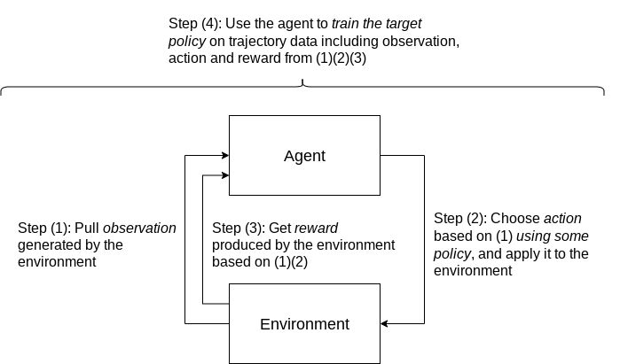

# Step-by-Step Demo

This demo showcase how to use (1) custom training, (2) custom hyperparameter
tuning, and (3) custom prediction serving over endpoints with
[Vertex AI](https://cloud.google.com/vertex-ai) to build a contextual bandits
based movie recommendation system. We implement the RL training and prediction
logic using the [TF-Agents](https://www.tensorflow.org/agents) library. We also
illustrate how to use TensorBoard Profiler to track the training process and
resources, allowing speed and scalability analysis.

We use the
[MovieLens 100K dataset](https://www.kaggle.com/prajitdatta/movielens-100k-dataset)
to build a simulation environment that frames the recommendation problem:

1.  User vectors are the environment observations;
2.  Movie items to recommend are the agent actions applied on the environment;
3.  Approximate user ratings are the environment rewards generated as feedback
    to the observations and actions.

For custom training, we assume the system dynamically interacts with the
environment in real time so that the target policy is the same as the behavior
policy: At each time step, we interact with the envionment to obtain an
observation, query the current policy for an action given said observation, and
lastly obtain a reward from the environment given the aforementioned observation
and action; then we use these pieces of data to train the policy.

The demo contains a notebook that carries out the full workflow and user
instructions, and a `src/` directory for Python modules and unit tests.

Read more about problem framing, simulations, and adopting this demo in
production and to other use cases in the notebook.
