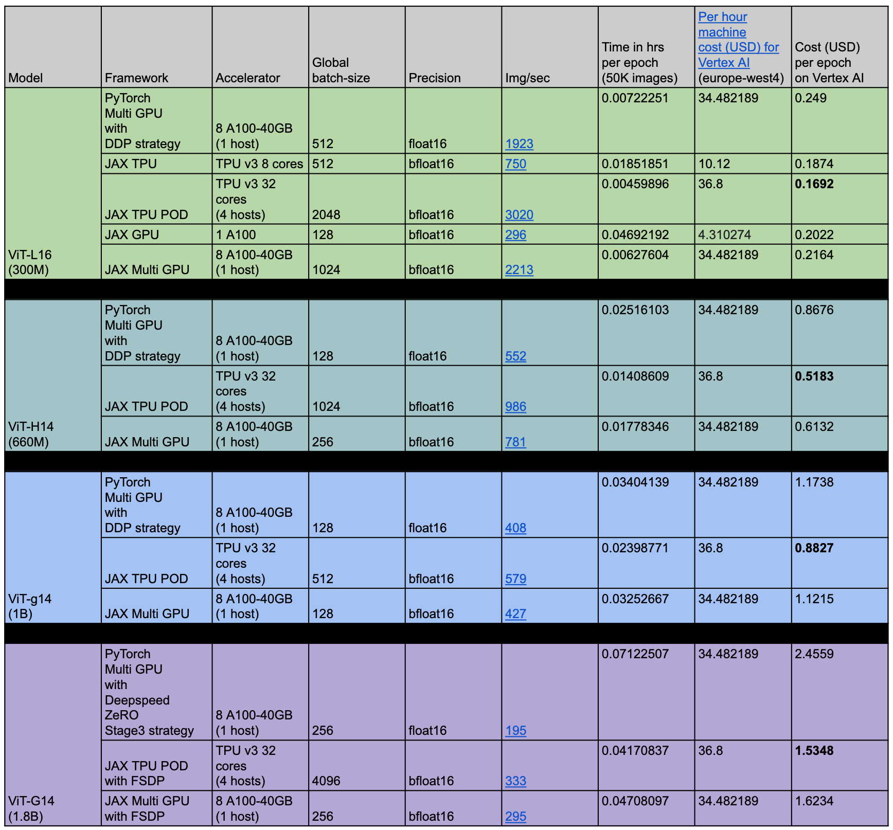
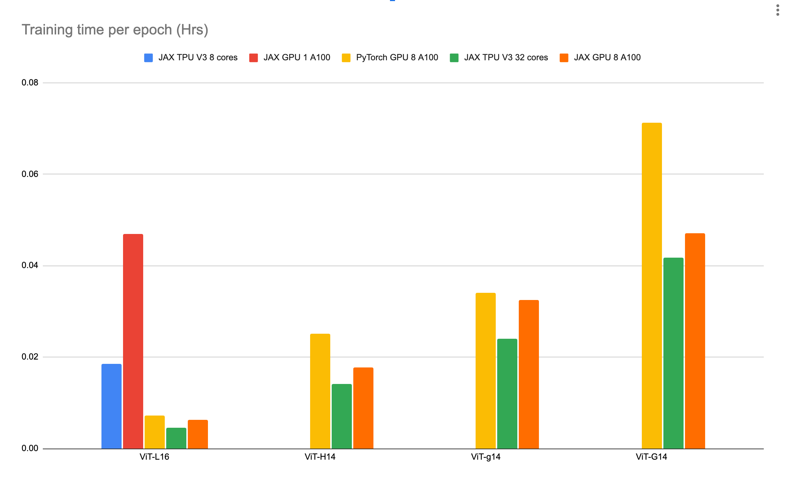
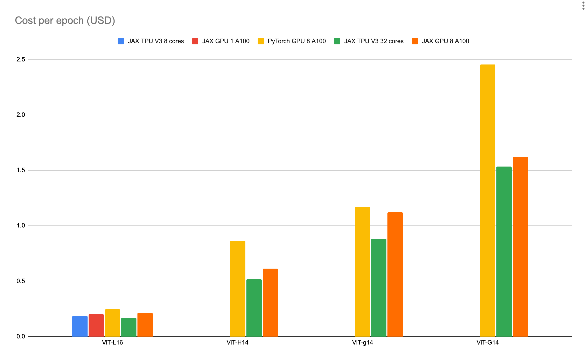

# ViT PyTorch vs JAX training benchmarks on Vertex AI Training Platform

Lav Rai, Software Engineer, Google Cloud

Xiang Xu, Software Engineer, Google Cloud

Andreas Steiner, Software Engineer, Google DeepMind

Tao Wang, Software Engineer, Google DeepMind

Alexander Kolesnikov, Research Engineer, Google DeepMind

## Introduction

Many repositories now offer both PyTorch and JAX versions of a model. For
example, [Hugging Face offers many models such as GPT2, BERT][1]
etc. Other examples are [OpenLLaMa][2] and [ViT][3]
models which were first developed in JAX and then their corresponding PyTorch
versions were made available. **Given both the PyTorch and JAX options for a
model, it may not be obvious as to which option to choose**. To make such a
decision, it is important for one to know about the training cost, effectiveness
and efficiency for each choice.

Apart from the framework choice, the other choice that one faces on Vertex AI
training platform is the type and count of the accelerators. Although the
[Vertex AI pricing table][4] lists the price per hour for each
machine, **one may not know beforehand about the training speed of JAX and
PyTorch frameworks for different types and count of the accelerators**.

If one has access to some training benchmark numbers for the same model
under (a) PyTorch and JAX frameworks and (b) for different types and count of
the accelerators, then it will be easier for them to make a cost effective
decision. Such a benchmark will also aid the developers in identifying strength
and weakness of different choices and then figure out recipes to remove those
weaknesses if possible.

This blog uses the ViT [classification models][5] of varying sizes
to benchmark the training performance of PyTorch and JAX versions on the Vertex
AI Platform under different machine configurations. The goal is to:

- Benchmark OSS ViT training for both PyTorch and JAX frameworks.
- Benchmark OSS ViT L16, H14, g14, and G14 models.
- Benchmark OSS ViT PyTorch training with A100 GPUs.
- Benchmark OSS ViT JAX training with A100 GPUs and TPU V3 accelerators.

## Benchmarking setup

This section lays out the benchmarking set up for the [PyTorch][6] and [JAX][7]
frameworks and provides a reasoning for choosing those settings.

### PyTorch GPU

#### Machine configuration

We run training jobs on [Vertex AI Custom Training][8] using 1
single node with 8 A100-40GB GPUs.

- Machine type: [a2-highgpu-8g][9]
- Machine count: 1
- Accelerator type: [NVIDIA_TESLA_A100 (40GB)][10]
- Accelerator count: 8

#### Modeling

We benchmark 4 variants of ViT model in different sizes:

- [ViT-L16, 300M params][11]
- [ViT-H14, 630M params][12]
- [ViT-g14, 1B params][13]
- [ViT-G14, 1.8B params][14]

We use the Huggingface [transformers library][15] for ViT L16 and
H14 variants, and the [TIMM library][16] for ViT g14 and G14
variants.

#### Dataset

We run training against the [cifar10][17] dataset with 50K training
images and 10K test images. To factor out network communication overhead for
data loading, we copy the whole dataset to the local disk then load data from
the local disk during training.

#### Training parameters

- Trainer
  - We use [PyTorch Lightning][18] as the trainer for the
    boilerplate data loading and train loop coding.
- Precision
  - Float16
- Input resolution
  - 224 x 224
- Strategy
  - We use [DDP][19] for models which can be entirely loaded to one
    GPU, use [Deepspeed-ZeRO][20] otherwise:
    - ViT-L16: DDP
    - ViT-H14: DDP
    - ViT-g14: DDP
    - ViT-G14: Deepspeed-ZeRO stage-3
- Batch size
  - We use the max batch size as power of 2 without CUDA OOM for each model:
    - ViT-L16: 64 per GPU
    - ViT-H14: 16 per GPU
    - ViT-g14: 16 per GPU
    - ViT-G14: 32 per GPU
- Compilation
  - We apply [torch.compile][21] to model whenever it's applicable:
    - ViT-L16: torch.compile
    - ViT-H14: torch.compile
    - ViT-g14: torch.compile
    - ViT-G14: N/A

### JAX TPU and GPU

#### Machine configuration

All the TPU and GPU training jobs are run on [Vertex AI Custom
Training][8]. The following machine configurations were used for the
TPU and GPU experiments:

**Note**: TPU V3 POD requires multi-host supporting training code. For example,
a 32 core POD runs on 4 hosts with each host using 8 cores.

**Note**: 8 A100 are similar to TPU V3 32 cores in terms of [Vertex AI
pricing][4].

**Note**: [Each TPU v3 chip has 2 cores which can use 32 GB high-bandwidth
memory][22] (16 GB per core) so total memory for 32 cores is 16x32 =
512 GB. Therefore for the same price, TPUs offer more memory than 8 A100-40GB
GPUs.

#### Modeling

We decided to use an OSS code repository for model implementation. Using an OSS
repository helps anyone to independently verify the benchmarking results and
also relate to the results well. For JAX, we selected the
[Big Vision][23] code repository.

Same as the PyTorch modeling, we benchmark 4 variants of ViT model in different
sizes:

- [ViT-L16, 300M params][24]
- [ViT-H14, 630M params][24]
- [ViT-g14, 1B params][24]
- [ViT-G14, 1.8B params][24]

**Note**: The [Big Vision code repo][23] has not made the
checkpoints publicly available for the models larger than the ViT-L16. Therefore
for the rest of the three variants, the experiments only used random
initialization for benchmarking the training speed.

#### Dataset

We use training against the [cifar10 TensorFlow dataset][25] with
50K training images and 10K test images. This dataset is the same as the one
used for PyTorch experiments except that it is loaded as a TensorFlow dataset.
Similar to the PyTorch experiments, we copy the whole dataset to the docker
image to factor out network communication overhead for data loading.

#### Training parameters

- Precision
  - "bfloat16" setting was used.
- Input resolution
  - 224 x 224 after resize (to 448x448) and random crop (to 224x224) before
    training.
    - This resolution for training was the same as the PyTorch settings.
- Strategy
  - Used DDP for all models except ViT-G14. ViT-G14 used the FSDP strategy.
- Batch size
  - We use the max batch size as power of 2 without OOM for each model. The
    [Benchmarking results][26] section shows the final
    batch size for each experiment.
  - Once a maximum batch-size for TPU V3 8 cores was determined, we just scaled
    it linearly for 32 cores.
  - Once a maximum batch-size for 1 A100 GPU was determined, we just scaled it
    linearly for 8 A100 GPUs.
- Compilation
  - [jax.jit() compilation][27] is used in JAX codes for efficient
    execution in XLA.
- GPU related flags
  - The following flags are set in the dockerfile for the GPU runs.
    - Note: _xla_gpu_enable_pipelined_collectives_ is set to false for the
      ViT-G14 FSDP run.

### Evaluation metric

For both the PyTorch and JAX experiments, the following evaluation metrics are
collected:

- Throughput: Images-per-second observed for training.
- Cost: The training-cost-per-epoch (USD).

**Note**: The above metrics are not biased against any framework or machine
configurations. In addition, these metrics will help one decide the most
efficient training configurations on Vertex AI.

## Benchmarking results

The lowest cost experiment for each model is marked in **bold** in the last
column.

The following bar charts summarize the performance visually:

The following section provides observations and conclusions for these results.

## Observation and Conclusions

- Training with JAX TPU V3 POD with 32 cores costs 33% less than the PyTorch GPU
  8 A100-40GBs runs.
- Training with JAX GPU 8 A100-40GBs costs 23% less than the PyTorch GPU 8
  A100-40GBs runs.
- JAX TPU V3 POD with 32 cores was 4x faster and slightly more cost-effective
  than the JAX TPU V3 8 core run for the ViT-large model. This indicates that it
  might be better to use more cores. The JAX TPU V3 speed scales very well with
  the number of cores.
- Cloud TPU VM training speed numbers were the same as the Vertex AI for
  TPU V3 8 cores. The dataset was copied to the docker in both the cases.
- The training-cost-per-epoch increases with the model size irrespective of the
  framework.

[1]: https://github.com/huggingface/transformers/blob/main/examples/research_projects/jax-projects/README.md#quickstart-flax-and-jax-in-transformers
[2]: https://github.com/openlm-research/open_llama
[3]: https://github.com/google-research/vision_transformer
[4]: https://cloud.google.com/vertex-ai/pricing#custom-trained_models
[5]: https://arxiv.org/abs/2010.11929
[6]: #pytorch-gpu
[7]: #jax-tpu-and-gpu
[8]: https://cloud.google.com/vertex-ai/docs/training/overview
[9]: https://cloud.google.com/vertex-ai/docs/training/configure-compute#machine-types
[10]: https://cloud.google.com/vertex-ai/docs/training/configure-compute#specifying_gpus
[11]: https://huggingface.co/google/vit-large-patch16-224-in21k
[12]: https://huggingface.co/google/vit-huge-patch14-224-in21k
[13]: https://github.com/huggingface/pytorch-image-models/blob/v0.9.2/timm/models/vision_transformer.py#L1308
[14]: https://github.com/huggingface/pytorch-image-models/blob/v0.9.2/timm/models/vision_transformer.py#L1312
[15]: https://huggingface.co/docs/transformers/main/model_doc/vit#transformers.ViTModel
[16]: https://github.com/huggingface/pytorch-image-models
[17]: https://huggingface.co/datasets/cifar10
[18]: https://lightning.ai/docs/pytorch/stable/
[19]: https://pytorch.org/docs/stable/notes/ddp.html
[20]: https://www.deepspeed.ai/tutorials/zero/
[21]: https://pytorch.org/tutorials/intermediate/torch_compile_tutorial.html
[22]: https://cloud.google.com/tpu/docs/system-architecture-tpu-vm#tpu_v3
[23]: https://github.com/google-research/big_vision
[24]: https://screenshot.googleplex.com/BximJgxsgvBVu38
[25]: https://www.tensorflow.org/datasets/catalog/cifar10
[26]: #benchmarking-results
[27]: https://jax.readthedocs.io/en/latest/jax-101/02-jitting.html
