# Benchmark Stable Diffusion v1-5 Fine Tuning and Serving With Google Cloud Vertex Model Garden

Dustin Luong, Software Engineer, Google Cloud
Gary Wei, Software Engineer, Google Cloud
Changyu Zhu, Software Engineer, Google Cloud
Genquan Duan, Software Engineer, Google Cloud

## Introduction
[The public notebook][1] shows the full examples of fine tuning and serving of Stable diffusion v1-5. [The github repo][2] contains examples of building training and serving dockers for Google Cloud Vertex Model Garden. This report benchmarks Stable diffusion v1-5 fine tuning and serving in Google Cloud Vertex AI, showing both efficiencies and effectiveness.

### Benchmark Highlights
- Fine tuning
  - Stable diffusion v1-5 with LoRA and Gradient checkpointing only requires ~10G GPU memory. Larger batch sizes, or larger resolutions require more GPU memories, but not does not change much for different LoRA ranks.
  - The fine tuning speed is fast in ~11 minutes for 1k steps, and costs less than $1 in 1 A100. The fine tuning speed increases with batch sizes, decreases with resolution, but is not affected much by LoRA ranks.
  - LoRA tunes a few percent (only 0.1% with LoRA rank=8) of all parameters, and the tuned models are very small (only 3.1MB with LoRA rank=8).
  - Dreambooth+LoRA and Dreambooth can achieve similar performances, but Dreambooth LoRA can require much less GPU.
  - Increasing batch size, reducing training steps, and increasing learning rate can result in models with the same performance for less cost.
- Inference
  - The optimized serving docker pytorch-peft-serve can speed up inference by 2x than current pytorch-diffuser-serve, and support both base models and fine tuned lora models.
  - The optimized serving docker pytorch-peft-serve can generate 4 512*512 images in 4.1 seconds on 1 V100 and 1.7 seconds on 1 A100.

Benchmark details are below.

## Fine Tuning Benchmarks

### Experiment Setup
We mainly compare two tuning algorithms:
- parameter efficient finetuning based on [dreambooth][3] and [LoRA][4] (shorten as Dreambooth+LoRA below)
- full parameter fine tuning based on [dreambooth][3] (shorten as Dreambooth below)

And then  report benchmark results on GPU memories, tuning parameters, tuning speeds, costs and accuracy, using the public oxford flowers dataset: [train][5] and [test][6], where the column blip_caption as texts, and column image as images. We also benchmark subject and prompt fidelity using the [dataset][7] from the Dreambooth paper.

The default tuning parameters during benchmark are:
- Hardware: 1 A100 40G
- batch size: 4
- lora_rank: 8
- resolution: 512
- max_train_steps: 10
- use_lora: False
- gradient_checkpointing: False

```
# Examples to start finetuning dockers.
MODEL_NAME="runwayml/stable-diffusion-v1-5"
OUTPUT_DIR=<OUTPUT_DIR>
INSTANCE_DATA_DIR=<INSTANCE_DATA_DIR>
INSTANCE_PROMPT=<INSTANCE_PROMPT>
IMAGE="us-docker.pkg.dev/vertex-ai/vertex-vision-model-garden-dockers/pytorch-peft-train"
docker run \
  --runtime=nvidia -e NVIDIA_VISIBLE_DEVICES=0 \
  --rm --name "test_gpu" \
  -it ${IMAGE} \
  --task=text-to-image-dreambooth-lora-peft \
  --pretrained_model_name_or_path=$MODEL_NAME \
  --resolution=512 \
  --instance_data_dir=$INSTANCE_DATA_DIR \
  --instance_prompt=$INSTANCE_PROMPT \
  --train_batch_size=4 \
  --max_train_steps=10 \
  --output_dir=${OUTPUT_DIR} \
  --use_lora \
  --lora_r=8 \
  --gradient_checkpointing
```

### GPU Memories
Many various factors will impact GPU memory usages. In this benchmark, we mainly benchmark with different finetuning algorithms, batch sizes, lora rank, resolution, and then recommended max batch size on different GPUs.


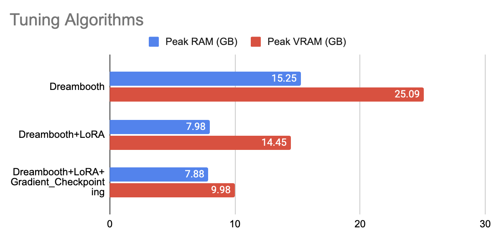

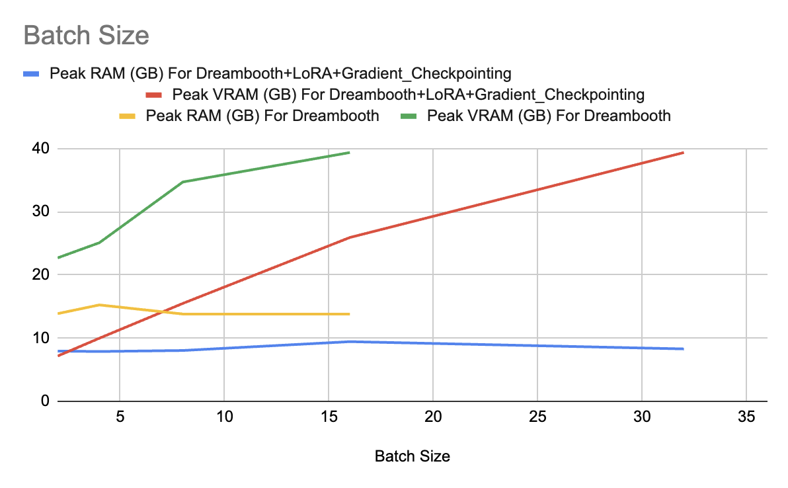

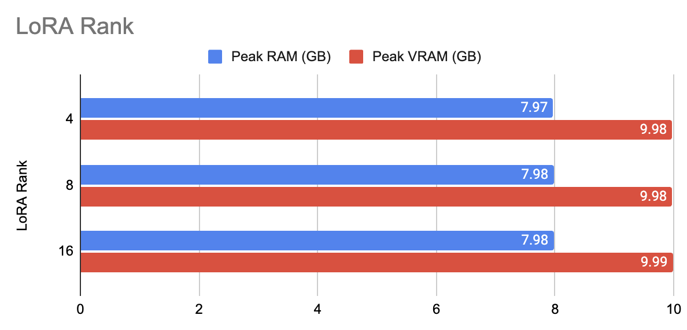

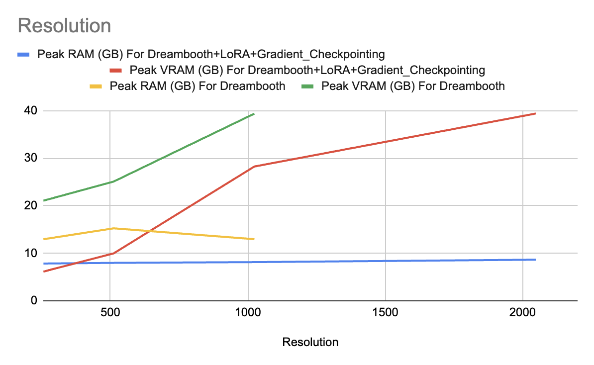

- LoRA tuning reduced about 47% peak RAM and 42% peak VRAM for GPU memory, compared to full parameter fine tuning.
- Gradient checkpointing decreases about 1% peak RAM and 31% peak VRAM for GPU memory further, compared without gradient checkpointing.
- The GPU memory does not change much for different LoRA ranks.
- Larger batch sizes require more GPU memories.
- Larger resolutions require more GPU memories.
- Dreambooth+LoRA+Gradient_Checkpointing can support max batch size as 32, or max resolution as 2048, but Dreambooth can only support max batch size as 8, or max resolution as 1024.

### Fine Tuning Parameters
This section shows the percentage of trainable parameters, and tuned model sizes.

- LoRA tunes quite a few percent (only 0.1% with LoRA rank=8) of all parameters, and the tuned models are very small (only 3.1MB with LoRA rank=8).

| LoRA Rank | Trainable parameters | Total parameters | Trainable Parameter Percentage | Fine tuned model size (MB) |
|---|---|---|---|---|
| 4 | 398592 | 859919556 | 0.05% | 1.57 |
|8 | 797184 | 860318148 | 0.09% | 3.09 |
| 16 | 1594368| 861115332| 0.19%| 6.13|
| 32| 3188736| 862709700| 0.37%| 12.21|
### Fine Tuning Speed And Costs
Fine tuning speeds and costs are affected by many different factors, such as batch size, tuning parameters, image resolutions, GPUs, and datasets. In order to make the report easy to understand, we set the following values in this section:
- Hardware: 1 A100 40G
- use_lora: True
- gradient_checkpointing: True

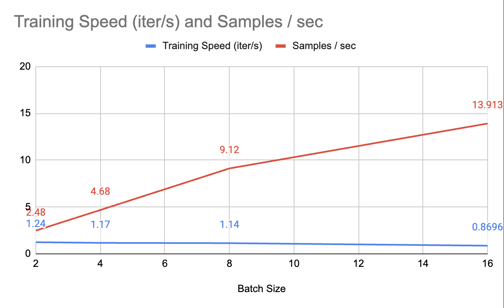

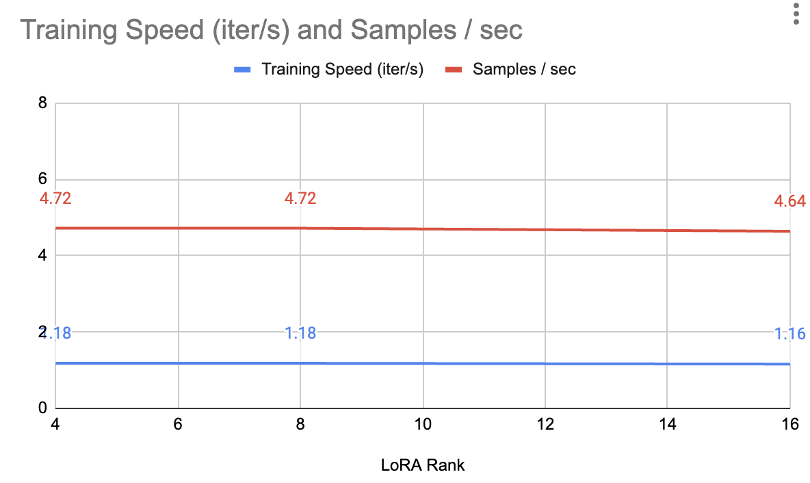

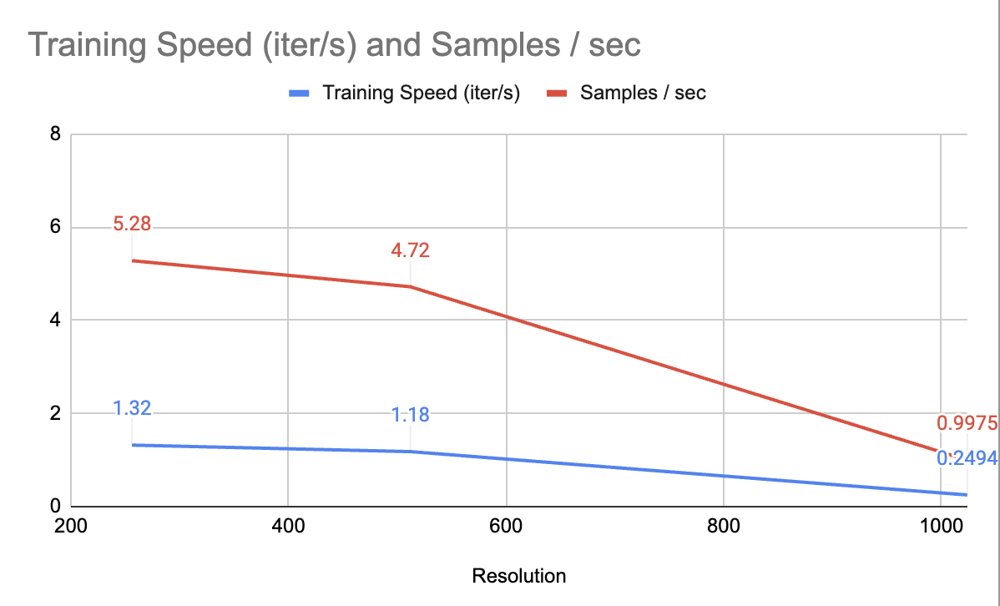

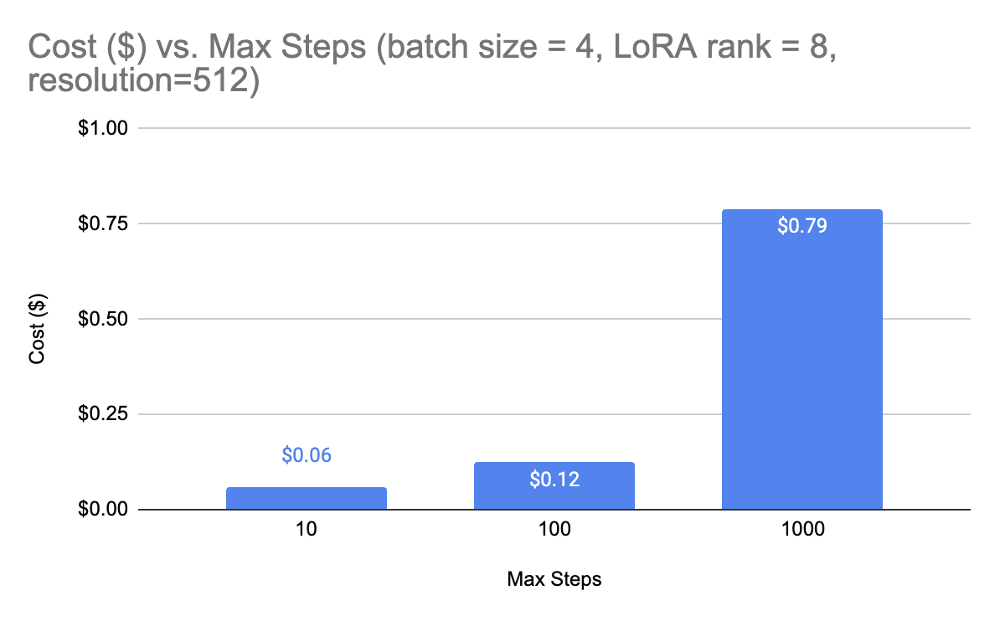

- The fine tuning speed increases with batch sizes, decreases with resolution, but is not affected much by LoRA ranks.
- The fine tuning speed is about 11 minutes for 1k steps, and costs less than $1 in 1 A100.

### Fine Tuning Quality
In this benchmark, we mainly benchmark Dreambooth and Dreambooth+LoRA to compare fine tuning quality. We compare [subject fidelity scored (DINO)][8], how well the subject is represented in the generated images, and [prompt fidelity scores (CoCa)][9], how well the generated images match the given prompt, for a single subject, a [dog][10] from the dataset released with the original Dreambooth paper. In practice, we recommend saving checkpoints periodically and inspecting validation prompts visually. We fine tuned the unet without fine tuning the text encoder and used the following hyperparameters:

Dreambooth
- Learning rate: 5e-6
- Batch size: 1

Dreambooth+LoRA
- Learning rate: 1e-4
- Batch size: 1

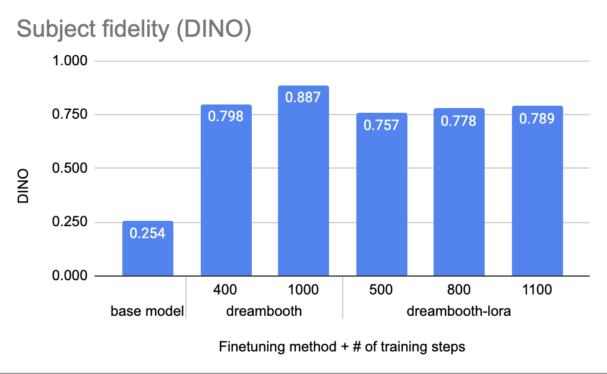

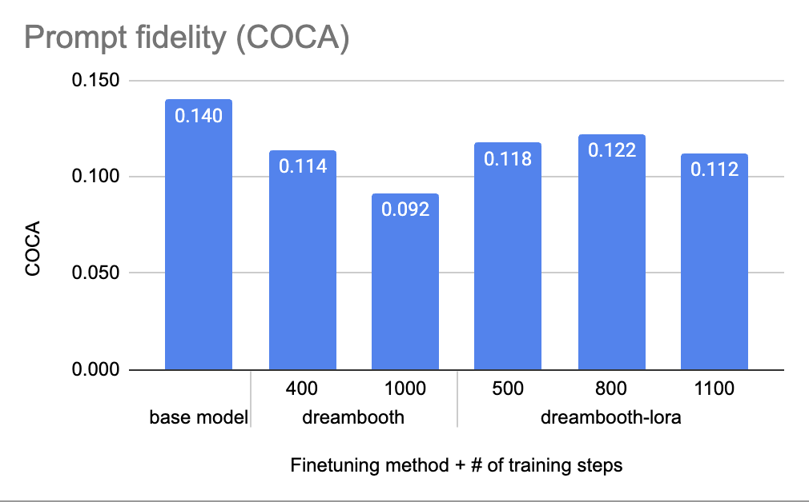

- Fine tuning with Dreambooth or Dreambooth+LoRA can result in models with comparable performance. The base model produced images of the class rather than the instance.
- Dreambooth+LoRA is able to achieve the same subject fidelity score as Dreambooth if trained for more epochs.
- Increasing the number of training steps results in better subject fidelity but at the cost of prompt fidelity.

### Suggested Max Batch Sizes By Resolutions
We benchmarked and suggested max batch sizes by resolutions on 1 A100 and 1 V100 as below. This is with LoRA and gradient checkpointing enabled.

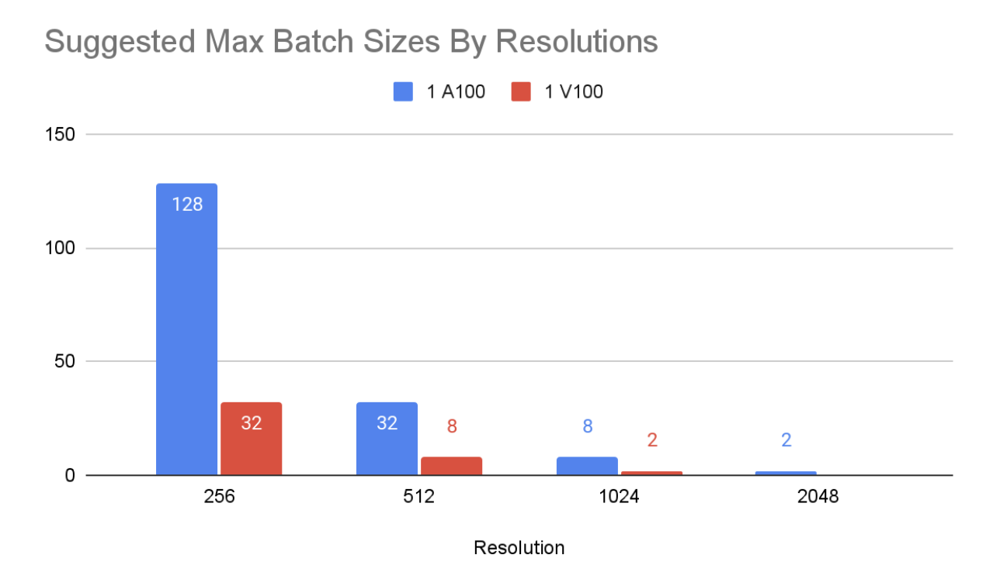

### Fine Tuning Cost Optimization
Increasing batch size allows for more images to be considered at each training step for fine tuning. This allows models to be trained in fewer training steps. In this benchmark, we aim to show how batch size can be increased to reduce training costs while still preserving subject and prompt fidelity.

Since the training dataset consists of 5 images, we train with a batch size of 5 and reduce the number of training steps from 400 to 80. Doing so results in a model that has not learned the subject since we’ve decreased the number of training steps. Conceptually, the model is taking a more precise step at each iteration, but it is taking fewer steps. To compensate for this, we increased the learning rate from 5e-6 and observed the best results at 1e-5 for full parameter finetuning.

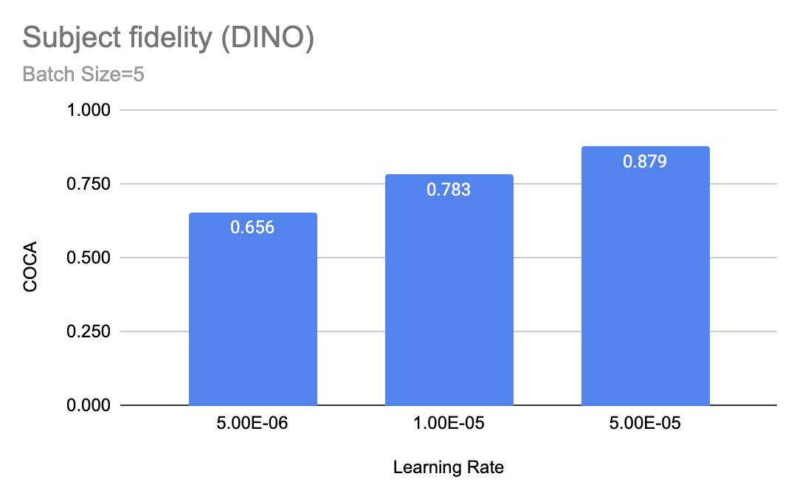

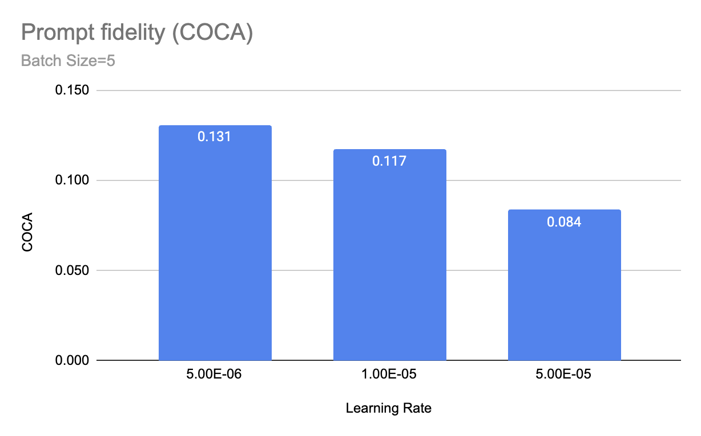

Comparing cost of training the “best” model for batch size 1 vs. batch size 5

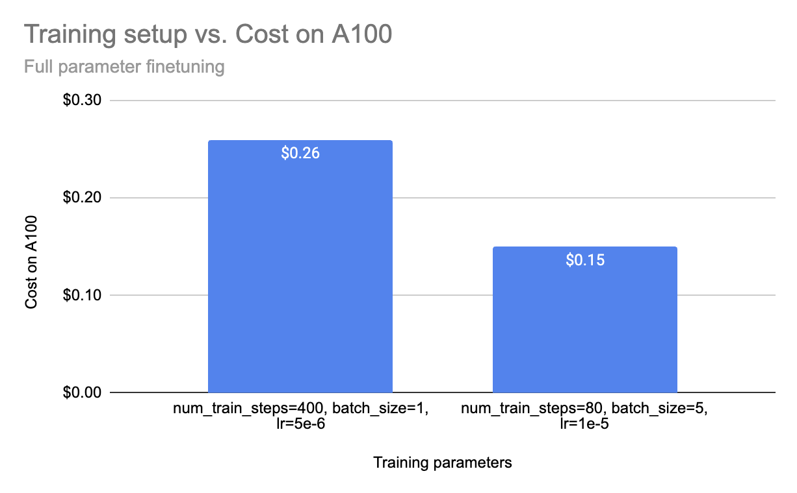


| Train method| Training parameters| Sample image| CoCa (prompt fidelity)| DINO (subject fidelity) | Cost of training on A100 |
|---|---|---|---|---|---|
| dreambooth| dreambooth, num_train_steps=400, batch_size=1, lr=5e-6| 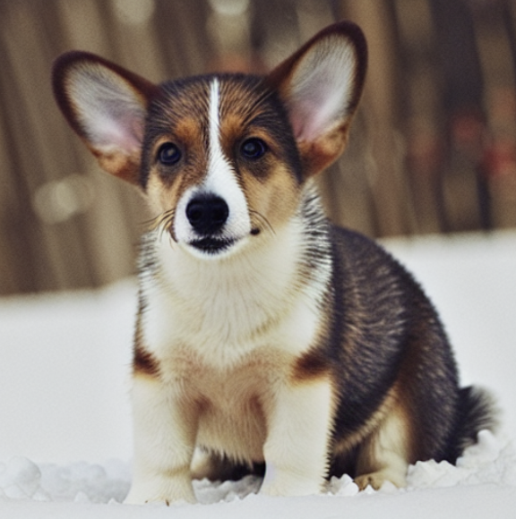 | 0.12215| 0.76531| $0.26 |
| dreambooth | dreambooth, num_train_steps=80, batch_size=5,lr=1e-5| 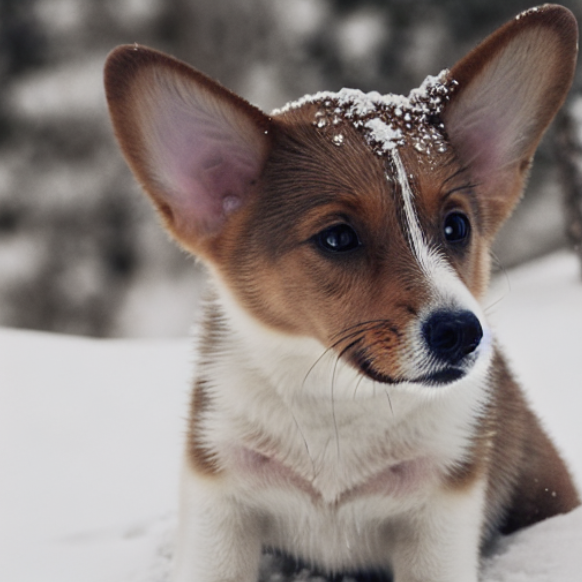| 0.12644| 0.74697 | $0.15 |
| dreambooth-lora| num_train_steps=500, batch_size=1, lr=1e-4, gc|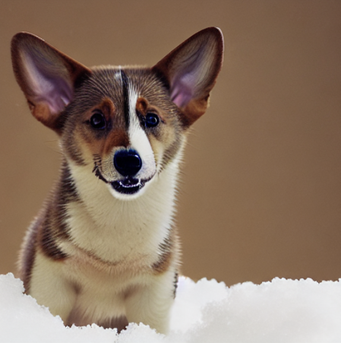| 0.12856| 0.78148 | $0.26|
| dreambooth-lora | num_train_steps=50, batch_size=5, lr=1e-3, gc | 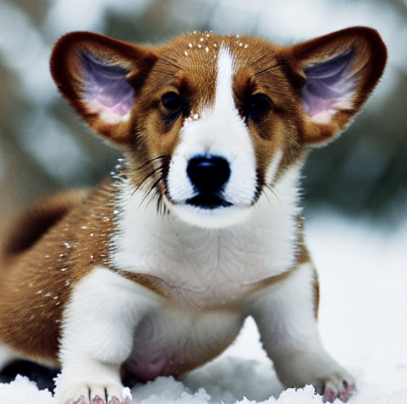 | 0.12566 | 0.75479 | $0.09 |


A followup question is that since finetuning can be run on a single GPU, should finetuning be run on 1 V100 or A100?

Setup:
- num_train_steps=800 / batch_size
- Resolution=512

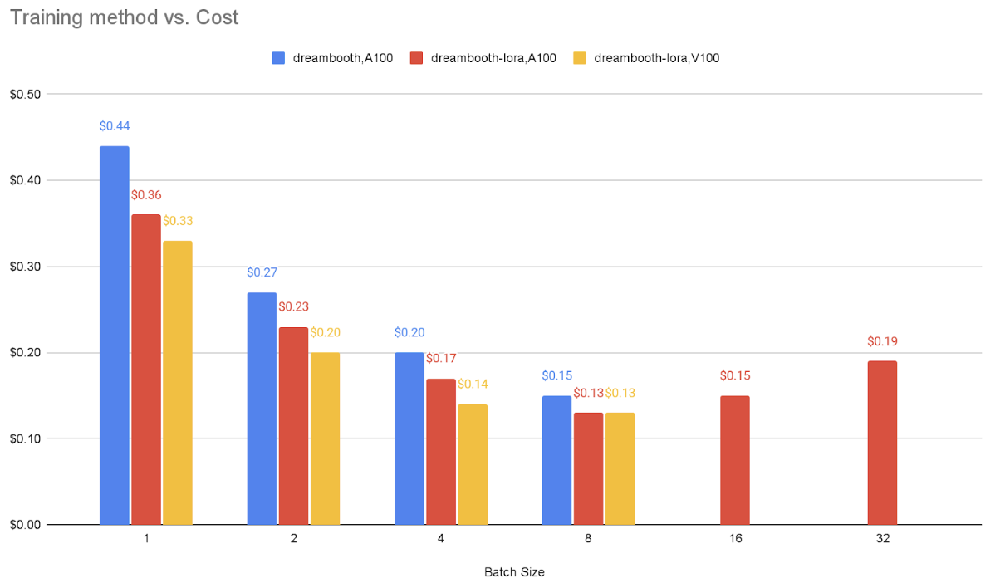
- Although V100 has a lower $/hr cost than an A100, the same training setup takes longer. Even given the longer training time, the cost on V100 is still lower.
- Dreambooth+LoRA enables training with larger batch sizes, however, larger batch sizes will not necessarily mean faster training time.
- It is possible to fine tune with 1 V100 on 512 resolution with Dreambooth+LoRA.
- Dreambooth fine tuning must be run on 1 A100 at 512 resolution.

## Inference Benchmarks
We provide two serving dockers in vertex model garden for stable diffusion:
- pytorch-diffuser-serve:
  - us-docker.pkg.dev/vertex-ai/vertex-vision-model-garden-dockers/pytorch-diffusers-serve
  - This serving docker only serves base stable diffusion models and does not contain any optimizations yet.
- pytorch-peft-serve:
  - us-docker.pkg.dev/vertex-ai/vertex-vision-model-garden-dockers/pytorch-peft-serve
  - This serving docker can serve base stable diffusion models, and base stable diffusion models with fine tuned lora models, and contains optimization for serving.

We run the two serving dockers on T4/V100/A100 to generate 4 512*512 images, and compare the inference speed without network considerations as:

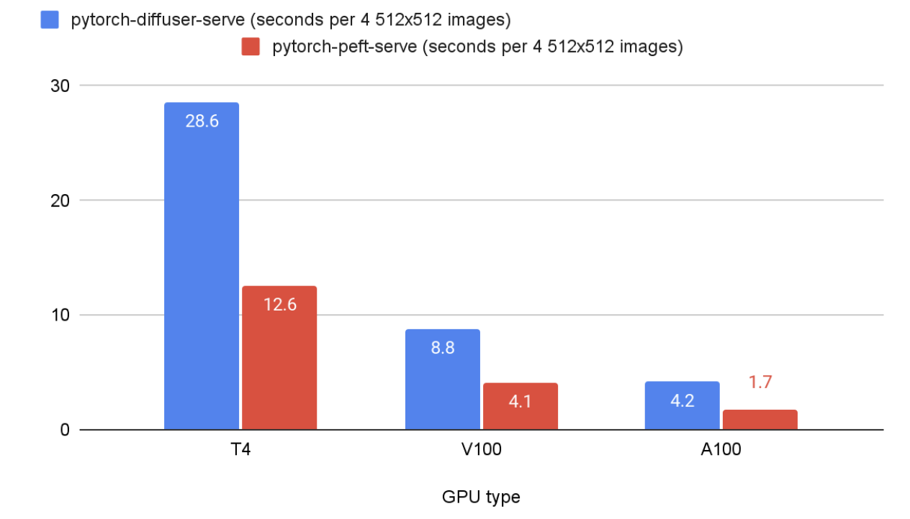
The speed up of optimized pytorch-peft-serve is about 2x than current pytorch-diffuser-serve.

### Serving cost comparison

Pytorch-diffuser-serve (without any optimizations)

| GPU type|  Time required to generate 4 512x512 images | Machine unit price ($ / hour) | Cost per image ($) |
|---|---|---|---|
| T4 | 28.6 | 0.4025| 0.00080 |
| V100 | 8.8 | 2.852| 0.00174|
| A100 | 4.2 | 4.2245 | 0.00123 |

Pytorch-peft-serve (with optimizations)

| GPU type | Time required to generate 4 512x512 images | Machine unit price ($ / hour) | Cost per image ($) |
|--- |---|---|---|
| T4 | 12.6 | 0.4025 | 0.00035 |
| V100 | 4.1 | 2.852 | 0.00081 |
|  A100 | 1.7 | 4.2245 | 0.00050 |

- The optimized pytorch-peft-serve has approximately half the price per image, compared with the un-optimized pytorch-diffuser-serve.
- Serving the model with a T4 is most cost effective, however, serving with an A100 still has the best throughput and fastest predictions.


[1]: https://github.com/GoogleCloudPlatform/vertex-ai-samples/blob/main/notebooks/community/model_garden/model_garden_pytorch_stable_diffusion.ipynb
[2]: https://github.com/GoogleCloudPlatform/vertex-ai-samples/tree/main/community-content/vertex_model_garden/model_oss
[3]: https://arxiv.org/abs/2208.12242
[4]: https://arxiv.org/abs/2106.09685
[5]: https://huggingface.co/datasets/Multimodal-Fatima/OxfordFlowers_train
[6]: https://huggingface.co/datasets/Multimodal-Fatima/OxfordFlowers_test_facebook_opt_6.7b_Attributes_ns_6149
[7]: https://github.com/google/dreambooth
[8]: https://arxiv.org/abs/2104.14294
[9]: https://arxiv.org/abs/2205.01917
[10]: https://github.com/google/dreambooth/tree/main/dataset/dog6
