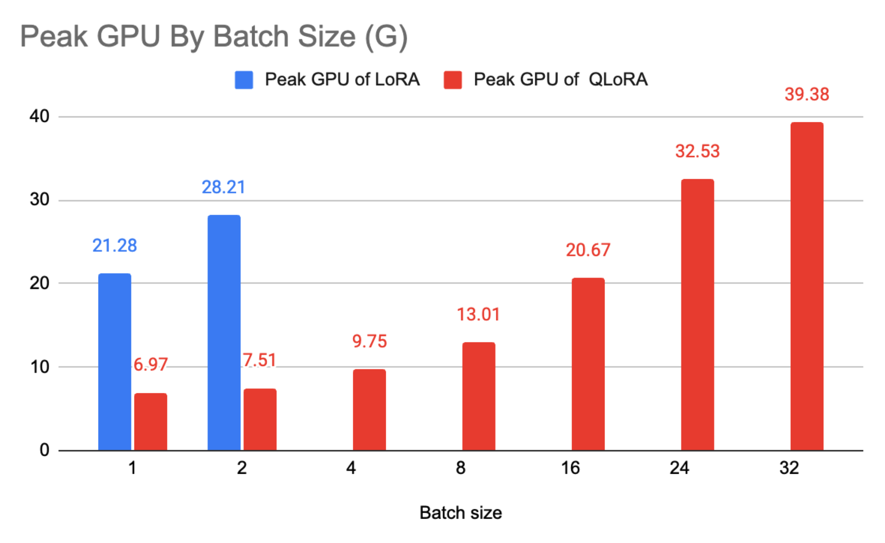
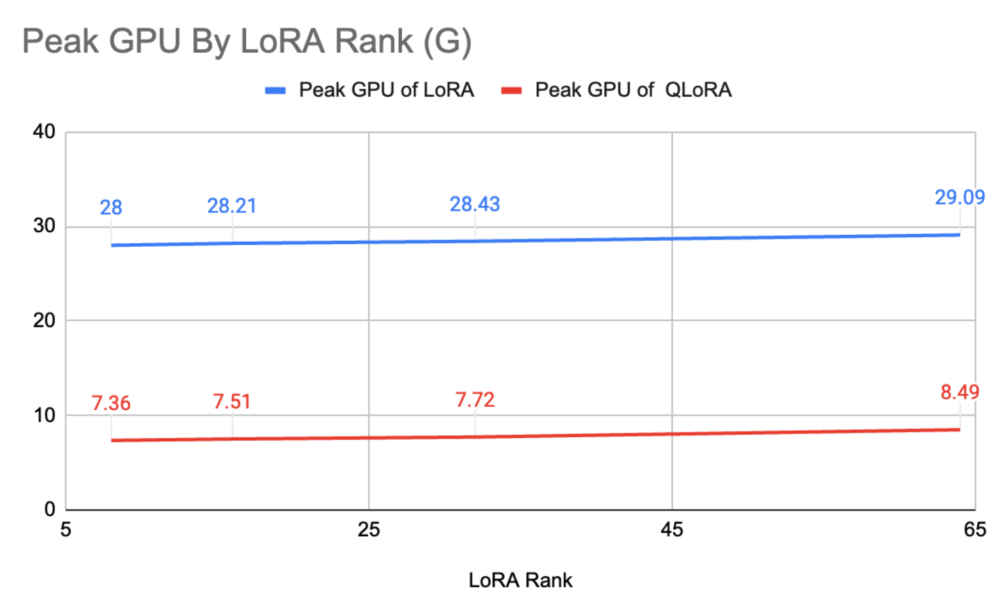
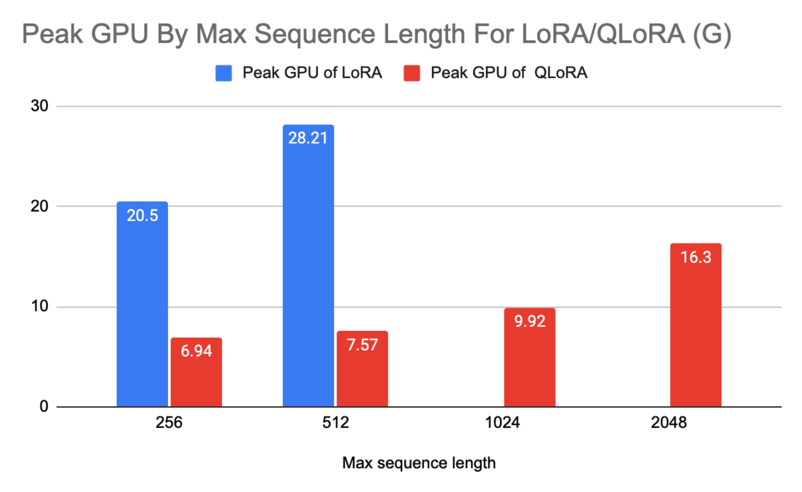
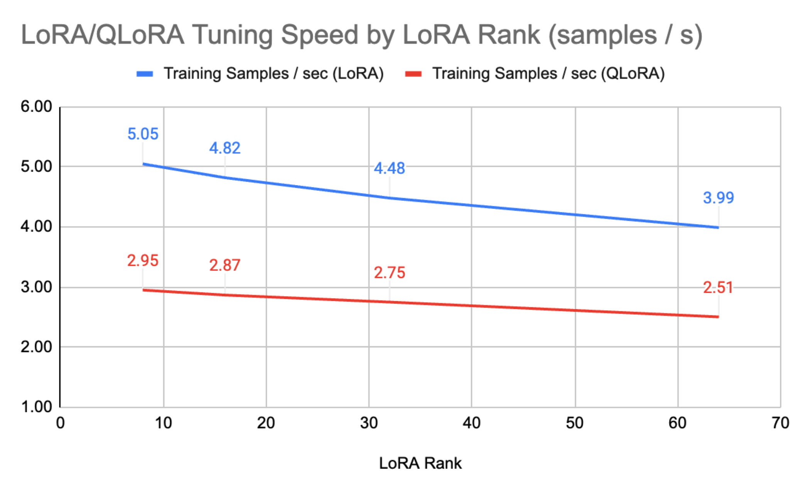
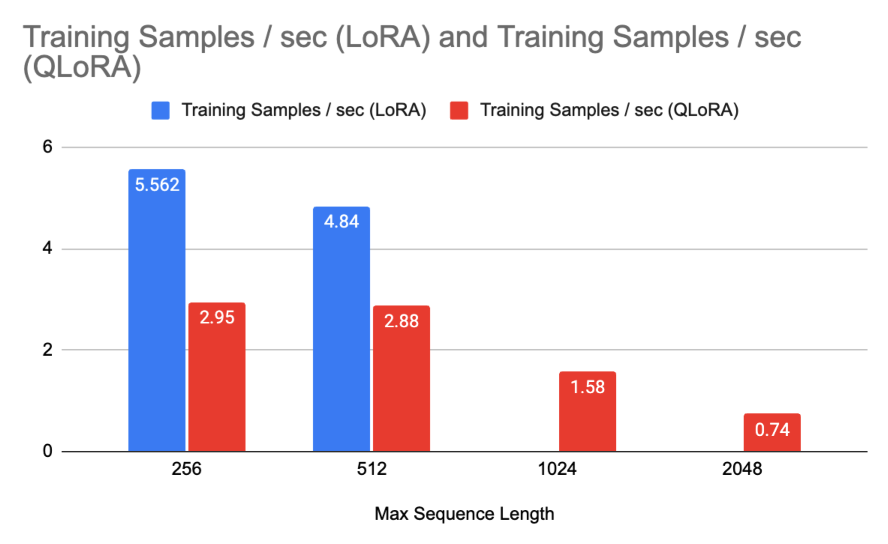
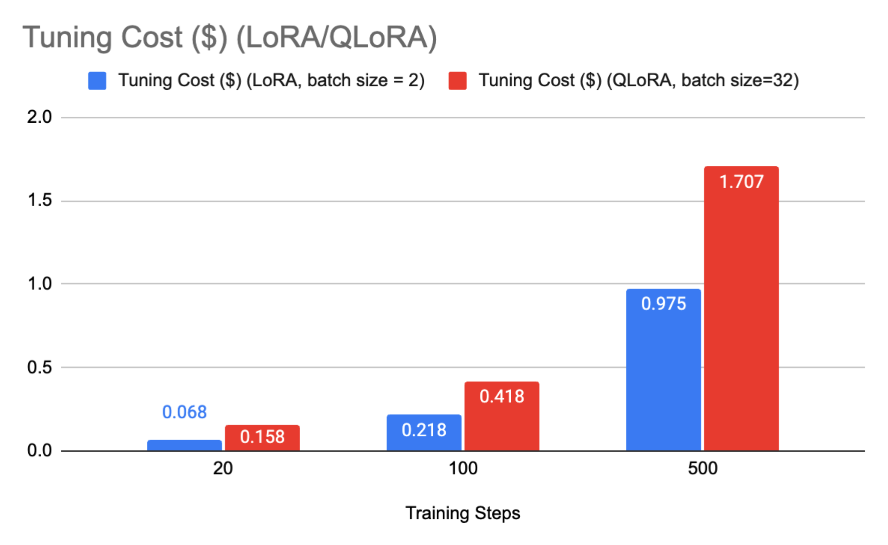

# Benchmark report on fine tuning the OpenLLaMA 7B model on Google Cloud Vertex Model Garden

Gary Wei, Software Engineer, Google Cloud
Dustin Luong, Software Engineer, Google Cloud
Changyu Zhu, Software Engineer, Google Cloud
Genquan Duan, Software Engineer, Google Cloud

## Introduction

Fine-tuning of LLMs can be non-trivial to find an optimal configuration of
machine types, training parameters, and other hyperparameters that achieves a
good balance between cost efficiency and model performance. To facilitate users
in conducting tuning experiments, this report benchmarks OpenLLaMA 7B
fine-tuning on Google Cloud Vertex Model Garden, demonstrating both efficiency
and effectiveness. The observations are general and can be applied to other LLM
models.

We benchmarked fine tuning algorithms [LoRA](https://arxiv.org/abs/2106.09685)
and [QLoRA](https://arxiv.org/abs/2305.14314) supported by
[huggingface PEFT libraries](https://github.com/huggingface/peft). LoRA, short
for Low-Rank Adaptation of Large Language Models, is an improved fine tuning
method where instead of fine tuning all the weights that constitute the weight
matrix of the pre-trained large language model, two smaller matrices that
approximate this larger matrix are fine-tuned. QLoRA is an even more
memory-efficient version of LoRA, where the pretrained model is loaded to GPU
memory as quantized 4-bit weights, while preserving similar effectiveness to
LoRA. We also provide simple scripts and parameter settings to reproduce the
results reported in this report.

In general, there are many factors that affect the performance of fine-tuning
experiments, such as hardware settings, parameters, cost, and accuracy. It is
impractical to obtain benchmarks for all possible combinations of these factors.
Instead, we focus on tuning a subset of related parameters and evaluating their
impact on a set of chosen metrics. The evaluation metrics are GPU memory usage,
percentage of parameters tuned, tuning speed, cost, and accuracy. The tuning
parameters are batch size, lora rank, maximum sequence length, and maximum
training steps.

## Key takeaways

-   **Use QLoRA to minimize the peak GPU requirements**: The QLoRA can
    significantly reduce the peak GPU memory usage by ~75% compared to LoRA. For
    OpenLLaMA7b, the peak memory is ~28G for LoRA and ~7G for QLoRA.
-   **Use LoRA to maximize the tuning speed and minimize the tuning cost**: LoRA
    is ~66% faster than QLoRA in fine tuning speed. LoRA/QLoRA tuning cost is
    low generally, while LoRA is even ~40% cheaper than QLoRA with the same
    parameters. Suggest to use QLoRA for limited GPU memories, and LoRA for
    limited training budgets. For OpenLLaMA7b, the tuning speed for LoRA/QLoRA
    ~5 samples / 3 samples per second, and the tuning cost for LoRA/QLoRA in 500
    steps is ~$1/$1.7 on `a2-highgpu-1g` with 1 A100 40G GPU. The tuning cost
    for QLoRA in 500 steps is $6.75 on n1-standard-8 with 1 V100 GPU, while LoRA
    could not run because of OOM.
-   **Use QLoRA to tune models with large sequence lengths**. For OpenLLaMA7b,
    the max sequence length for QLoRA can be 2048 when consuming 16.3G GPU,
    while the max sequence length for LoRA is 512 when consuming 28.2G GPU, and
    encounter OOM when max sequence length is 1024.
-   **Both LoRA and QLoRA give similar accuracy improvement after fine tuning.**
    For OpenLLaMA7b, both LoRA/QLoRA can improve the average accuracy by ~4%
    evaluating on 3 typical tasks (ARC challenge, HellaSwag and TruthfulQA),
    after training 1875 steps on dataset
    [timdettmers/openassistant-guanaco](https://huggingface.co/datasets/timdettmers/openassistant-guanaco).
-   **Use a big batch size if GPU memory is not a constraint**. For OpenLLaMA7b
    with other default parameters, we suggest using a batch size as 24 for
    QLoRA, but 2 for LoRA when tuning with 1 A100 40G. We also suggest using a
    batch size as 8 for QLoRA when tuning with 1 V100. Tuning with LoRA and
    batch size as 1 got OOM and we don't recommend tuning LoRA with 1 V100.

## Benchmark Details

### Experiment Setup

The benchmark dataset is
[timdettmers/openassistant-guanaco](https://huggingface.co/datasets/timdettmers/openassistant-guanaco).
The training dataset is directly downloaded from hugging face to the VM, before
every experiment.

The default tuning parameters during benchmark are:

-   Host VM: a2-highgpu-1g
-   Accelerator type: 1 A100 40G
-   batch size: 2
-   lora_rank: 16
-   max_seq_length: 512
-   precision_mode: float16
-   max_train_steps: 500

For simplicity, we set the precision mode to `float16` when tuning LoRA models,
and set the precision to `4bit` for QLoRA.

Sample script to start fine tuning dockers in a VM on GCP.

```shell
IMAGE_TAG=us-docker.pkg.dev/vertex-ai/vertex-vision-model-garden-dockers/pytorch-peft-train:latest
docker run  --runtime=nvidia  -e NVIDIA_VISIBLE_DEVICES=0 \
--rm --name "test_gpu"  -it --pull=always ${IMAGE_TAG} \
--task=instruct-lora \
--pretrained_model_id=openlm-research/open_llama_7b \
--dataset_name="timdettmers/openassistant-guanaco"  \
--instruct_column_in_dataset="text" \
--precision_mode="float16" \
--output_dir=<OUTPUT DIR>  \
--lora_rank=2 \
--max_sequence_length=512 \
--learning_rate=2e-4 \
--max_steps=50
```

### GPU Memory

In this benchmark, we investigated the impact of batch size, lora rank, and
maximum sequence length on GPU memory, and then made recommendations on the
maximum batch size for different GPUs.

#### Peak GPU memory by batch size (GB)



-   The QLoRA can significantly reduce the peak GPU memory usage by ~75%
    compared to LoRA. The peak GPU memory is ~28G for LoRA and ~7G for QLoRA
    when batch size is 2.
-   QLoRA can support much larger batch sizes than LoRA
    -   We can use a batch size as 32 for QLoRA, but only 2 for LoRA on 1 A100
        40G.
    -   We can use a batch size of 8 for QLoRA on 1 V100 GPU. LoRA will fail
        with OOM even with a batch size of 1.

#### Peak GPU memory by LoRA rank (GB)



-   Peak GPU memories are quite similar for different LoRA ranks for both
    LoRA/QLoRA.
-   The peak GPU memory increasing percentages are very small generally when
    LoRA rank increases.
    -   The peak GPU memory increases from 28G with LoRA rank 4 to 29.09G with
        LoRA rank 64, and the increasing percentage is only ~3.9%.

#### Peak GPU memory by max sequence length for LoRA/QLoRA (GB)



-   The peak GPU increases quickly when max sequence length increases for both
    LoRA/QLoRA, and the increasing rate of LoRA is much faster than QLoRA.
    -   For LoRA tuning, the GPU memory increased from 20.5G (max sequence
        length=256) to 28.2G (max sequence length=512), an increase of ~37%.
    -   For QLoRA tuning, the GPU memory increased from 6.94G (max sequence
        length=256) to 7.57G (max sequence length=512), an increase of ~9%.
-   The max sequence length for QLoRA can be 2048 when consuming 16.3G GPU,
    while the max sequence length for LoRA is 512 when consuming 28.2G GPU, and
    encounter OOM when max sequence length is 1024.

### Fine Tuning Parameters

This section shows the number/percentage of trainable parameters, and the sizes
of the fine tuned models. LoRA and QLoRA differ only in how they represent the
precision of their parameters. The total number of parameters and the number of
trainable parameters are the same for both methods.

| LoRA Rank | Finetuned parameters | Total parameters | Trainable Parameter Percentage | Fine tuned model size (MB) |
| --------- | -------------------- | ---------------- | ------------------------------ | -------------------------- |
| 8         | 2.00E+07             | 6.76E+09         | 0.3%                           | 76.4                       |
| 16        | 4.00E+07             | 6.78E+09         | 0.6%                           | 152.65                     |
| 32        | 8.00E+07             | 6.82E+09         | 1.2%                           | 305.15                     |
| 64        | 1.60E+08             | 6.90E+09         | 2.3%                           | 610.15                     |


LoRA/QLoRA tunes quite a small fraction (only 0.3% with LoRA rank=8) of all
parameters, and the tuned models are very small (only 76.4MB with LoRA rank=8).

### Fine Tuning Speed And Costs

The fine-tuning speed and cost are affected by various factors, such as the
GPUs, LoRA ranks, and max sequence lengths.

-   LoRA is ~66% faster than QLoRA in fine tuning speed. The tuning speed for
    LoRA/QLoRA ~5 samples / 3 samples per second on 1 A100 40G GPU
-   Higher LoRA ranks, slower tuning speed for both LoRA/QLoRA.
    -   LoRA tuning speed reduces from ~5 samples per second with LoRA rank as 8
        to ~4 samples per second with LoRA rank as 64, slowed down by 20%.
    -   QLoRA tuning speed reduces from ~3 samples per second with LoRA rank as
        8 to ~2.5 samples per second with LoRA rank as 64, slowed down by 17%.



-   Longer sequence lengths, slower tuning speed.
    -   LoRA tuning speed reduces from ~5.56 samples per second with max
        sequence length as 256 to ~4.84 samples per second with max sequence
        length as 512 slowed down by 13%.
    -   LoRA tuning speed reduces from ~2.95 samples per second with max
        sequence length as 256 to ~2.88 samples per second with max sequence
        length as 512 slowed down by ~2.4%.



-   LoRA/QLoRA tuning cost is low generally, while LoRA is even ~40% cheaper
    than QLoRA with the same parameters.
    -   The LoRA/QLoRA fine tuning cost for 500 steps is ~$1/$1.7 on 1 A100 40G.
    -   The tuning cost for QLoRA in 500 steps is $6.75 on n1-standard-8 with 1
        V100 GPU, while LoRA could not run because of OOM.



### Accuracy

We fine tuned Open Llama 7B model with
[timdettmers/openassistant-guanaco](https://huggingface.co/datasets/timdettmers/openassistant-guanaco),
and report accuracy similar to the
[HuggingFace leaderboard](https://huggingface.co/spaces/HuggingFaceH4/open_llm_leaderboard)
using
[Eleuther AI Language Model Evaluation Harness](https://github.com/EleutherAI/lm-evaluation-harness).
[HuggingFace leaderboard](https://huggingface.co/spaces/HuggingFaceH4/open_llm_leaderboard)
mainly compares models on ARC, HellaSwag, MMLU, and TruthfulQA. The authors did
not publish OpenLLaMA 7B on MMLU
([link](https://huggingface.co/openlm-research/open_llama_7b)). Therefore, we
only benchmark accuracies on ARC, HellaSwag, and TruthfulQA.

|                                                              | Mean | ARC  | HellaSwag | TruthfulQA | Tuning Parameters                                            |
| ------------------------------------------------------------ | ---- | ---- | --------- | ---------- | ------------------------------------------------------------ |
| OpenLLaMA7B ([Original Report](https://huggingface.co/openlm-research/open_llama_7b)) | 0.49 | 0.41 | 0.73      | 0.34       | n/a                                                          |
| OpenLLaMA7B ([Re-run with lm-evaluation-harness](https://github.com/EleutherAI/lm-evaluation-harness)) | 0.51 | 0.47 | 0.72      | 0.35       | n/a                                                          |
| OpenLLaMA7B+LoRA                                             | 0.56 | 0.48 | 0.74      | 0.45       | LoRA Rank=16; Max Sequence Length=512;Learning Rate=1e-4; Train steps=1875 |
| OpenLLaMA7B+QLoRA                                            | 0.53 | 0.45 | 0.73      | 0.42       | LoRA Rank=16; Max Sequence Length=512; Learning Rate=1e-4; Train steps=1875 |

-   The base OpenLLaMA7B model gets better performance (2%) when using the
    [Eleuther AI Language Model Evaluation Harness](https://github.com/EleutherAI/lm-evaluation-harness).
-   LoRA/QLoRA can improve the performance by ~2-4% when trained for 1875 steps
    with learning rate 1e-4.
