  

# VTC Multi-Domain Dataset: Mitigating Catastrophic Forgetting with Data Mixing

**Author:** [Mayank Sharan](mailto:mayanksharan@google.com)

## Table of Contents

* [Intro](#intro)
* [Background](#background)
* [Dataset Curation](#dataset-selection)
* [Forgetting Mitigation Best Practices](#forgetting-mitigation-best-practices)
    * [Experimental Setup](#experimental-setup)
    * [Mitigating Forgetting](#mitigating-forgetting)
    * [Mixing Ratios](#mixing-ratios)
    * [Different Starting Models](#different-starting-models)
* [Acknowledgements](#acknowledgements)
* [References](#references)

## Intro

In this entry of our blog series on model training best practices for Vertex AI Training Cluster (VTC) customers, we talk about catastrophic forgetting and how to mitigate it. We focus on tuning public models using supervised fine tuning (SFT) with a specialized domain dataset. With both open and closed source models performing well on general tasks the primary goal of training one's own models is to improve the performance on specialized tasks. This typically comes at the cost of the model forgetting general capabilities which can severely limit the utility of the trained model.

There are many possible interventions to limit forgetting, the most effective is mixing the target dataset with the actual dataset used in the model’s training. Since this is not available even for the most open source models, we have curated a multi-domain dataset that delivers the same benefits. This allows Vertex AI Training Cluster (VTC) customers to maintain and surpass frontier level model capabilities while training to further performance on specialized tasks.

<figure align="center" id="fig-teaser">
<table align="center" width="80%">
  <tr>
    <td align="center" width="100%">
      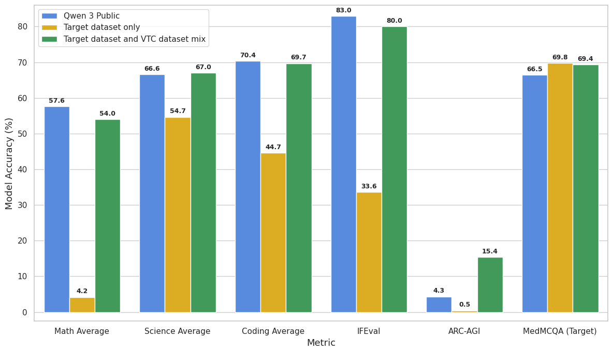 
    </td>
  </tr>
</table>
<figcaption align="left">
<b>Figure 1: Impact of mixing VTC Post Training dataset on Forgetting (8B model). </b> <i>Comparing SFT runs using only a specialized target dataset (MedMCQA) vs a mix of the target dataset and the VTC Post training dataset. Forgetting across all non-target domains is significantly mitigated with no performance loss on the target metric. Qwen3 Public here is the instruction tuned public Qwen3 8B model and the other two models are trained starting from the base Qwen3 8B model using only the target dataset and a mix of target dataset with the VTC dataset.</i>
</figcaption>
</figure>

We provide a thorough set of experiments to serve as a guide for reducing forgetting while post training the Qwen3 open-weight thinking model family, beginning from their base pre-trained checkpoints. Furthermore, we demonstrate the value our datasets provide across model sizes often surpassing the performance of the official Qwen3 models while preserving performance on the specialized task (See [Figure 1](#fig-teaser)). The Qwen3 family was specifically chosen for this study because its diverse range of parameter counts and the availability of both pre-trained and post-trained checkpoints provide an ideal environment for high-fidelity scaling analysis.

To ensure our findings can be applied to a broad set of applications we validate our findings across five model sizes: 0.6B, 1.7B, 4B, 8B and 14B parameters. To support our VTC community in accelerating their own development, all code, datasets, and experiment configurations used in this blog are being made available for use in your training workloads.

## Background

Loss landscapes for neural networks have always been a complex multidimensional manifold rather than the simple convex ones that gradient descent is built for. Forgetting is a well known phenomenon in model customization, the first academically recorded instance being (McCloskey and Cohen, 1989) [<a href="#ref1">1</a>]. These manifolds have become even more complex with the introduction of Large Language Models where the number of parameters being optimized are typically in the billions. This makes it hard to mathematically grasp issues like forgetting. [Figure 2](#fig-loss-landscape) demonstrates a geometric understanding of why forgetting happens and how data mixing can mitigate it.

<figure align="center" id="fig-loss-landscape">
<table align="center" width="80%">
  <tr>
    <td align="center" width="100%">
      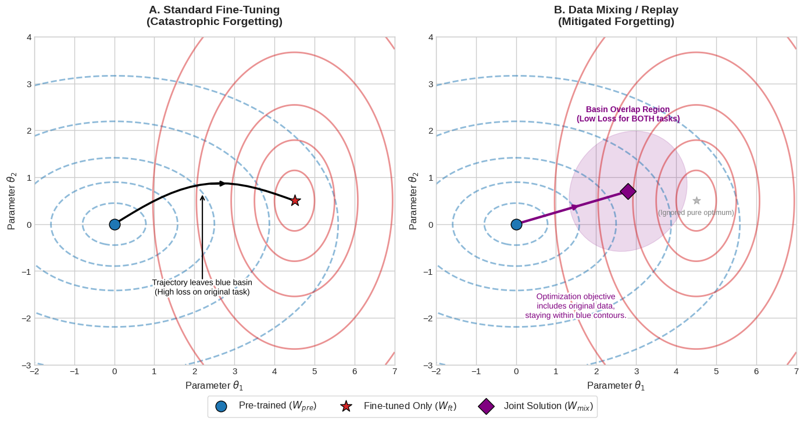 
    </td>
  </tr>
</table>
<figcaption align="left">
<b>Figure 2: Geometric Interpretation of Data Mixing to Mitigate Forgetting. </b> <i>Fine tuning objectives being meaningfully out of distribution from the pre-trained model often drives forgetting. Mixing in a dataset similar to the model distribution adjusts the objective enough to learn the new task without as much forgetting.</i>
</figcaption>
</figure>

## Dataset Selection

Our primary requirements for a target dataset to run experiments to validate this were:

1. It should be out of distribution to cause forgetting
2. It should have an evaluation metric that it directly improves
3. It should be able to train the model to perform better than the counterpart generalist model

A good heuristic to determine where the data lies with respect to the model distribution is by calculating perplexity on samples from the dataset. Assuming
- $$X={x_1, x_2, …, x_N}$$ is a dataset sample represented as sequence of tokens
- $$P(x_i \mid x_{<i})$$ is the model likelihood of the i-th token given the sample till that token

Then the perplexity for this sample can be calculated as follows:

$$\begin{align*}  
& ppl(X) = \exp \left( -\frac{1}{N} \sum_{i=1}^{N} \log P(x_i \mid x_{<i}) \right) \\
& = \exp \left( -\frac{1}{N} \log (\prod_{i=1}^{N} P(x_i \mid x_{<i})) \right)
\end{align*}  $$

The product form of the equation shows that this is a direct measure of the joint probability of this sequence of tokens according to the model. Since this computation has a balancing negative sign to account for the negative log value a lower joining probability results in a higher perplexity value and vice versa. We evaluated the following datasets as out-of-distribution candidates:

- [MedMCQA](https://huggingface.co/datasets/syz-ml2025/medmcqa) : Multiple Choice Questions (MCQ) dataset focusing on the medical domain
- [BirdSQL](https://huggingface.co/datasets/birdsql/bird23-train-filtered) : Text to SQL generation dataset
- [HardGen](https://huggingface.co/datasets/Bingguang/HardGen) : Function calling dataset

We also calculate perplexity on [OpenR1-Math-220k](https://huggingface.co/datasets/open-r1/OpenR1-Math-220k) to provide a reference as we expect this to be in distribution for the model given the Qwen3 models are particularly strong in the math domain.

<table id="tab-perplexity" style="margin-left:auto; margin-right:auto;">
  <thead>
    <tr>
      <th>Dataset \ Model</th>
      <th>Qwen3-0.6B</th>
      <th>Qwen3-8B</th>
      <th>Ours-0.6B</th>
      <th>Ours-8B</th>
    </tr>
  </thead>
  <tbody>
    <tr>
      <td>MedMCQA</td>
      <td>63.00</td>
      <td>66.00</td>
      <td>42.00</td>
      <td>20.75</td>
    </tr>
    <tr>
      <td>BirdSQL</td>
      <td>38.50</td>
      <td>55.50</td>
      <td>45.50</td>
      <td>17.00</td>
    </tr>
    <tr>
      <td>HardGen</td>
      <td>2.23</td>
      <td>2.03</td>
      <td>2.28</td>
      <td>1.79</td>
    </tr>
    <tr>
      <td>OpenR1-Math</td>
      <td>8.63</td>
      <td>9.75</td>
      <td>6.44</td>
      <td>5.34</td>
    </tr>
  </tbody>
  <caption style="text-align: left;"><b>Table 1:</b> Perplexity score analysis with the public instruction tuned Qwen3 models and Qwen3 base models trained using the VTC dataset (Ours) to identify a suitable target dataset.</caption>
</table>

We see from [Table 1](#tab-perplexity) that OpenR1-Math-220k as we expected has low perplexity scores and HardGen shows an even lower perplexity score eliminating it from consideration. MedMCQA samples have high perplexity scores across all considered models. This dataset also has the advantage of a straightforward evaluation metric as we can use the validation split in the form of an MCQ verified evaluation.

Based on this analysis we choose MedMCQA as our target dataset for these experiments. Additionally, since we are training a thinking model and the dataset does not have thinking traces we use the Qwen3-235B model to inject thinking traces into the training samples.

## Forgetting Mitigation Best Practices

### Experimental Setup

#### Dataset Mixing

We tested the impact of how forgetting responds to mixing the base dataset in different ratios with the target dataset. The base dataset here refers to the multi domain SFT dataset we have developed (see our [distillation blog post](https://googlecloudplatform.github.io/vertex-ai-samples/vertex-training-cluster/model_distillation_best_practices) [<a href="#ref2">2</a>] for details of the generation process) that can replicate and on certain metrics beat the public Qwen3 models. The target dataset here refers to the MedMCQA dataset. It is important to understand that in all mixing scenarios where the target dataset is present we will use the complete target dataset as that is the reasonable course of action we expect any customer to take. This leads to the total number of samples used in training varying based on the mixing ratio.

We run 2 baseline experiments for each model size: using only the base dataset and only the target dataset. The mixing experiments are the base dataset being mixed in ratios of 0.9:0.1, 0.75:0.25 and 0.5:0.5. (0.9:0.1 means 90% of samples are from the base in-distribution dataset, while 10% are from the target out-of-distribution dataset.)

The base dataset is randomly subsampled for each of these experiments. For simpler reference and analysis let’s define a mixing ratio $$0 <= \alpha < 1$$, such that the final dataset mixture includes $$ N^{'}_{B} = \frac{\alpha}{1 - \alpha} N_T$$ samples from the base dataset where $$N_T$$is the number of samples in the target dataset. In each of these mixtures the complete target dataset is used, contributing $$N_T$$ samples for a total training dataset size of $$\frac{N_T}{1 - \alpha}$$.

Since, our target dataset has 182,712 samples, this means that:

- 0.9:0.1 ratio ($$\alpha = 0.9$$) : Uses a total of 1,827,120 training samples
- 0.75:0.25 ratio ($$\alpha = 0.75$$) : Uses a total of 730,849 training samples
- 0.5:0.5 ratio ($$\alpha = 0.5$$) : Uses a total of 365,425 training samples

#### Evaluation

<table id="tab-eval-setup" style="margin-left:auto; margin-right:auto;">
  <thead>
    <tr>
      <th>Capabilities</th>
      <th>Benchmarks</th>
      <th># Test Samples</th>
      <th>Eval Metrics</th>
    </tr>
  </thead>
  <tbody>
    <tr>
      <td rowspan="7">Math</td>
      <td>AIME 24</td>
      <td>30</td>
      <td>pass@1 (average of 10)</td>
    </tr>
    <tr>
      <td>AIME 25</td>
      <td>30</td>
      <td>pass@1 (average of 10)</td>
    </tr>
    <tr>
      <td>BeyondAIME</td>
      <td>100</td>
      <td>pass@1 (average of 5)</td>
    </tr>
    <tr>
      <td>Math 500</td>
      <td>500</td>
      <td>pass@1</td>
    </tr>
    <tr>
      <td>HMMT 25</td>
      <td>30</td>
      <td>pass@1 (average of 10)</td>
    </tr>
    <tr>
      <td>BRUMO 25</td>
      <td>30</td>
      <td>pass@1 (average of 10)</td>
    </tr>
    <tr>
      <td>CMIMC 25</td>
      <td>40</td>
      <td>pass@1 (average of 10)</td>
    </tr>
    <tr>
      <td rowspan="3">Science</td>
      <td>GPQA</td>
      <td>448</td>
      <td>pass@1 (average of 5)</td>
    </tr>
    <tr>
      <td>MMLU</td>
      <td>14042</td>
      <td>pass@1</td>
    </tr>
    <tr>
      <td>MMLU Pro</td>
      <td>12032</td>
      <td>pass@1</td>
    </tr>
    <tr>
      <td rowspan="2">Coding</td>
      <td>HumanEval</td>
      <td>164</td>
      <td>pass@1 (average of 5)</td>
    </tr>
    <tr>
      <td>LiveCodeBench v6</td>
      <td>175</td>
      <td>pass@1 (average of 5)</td>
    </tr>
    <tr>
      <td>Instruction Following</td>
      <td>IFEval</td>
      <td>541</td>
      <td>pass@1 (Strict Accuracy)</td>
    </tr>
    <tr>
      <td>Reasoning</td>
      <td>ARC-AGI 1</td>
      <td>400</td>
      <td>pass@1 (average of 5)</td>
    </tr>
    <tr>
      <td>Medical (Target domain)</td>
      <td>MedMCQA</td>
      <td>4183</td>
      <td>pass@1</td>
    </tr>
  </tbody>
  <caption style="text-align: left;"><b>Table 2:</b> Comprehensive overview of task domains, evaluation benchmarks, and associated performance metrics.</caption>
</table>

Our evaluation benchmarks and metrics are detailed in [Table 2](#tab-eval-setup). To ensure statistical reliability on smaller datasets, we report metrics averaged over multiple independent runs to mitigate variance. For each domain with multiple evaluations, we utilize the average score across the core benchmarks as our primary performance indicator. To maintain a consistent comparison, both our trained models and the official Qwen3 thinking models were evaluated using standardized sampling parameters — `Temperature=0.6`, `Top-P=0.95`, `Top-K=20` and `Max-tokens=32768` — aligning with the recommended [best practices](https://huggingface.co/Qwen/Qwen3-14B#best-practices) from the official Qwen3 model card.

Note that we have separated MedMCQA as a target metric instead of including it in the Science domain. This is to ensure clear outcomes from our experiments and to demonstrate impacts on model performance without any interference.

#### Training

##### Vertex AI Training Cluster

All experiments and results presented were orchestrated using the [Vertex AI Training Cluster (VTC)](https://docs.cloud.google.com/vertex-ai/docs/training/training-clusters/overview). VTC is a managed Google Cloud service designed to simplify and accelerate large-scale AI workloads. It provides a simple managed user experience that enables optimized GPU scheduling, automated fault tolerance, high hardware resiliency, quick start recipes and science tooling which drastically reduces the time from cluster setup to production training and speeds up experimentation.

##### Training Framework and Hyperparameters

We utilize NVIDIA [NeMo RL](https://github.com/NVIDIA-NeMo/RL), an open library from the [NVIDIA NeMo framework](https://github.com/NVIDIA-NeMo/) as the primary training library, leveraging the Megatron backend for distributed scaling. Models are initialized from a Qwen3 Base checkpoint and fine-tuned with a 32,768 context window on curated datasets. Optimization is handled via AdamW ($$\beta_1=0.9$$, $$\beta_2=0.95$$, weight decay=0.1) using a linear warmup and cosine decay schedule. All training is conducted using BF16 mixed precision. There are many model sizes and dataset mixes used in the experimentation so the maximum learning rate is guided by learning rate scaling laws (see [distillation blog post](https://googlecloudplatform.github.io/vertex-ai-samples/vertex-training-cluster/model_distillation_best_practices#hyperparameter-scaling) [<a href="#ref2">2</a>] for more) available as a part of VTC. The value is validated by testing slight adjustments from the recommended value for each dataset mixture.

### Mitigating Forgetting

All models in this experiment are trained starting from the Qwen3 base checkpoint. We explore the impact of dataset mixing by comparing the public Qwen3 instruction tuned model performance with our two baselines — model trained with only the target dataset and model trained only with the base dataset — and with a model trained using a 0.9 ratio mix.

<figure align="center" id="fig3_data_mixing">

<table align="center" width="100%">
  <tr>
    <td align="center" width="50%">
      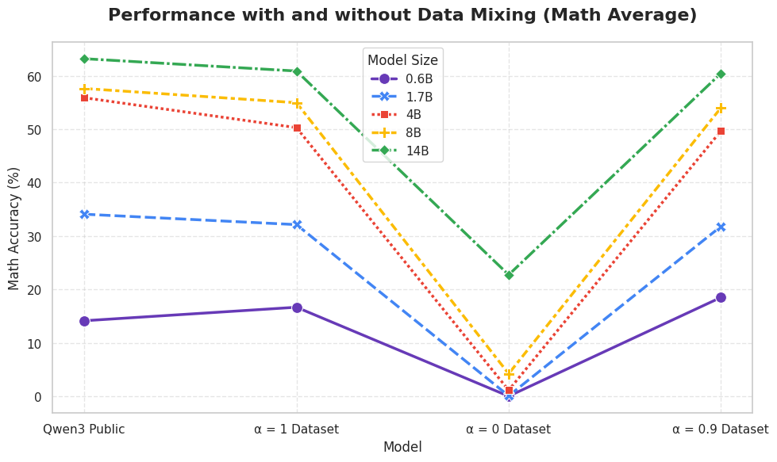 
      <b>(a)</b> Math
    </td>
    <td align="center" width="50%">
      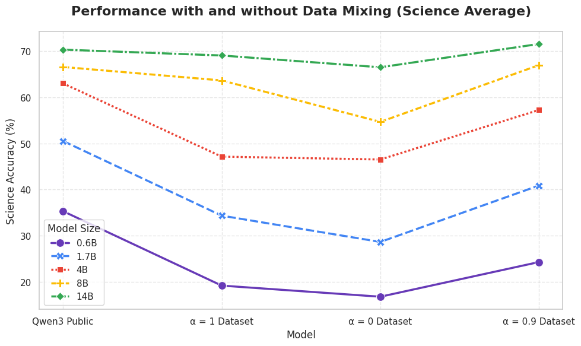 
      <b>(b)</b> Science
    </td>
  </tr>
  <tr>
    <td align="center" width="50%">
      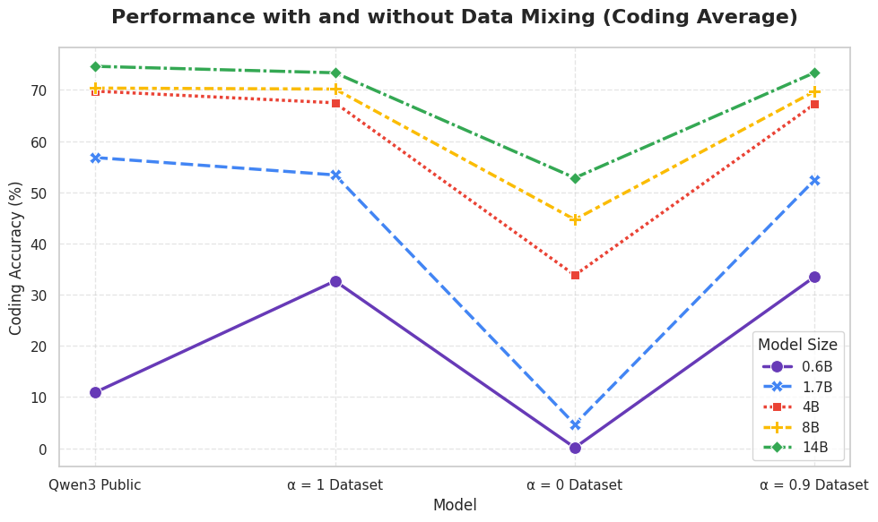 
      <b>(c)</b> Coding
    </td>
    <td align="center" width="50%">
      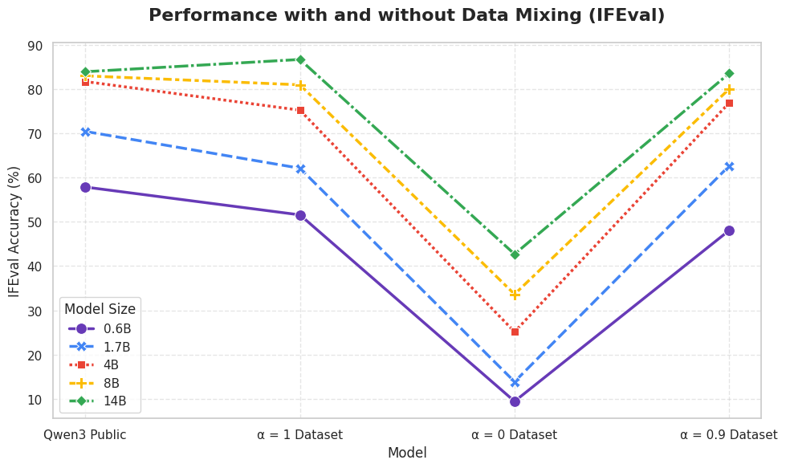 
      <b>(d)</b> IFEval
    </td>
  </tr>
  <tr>
    <td align="center" width="50%">
      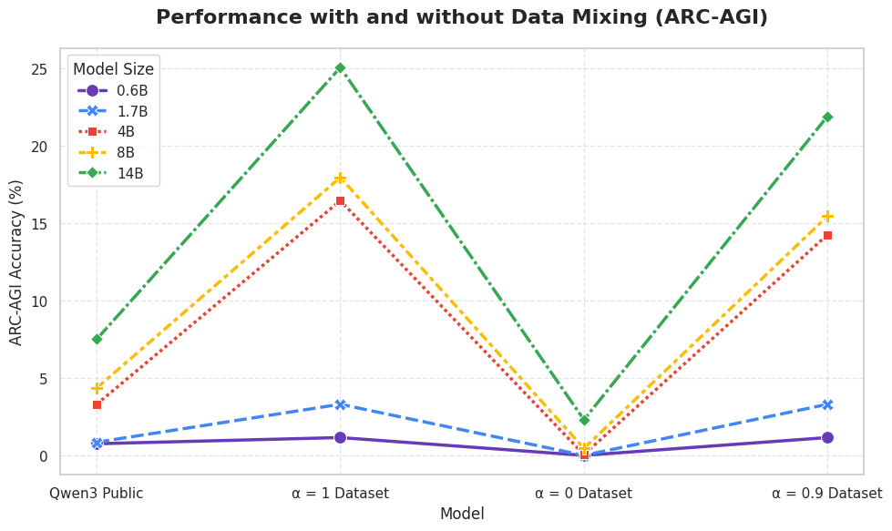 
      <b>(e)</b> ARC-AGI
    </td>
    <td align="center" width="50%">
      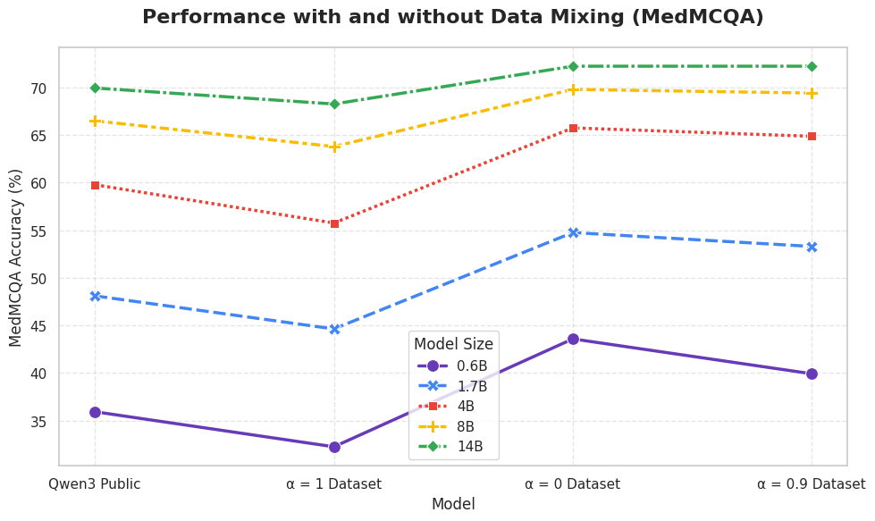 
      <b>(f)</b> MedMCQA
    </td>
  </tr>
</table>
<figcaption align="left">
<b>Figure 3: Performance with and without Data Mixing.</b> <i>A comparison across (a) Math, (b) Science, (c) Coding, (d) IFEval, (e) ARC-AGI and (f) MedMCQA benchmarks showing how data mixing impacts forgetting and performance on the target metric.</i>
</figcaption>

</figure>

[Figure 3](#fig3_data_mixing) shows that for all non-target metrics other than Science using just the target dataset shows significant forgetting. Math and ARC-AGI are almost completely forgotten for all model sizes up to 8B parameters. The mixed dataset recovers the performance to similar levels as the base dataset. The base dataset delivers performance comparable to the public model in all domains and significantly better on ARC-AGI.

The Science domain evaluations do not suffer severe forgetting likely because MedMCQA is very close to this domain. In fact, for the 8B and 14B sizes due to these transfer learning dynamics the $$\alpha = 0.9$$ model outperforms both the public ITed and the base dataset ($$\alpha = 1$$) models.

Performance on the target metric of MedMCQA follows expected behavior with best results achieved by the model when trained only with the target dataset. It is important to note that the $$\alpha = 0.9$$ model for all sizes is still significantly better than the public ITed and base dataset ($$\alpha = 1$$) model and for all sizes other than the 0.6B mostly maintains the performance gains of the target dataset ($$\alpha = 0$$) model.

#### Key Observations

Combining these conclusions we can see that mixing with our base dataset:

- Matches and outperforms the public instruction tuned model on general tasks.
- Preserves the gains beyond the public model on target tasks.
- Provides additional gains on tasks from a similar domain.

### Mixing Ratios

Now that we know that mixing the base dataset almost eliminates forgetting it is important to understand how performance changes for different mixing configurations. This is also important to examine as it determines training length and hence the cost. We will compare models trained only with the target dataset to models trained using dataset mixes with $$\alpha = 0.5, 0.75, 0.9$$. The ratio mentioned here refers to the proportion of the dataset from the base dataset.

<figure align="center" id="fig4_mixing_ratios">

<table align="center" width="100%">
  <tr>
    <td align="center" width="50%">
      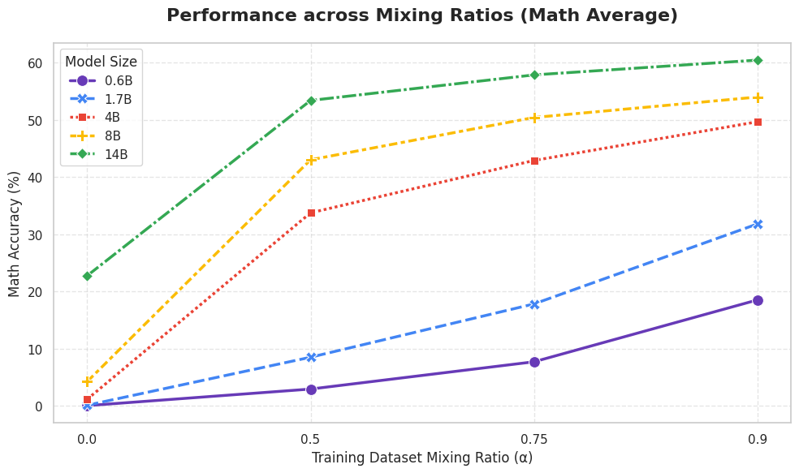 
      <b>(a)</b> Math
    </td>
    <td align="center" width="50%">
      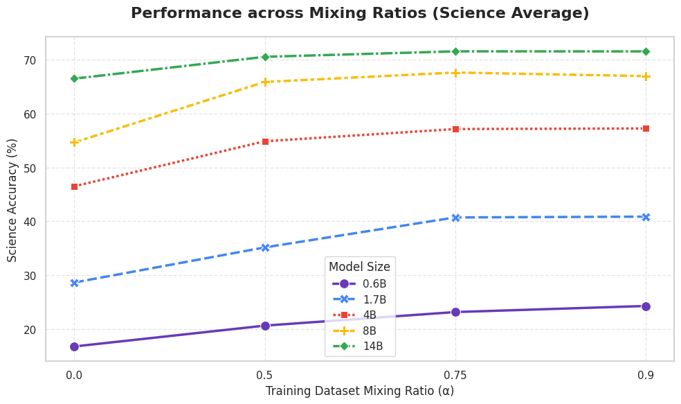 
      <b>(b)</b> Science
    </td>
  </tr>
  <tr>
    <td align="center" width="50%">
      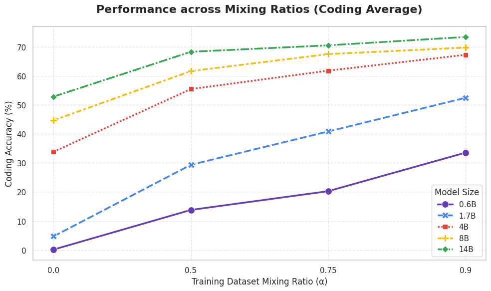 
      <b>(c)</b> Coding
    </td>
    <td align="center" width="50%">
      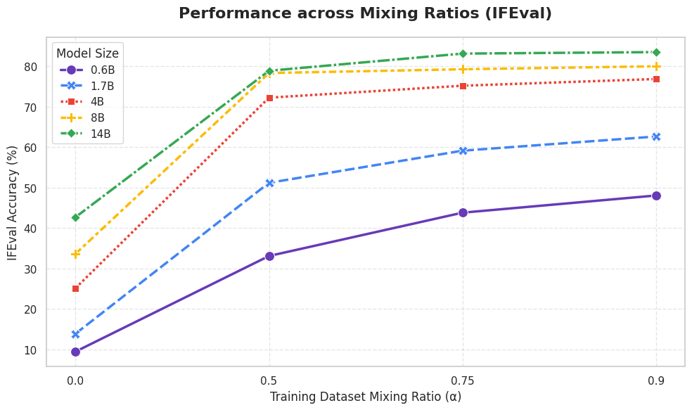 
      <b>(d)</b> IFEval
    </td>
  </tr>
  <tr>
    <td align="center" width="50%">
      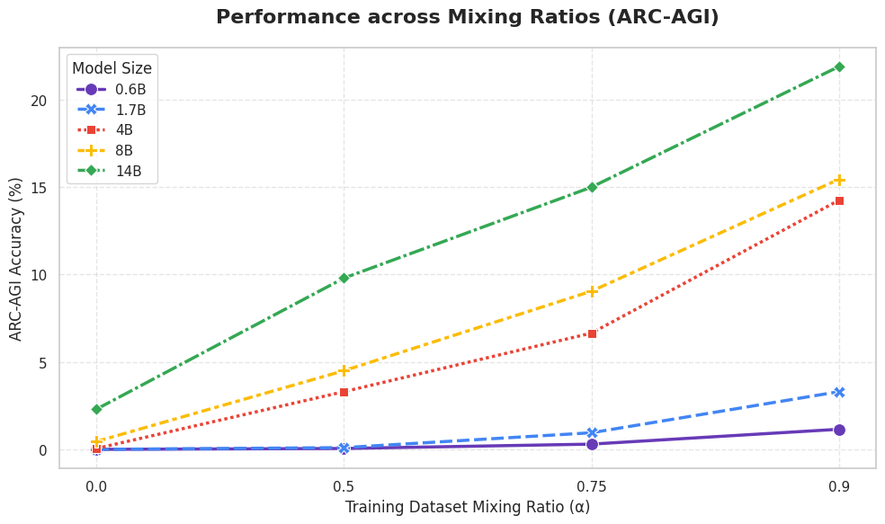 
      <b>(e)</b> ARC-AGI
    </td>
    <td align="center" width="50%">
      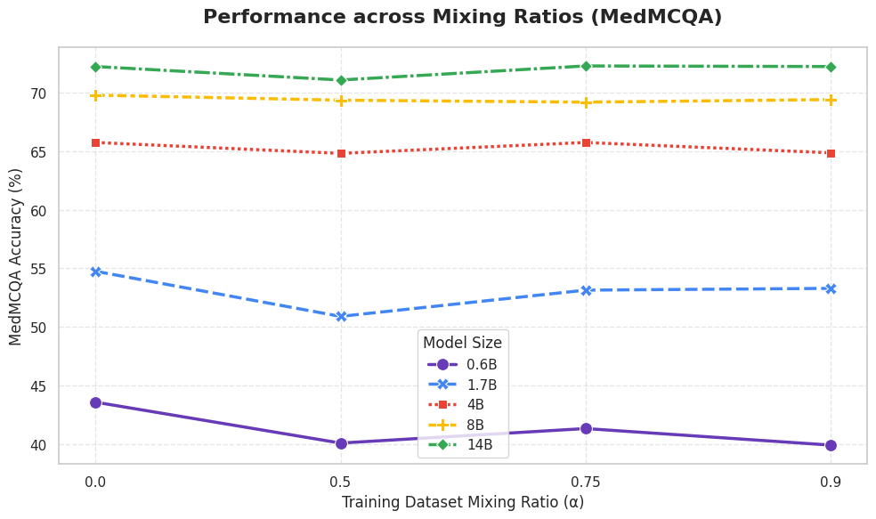 
      <b>(f)</b> MedMCQA
    </td>
  </tr>
</table>
<figcaption align="left">
<b>Figure 4: Performance across Mixing Ratios.</b> <i>A comparison across (a) Math, (b) Science, (c) Coding, (d) IFEval, (e) ARC-AGI and (f) MedMCQA benchmarks showing how dataset mixing ratios impact forgetting and performance on the target metric.</i>
</figcaption>

</figure>

[Figure 4](#fig4_mixing_ratios) shows that for all non-target metrics mixing helps achieve better performance than just using the target dataset even with a $$\alpha = 0.5$$ mix. As expected the performance on non target metrics worsens as we lower the ratio of the base dataset. This effect is more pronounced in the smaller size models and for datasets like ARC-AGI where the mixed training provides a lot more gain. These patterns confirm that the gains on non target metrics are directly correlated to the base dataset.

The effect while present for Science domain metrics is much less pronounced due to the cross domain characteristics. Even with lower ratios the performance for models 4B and larger holds, confirming that our target dataset of MedMCQA here contributes to limiting forgetting for this domain.

The performance on the target metric, MedMCQA, stays mostly consistent with dips mostly when going from $$\alpha = 0.75$$ mix to $$\alpha = 0.5$$ mix. This aligns well as in all cases we are doing a complete epoch on the target dataset. The performance mostly holding at mixing ratios indicates that the tradeoff on the target metrics is relatively low even at an aggressive mixing ratio like 0.5.

#### Key Observations

The mixing ratio comparison shows us that:

- A mixing ratio of 0.9 is the best for achieving gains on target tasks and limiting forgetting.
- A mixing ratio of even 0.5 limits forgetting well while only doubling the token budget compared to training without any mixing.

### Different Starting Models

We have trained all our models starting from Qwen3 base checkpoints. A natural question here might be: What happens if we train starting from the instruction tuned public Qwen3 checkpoints for our target task? In this section we examine this question and compare the ITed model tuned with the target dataset and an $$\alpha = 0.9$$ mix to the ITed model itself and the base model tuned with an $$\alpha = 0.9$$ mix.

<figure align="center" id="fig5_starting_models">

<table align="center" width="100%">
  <tr>
    <td align="center" width="50%">
      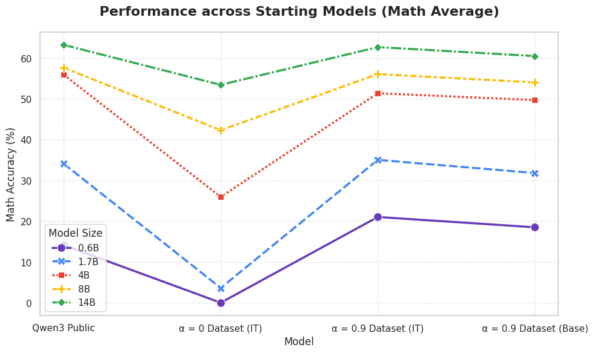 
      <b>(a)</b> Math
    </td>
    <td align="center" width="50%">
      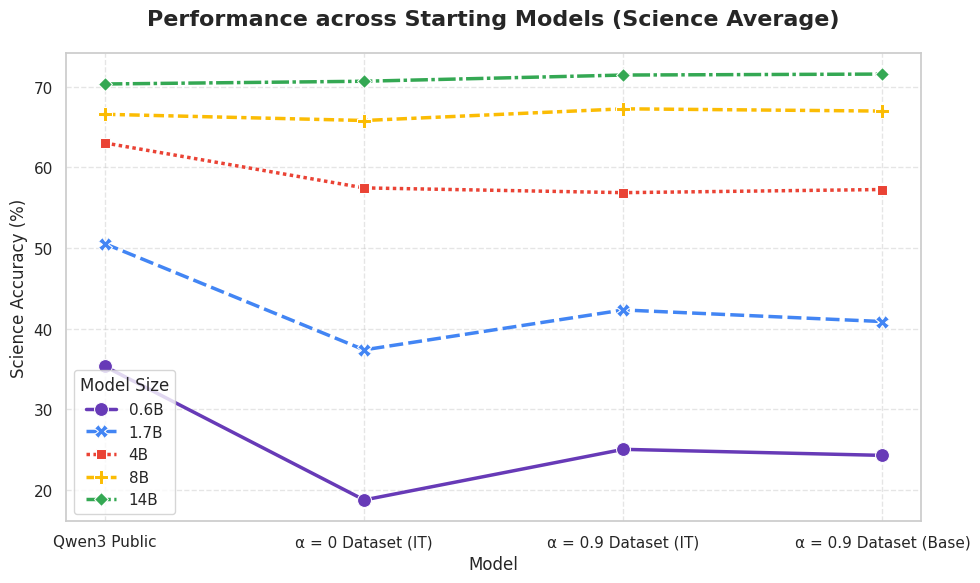 
      <b>(b)</b> Science
    </td>
  </tr>
  <tr>
    <td align="center" width="50%">
      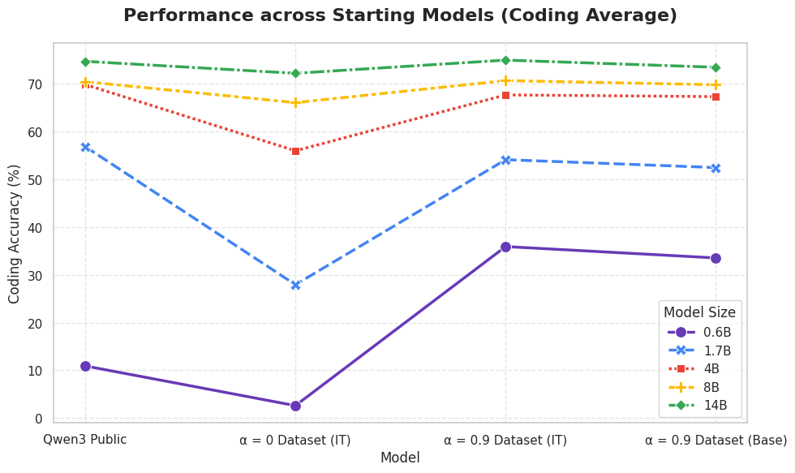 
      <b>(c)</b> Coding
    </td>
    <td align="center" width="50%">
      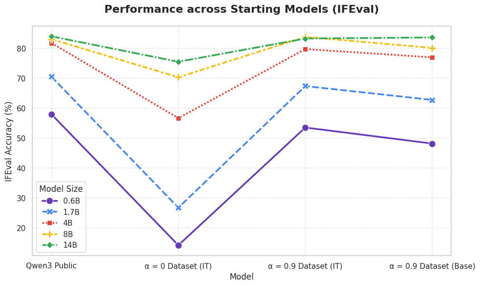 
      <b>(d)</b> IFEval
    </td>
  </tr>
  <tr>
    <td align="center" width="50%">
      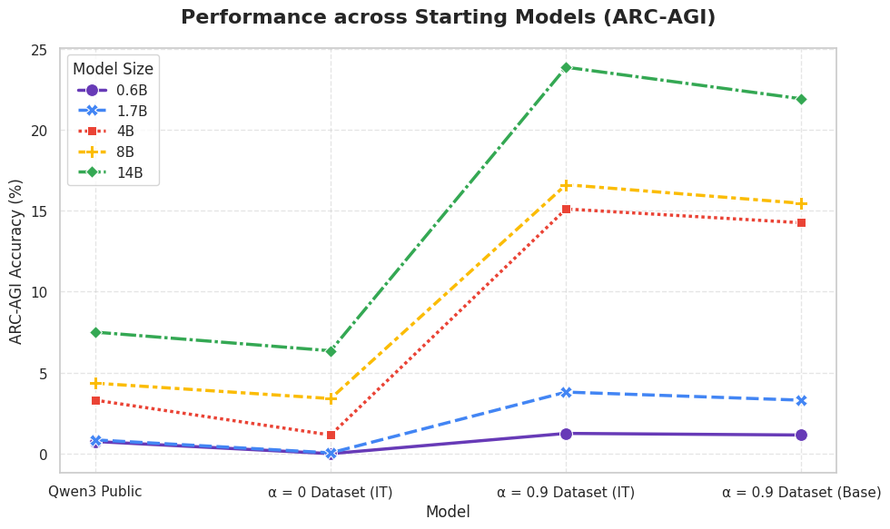 
      <b>(e)</b> ARC-AGI
    </td>
    <td align="center" width="50%">
      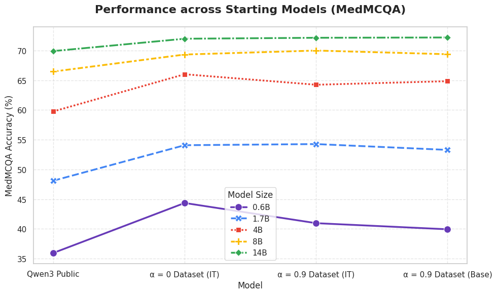 
      <b>(f)</b> MedMCQA
    </td>
  </tr>
</table>
<figcaption align="left">
<b>Figure 5: Performance across Starting Models.</b> <i>A comparison across (a) Math, (b) Science, (c) Coding, (d) IFEval, (e) ARC-AGI and (f) MedMCQA benchmarks showing how different starting models impact forgetting and performance on the target metric. Qwen 3 Public is the public instruction tuned Qwen3 model, &alpha;=0 (IT) and &alpha;=0.9 (IT) are the public ITed Qwen3 model trained only with the target dataset and the &alpha;=0.9 mixed dataset. &alpha;=0.9 (Base) is the base Qwen3 model trained on a 90% VTC dataset and 10% target dataset mix.</i>
</figcaption>

</figure>

In [Figure 5](#fig5_starting_models), among the non-target metrics other than science we see a common trend that starting with the IT model and using only the target dataset ($$\alpha = 0$$) shows severe forgetting. The base model and the ITed model trained using the $$\alpha = 0.9$$ mix match or surpass the performance of the public model. This shows that starting with an ITed model while better than starting with the base model is still not a solution to forgetting. This also shows the high quality of our dataset that it can provide further gains on the public ITed model.

Science domain metrics show different trends based on the model size. The advantage of data mixing is much more apparent in 0.6B and 1.7B models. Overall though there are no disadvantages to mixing across all model sizes. The IT model demonstrating significant forgetting is a clear indication that cross domain characteristics of our target dataset are not enough to mitigate forgetting on its own.

The performance of the target metric, MedMCQA, shows no additional gain when we train using only the target dataset except for the 0.6B model, whether the starting model is a base model or the IT model. For all model sizes other than the 0.6B model we also see that the $$\alpha = 0.9$$ mix trained model does not lose any meaningful performance compared to the target dataset only trained models. All the models trained using the target dataset clearly improve on the public model.

#### Key Observations

The comparison of different starting models shows us:

- Using the ITed model as the starting model is better than the Base model.
- The IT model also shows catastrophic forgetting and loses performance on non target metrics.
- The $$\alpha = 0.9$$ mix avoids forgetting even with the ITed starting model showing its robustness.

## Acknowledgements

We would like to express our sincere gratitude to the NVIDIA NeMo RL team–specifically Terry Kong– for their invaluable support throughout this project.

We would also like to express our gratitude to our VTC teammates: Mohammadreza Mohseni, Weiran Zhao, Fei Xia, Youbao Tang, Xuehan Xiong, Joseph Pagadora, Jiuqiang Tang, Bo Wu, Lav Rai, and Minwoo Park for developing the underlying datasets, providing infrastructure support, feedback, and insightful discussions throughout the project. We also thank Ting Yu, Shengyang Dai, Peng Xu, and Saurabh Tiwary for their leadership and support.

## References

[1] McCloskey, Michael, and Neal J. Cohen. "Catastrophic interference in connectionist networks: The sequential learning problem." Psychology of learning and motivation. Vol. 24. Academic Press, 1989. 109-165.

[2] Google Cloud. "Model Distillation Best Practices." Vertex AI Training Cluster Samples. Google, 2026. https://googlecloudplatform.github.io/vertex-ai-samples/vertex-training-cluster/model_distillation_best_practices.