# Model Distillation Best Practices

**Authors:** [Xuehan Xiong](mailto:xxman@google.com), [Youbao Tang](mailto:tangyoubao@google.com), [Fei Xia](mailto:feixia@google.com), [Bao Thach](mailto:baothach@google.com), [Joseph Pagadora](mailto:jcpagadora@google.com)

## Table of Contents

* [Intro](#intro)
* [Background](#background)
* [Dataset Curation](#dataset-curation)
    * [Non-Agentic Tasks](#non-agentic-tasks)
    * [Agentic Task (Tool Utilization)](#agentic-task-tool-utilization)
* [Model Distillation Experiments](#model-distillation-experiments)
    * [Experimental Setup](#experimental-setup)
    * [Choosing Teacher Models](#choosing-teacher-models)
    * [Number of Rollouts per Prompt](#number-of-rollouts-per-prompt)
    * [Rejection Sampling](#rejection-sampling)
* [Distillation Scaling Laws](#distillation-scaling-laws)
    * [Scaling learning rates based on global batch size](#scaling-learning-rates-based-on-global-batch-size)
    * [Scaling learning rates based on model parameters](#scaling-learning-rates-based-on-model-parameters)
    * [Scaling learning rates based on token budget](#scaling-learning-rates-based-on-token-budget)
* [Key Takeaways](#key-takeaways)
* [Acknowledgements](#acknowledgements)
* [Appendix](./appendix.md#appendix)

## Intro

Welcome to the inaugural installment of our blog series dedicated to model training best practices for Vertex AI Training Cluster (VTC) customers. In this article, we examine model distillation—a popular cost-effective methodology for optimizing student models by leveraging the intelligence of high-capacity teacher models. Two primary distillation schemes are typically employed: **on-policy** and **off-policy distillation**. In an on-policy setting, the student model generates its own reasoning traces during training, which are then evaluated or corrected by a teacher model in real-time. While effective, this approach is computationally intensive and requires constant active inference from the teacher.

This blog focuses on **off-policy distillation**, a more resource-efficient methodology where the student is trained on a high-quality, static dataset of reasoning traces previously generated by the teacher. By decoupling the teacher's generation phase from the student's training phase, we can leverage massive teacher models like the [Qwen3-235B](https://huggingface.co/Qwen/Qwen3-235B-A22B-Thinking-2507) or [GLM-4.7 355B](https://huggingface.co/zai-org/GLM-4.7-FP8) to curate "gold-standard" trajectories that the student then learns to emulate through supervised fine-tuning. This approach allows [Vertex AI Training Cluster](https://docs.cloud.google.com/vertex-ai/docs/training/training-clusters/overview) (VTC) customers to achieve frontier-level reasoning performance without the overhead of maintaining two models in memory simultaneously.

<figure align="center" id="fig-teaser">

<table align="center" width="90%">
  <tr>
    <td align="center" width="50%">
      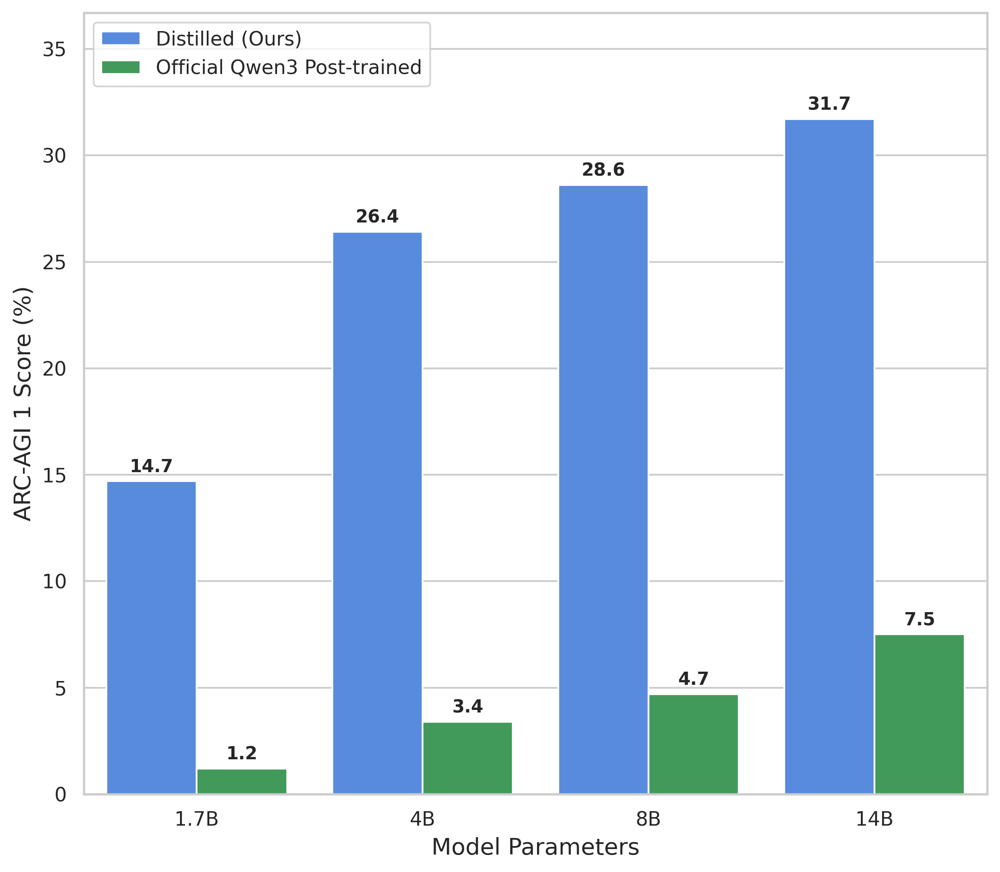 
      <b>(a)</b> ARC-AGI 1
    </td>
    <td align="center" width="50%">
      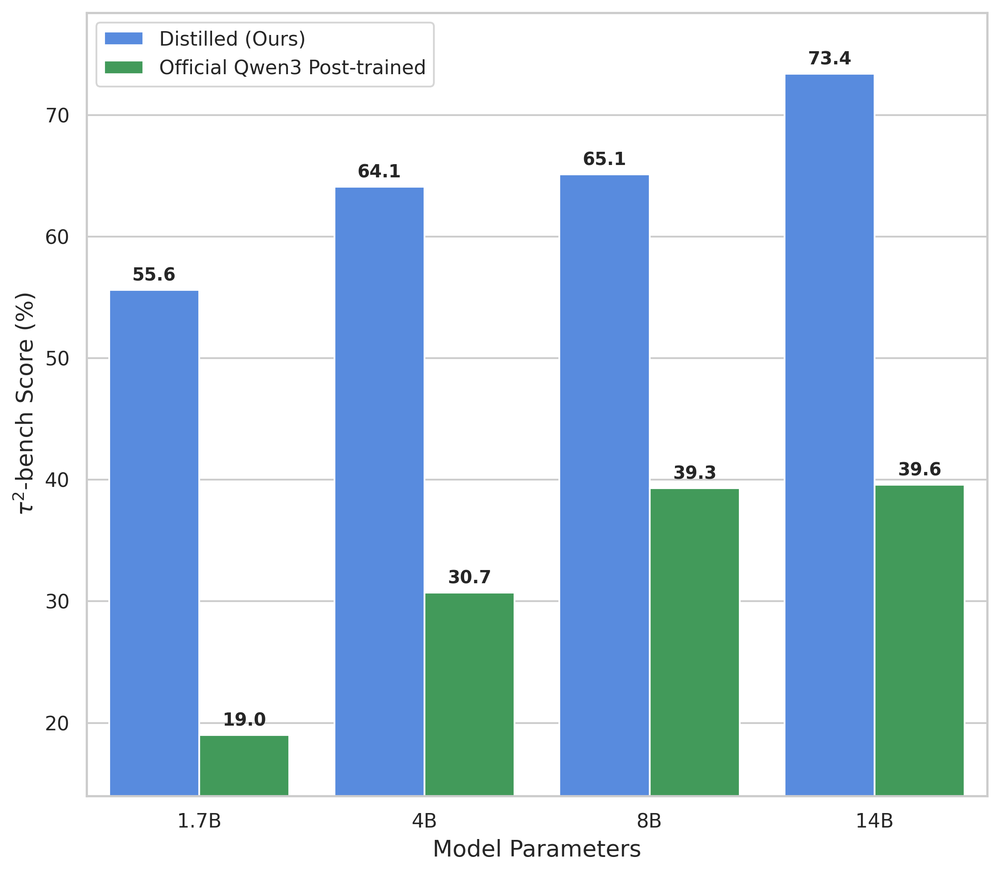 
      <b>(b)</b> &tau;2-bench
    </td>
  </tr>
</table>
<figcaption align="left">
<b>Figure 1: Distilled Student Model Performance on Novel Domains.</b> <i>Comparison of student models fine-tuned via off-policy distillation versus official Qwen3 post-trained models of equivalent scale, showing significant performance gains on ARC-AGI 1 and &tau;2-bench.</i>
</figcaption>

</figure>

We provide a rigorous, step-by-step framework for reproducing the advanced reasoning capabilities of the Qwen3 open-weight thinking model family, beginning from their base pre-trained checkpoints. Furthermore, we demonstrate how this same distillation pipeline can be applied to novel domains, such as [ARC-AGI 1](https://arcprize.org/arc-agi/1/) and [$\tau^2$-bench](https://github.com/sierra-research/tau2-bench), to develop student models that surpass the performance of official Qwen3 variants of equivalent scale (See [Figure 1](#fig-teaser)). The Qwen3 family was specifically chosen for this study because its diverse range of parameter counts and the availability of both pre-trained and post-trained checkpoints provide an ideal environment for high-fidelity scaling analysis.

To ensure the broad applicability of our findings, we conducted rigorous evaluations across four distinct task domains: competitive mathematics, instruction following, complex puzzle-solving, and tool utilization. We further validated these results across four model scales—1.7B, 4B, 8B, and 14B parameters—to demonstrate that our methodology remains consistent as model complexity increases.

To support our VTC community in accelerating their own development, all code, datasets, and experiment configurations used in this blog are being made available for use in your training workloads.

## Background

To establish a mathematical foundation for our experiments, we first delineate the key differences between the two predominant strategies in model distillation: off-policy distillation and on-policy distillation.

In off-policy distillation for an LLM, we assume:

* $z \sim P(Z)$: prompts drawn from some prompt distribution
* $x \sim P(X|z)$: responses generated by the teacher distribution conditioned on prompt $z$
* $Q(X|z)$: student distribution we want to train

The standard off-policy distillation objective minimizes the KL divergence from the student to the teacher:

$$\begin{align*}  
& \min_Q \mathbb{E}_{Z} \left[\mathbb{E}_{X|Z}\left[\log \frac{P(X|Z)}{Q(X|Z)}\right]\right] \\  
&= \min_Q \sum_{z} P(z) \sum_{x}P(x|z) \log\frac{P(x|z)}{Q(x|z)}  
\end{align*}  $$

Since the teacher distribution ($P$) is fixed, minimizing KL is equivalent to:

$$\begin{align*}  
& \max_Q \mathbb{E}_{Z}\left[\mathbb{E}_{X|Z}\left[\log Q(X|Z)\right]\right] \\  
&= \max_Q \sum_{z} P(z) \sum_{x}P(x|z) \log Q(x|z)  
\end{align*}  $$

Given a dataset of prompts and teacher-generated responses:

$$\begin{align*}  
\{z_i\}_{i=1}^M \quad & \text{where} \quad z_i \sim P(Z) \\  
\{x_{ij}\}_{i,j=1}^{M,N} \quad & \text{where} \quad x_{ij} \sim P(X | z_i)  
\end{align*}  $$

the empirical loss by Monte Carlo sampling becomes:

$$L_{\text{distill}}(Q) \approx -\frac{1}{MN}\sum_{i=1}^M\sum_{j=1}^N \log Q(x_{ij} | z_i).  $$

This is simply maximum likelihood estimation for $Q$ on teacher responses, which shares the same objective as Supervised Fine-tuning (SFT).

In on-policy distillation, responses are sampled from the student:

$$z \sim P(Z), \quad x \sim Q(X | z)  $$

The teacher is only used to evaluate those student samples, so expectations are taken under $Q$, not $P$.

The natural objective is:

$$\min_Q \mathbb{E}_{Z} \left[\mathrm{KL}\big(Q(X|Z)||P(X|Z)\big) \right]  $$

This objective defines the **reverse KL divergence**, which is characterized by its mode-seeking behavior. In this regime, the student model tends to concentrate its probability mass on the primary modes of the teacher distribution. This stands in contrast to the forward KL divergence used in off-policy distillation, which exhibits mean-seeking or mass-covering behavior, forcing the student to cover the entire support of the teacher’s distribution. Forward KL forces the student to allocate probability mass to *all* teacher modes, even those it cannot represent well. Under capacity constraints, this mass-covering approach produces a compromise distribution that can underperform a smaller, sharper target. This provides the intuition for our empirical results on Capacity Matching (Section [Choosing Teacher Models](#choosing-teacher-models)), where a same-sized teacher model proved most effective in some tasks.

## Dataset Curation

To facilitate the distillation of frontier-level reasoning, we established a high-fidelity data curation pipeline tailored to our four primary task domains: competitive mathematics, instruction following, reasoning/pattern recognition, and agentic tool utilization.

### Non-Agentic Tasks

#### Math

We selected [OpenR1-Math](https://huggingface.co/datasets/open-r1/OpenR1-Math-220k) as our primary prompt source and implemented a multi-stage filtering pipeline to ensure the highest data fidelity:

1. **Verification filtering**: To ensure objective evaluation, we retained only "math-word-problem" types, discarding Multiple Choice Questions (MCQ) and proofs. MCQs were specifically excluded to mitigate the risk of the model arriving at a correct answer (25% baseline probability) through flawed reasoning chains.
2. **Near-duplicate removal**: We employed Locality-Sensitive Hashing (LSH) to identify and prune near-identical prompts within the training set and across our evaluation benchmarks, preventing data contamination and overfitting.
3. **Instructional sanitization**: We identified and removed hundreds of prompts containing extraneous translation instructions. This step ensures the student model remains focused on the mathematical reasoning task rather than defaulting to secondary objectives.
4. **Solution leakage prevention**: To enforce authentic problem-solving, we stripped prompts containing pre-existing solutions, which would otherwise provide the teacher model with an "open-book" advantage and degrade the quality of the distilled reasoning traces.

This rigorous curation process successfully refined the initial pool of 93,733 candidates into a high-quality dataset of 75,726 prompts.

#### Instruction Following

We selected the default partition of the [ifeval-like-data](https://huggingface.co/datasets/argilla/ifeval-like-data) dataset, comprising 550,000 unfiltered synthetic rows. To ensure data integrity, we applied a multi-stage refinement pipeline:

1. **Invalid sample pruning**: We discarded rows with missing language codes or malformed JSON within the "kwargs" field to maintain structural consistency.
2. **Conflict resolution**: We identified and removed pairs of mutually exclusive instructions that cannot be reliably evaluated together, utilizing a predefined mapping of instruction conflicts (`IFEVAL_INSTRUCTION_CONFLICTS`).
3. **Adherence verification**: Each teacher-generated response was rigorously assessed using the [lm_eval](https://github.com/EleutherAI/lm-evaluation-harness) library. Prompts that failed to meet their defined constraints were excluded.
4. **Strict accuracy filtering**: As a final quality gate, we retained only those samples where the response achieved "strict accuracy" at the prompt level, ensuring the student model learns from perfect examples of instruction following.
5. **LSH-based deduplication**: We utilized LSH to prune near-duplicate prompts within the training set and across the official IFEval benchmark to prevent contamination.

This pipeline successfully distilled the initial pool into 70,373 high-fidelity samples for our instruction-following training set.

#### Reasoning/Pattern Recognition

The [re-arc](https://github.com/michaelhodel/re-arc?tab=readme-ov-file) repository provides a way to programmatically synthesize [ARC-AGI-1](https://arcprize.org/arc-agi/1/) data. For each of the 400 training examples in the official ARC-AGI-1 dataset, re-arc provides a generator function to create similar puzzles following the same pattern (See [Figure 2](#fig-rearc-example) for one example). In total, we have generated 7926 puzzles for our experiments where we reserve 256 samples for validation and the rest for training.

<figure align="center" id=fig-rearc-example>

<table align="center" width="80%">
  <tr>
    <td align="center" width="100%">
      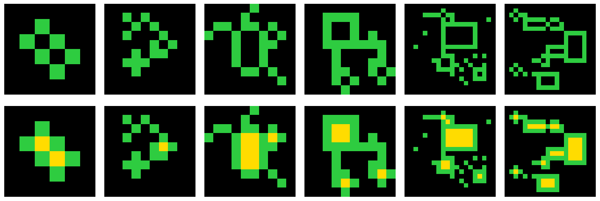 
      <b>(a)</b> ARC-AGI original puzzles
    </td>
  </tr>
  <tr>
    <td align="center" width="510%">
      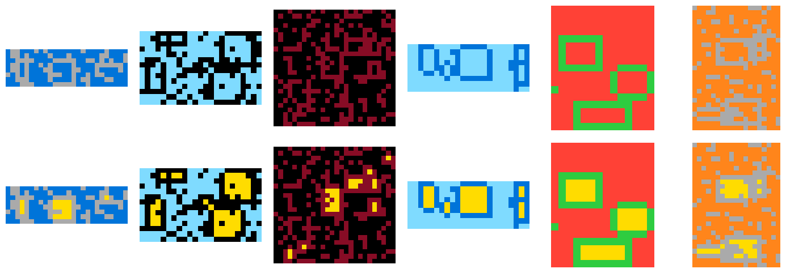 
      <b>(d)</b> Generated puzzles using re-arc
    </td>
  </tr>
</table>
<figcaption align="left">
<b>Figure 2:</b> <i>Example of ARC-AGI 1 puzzle synthesis using the re-arc repository, showing an original training example and a generated similar puzzle following the same pattern.</i>
</figcaption>

</figure>

#### Response Generation

Following prompt collection, we utilize a "thinking" teacher model to generate reasoning traces. To maintain a lean data pipeline, we store only the sampled tokens; given our ~150K vocabulary size, persisting full logits or log-probabilities would create prohibitive storage overhead. This approach is statistically grounded: as the number of samples increases, it provides an unbiased estimate of the KL divergence from the student model to the teacher model.

To maximize response diversity, we set both `Temperature` and `Top-P` to 1.0 during sampling. Finally, we prune any responses truncated by the maximum sequence length, as these instances frequently exhibit repetitive patterns that could degrade the student model’s performance.

### Agentic Task (Tool Utilization)

We utilized a specialized two-stage generation framework to synthesize high-complexity tool-use data for distillation training, leveraging sandboxed execution environments.

1. **Task Generation**: This initial phase analyzes a target agent's specific tool list to propose a variety of diverse, high-level topics. For each identified topic, the system synthesizes a comprehensive user scenario that includes the initial environment status, the necessary database state, and precise evaluation criteria required for verification.
2. **Trajectory Generation and Verification**: A verified $\tau^2$-bench sandbox is employed to execute each generated task several times in parallel, capturing a wide variety of trajectories. These execution outputs—comprising model responses, tool invocations, and subsequent state modifications—undergo a rigorous verification process. By applying deterministic checks such as action matching, database state differentials, and natural language assertions, the pipeline calculates the reward for every trajectory produced.

Once trajectories are verified, they are carefully remapped into final training configurations to maximize learning efficiency. For distillation, the complete reasoning trace is captured and enclosed within required `<think>` tags, ensuring architectural consistency for the thinking model. A sample task and trajectory are provided in the [Appendix: $\tau^2$-bench Synthetic Example](./appendix.md#-bench-synthetic-example).

## Model Distillation Experiments

### Experimental Setup

#### Evaluation
Our evaluation benchmarks and metrics are detailed in [Table 1](#tab-eval-setup) and the prompts can be found in the [Appendix: Prompts Used in Evaluation](./appendix.md#prompts-used-in-evaluation). To ensure statistical reliability on smaller datasets, we report metrics averaged over multiple independent runs to mitigate variance. For the Mathematics domain, we utilize the average score across six core benchmarks as our primary performance indicator, while granular results for individual benchmarks are provided in the [Appendix: Individual Math Benchmark Results](./appendix.md#individual-math-benchmark-results). For $\tau^2$-bench, we use GLM-4.7-FP8 as the user LLM and report the average score across three domains, “Telecom”, “Retail”, and “Airline”. To maintain a consistent comparison, both our distilled student models and the official Qwen3 thinking models were evaluated using standardized sampling parameters—`Temperature=0.6`, `Top-P=0.95`, and `Top-K=20`—aligning with the recommended [best practice](https://huggingface.co/Qwen/Qwen3-14B#best-practices) from the official Qwen3 model card.

<table id="tab-eval-setup" style="margin-left:auto; margin-right:auto;">
  <thead>
    <tr>
      <th>Capabilities</th>
      <th>Benchmarks</th>
      <th># Test Samples</th>
      <th>Eval Metrics</th>
    </tr>
  </thead>
  <tbody>
    <tr>
      <td rowspan="6">Math</td>
      <td>AIME 24</td>
      <td>30</td>
      <td>pass@1 (average of 16)</td>
    </tr>
    <tr>
      <td>AIME 25</td>
      <td>30</td>
      <td>pass@1 (average of 16)</td>
    </tr>
    <tr>
      <td>BeyondAIME</td>
      <td>100</td>
      <td>pass@1 (average of 5)</td>
    </tr>
    <tr>
      <td>HMMT 25</td>
      <td>30</td>
      <td>pass@1 (average of 16)</td>
    </tr>
    <tr>
      <td>BRUMO 25</td>
      <td>30</td>
      <td>pass@1 (average of 16)</td>
    </tr>
    <tr>
      <td>CMIMC 25</td>
      <td>40</td>
      <td>pass@1 (average of 16)</td>
    </tr>
    <tr>
      <td>Instruction Following</td>
      <td>IFEval</td>
      <td>541</td>
      <td>pass@1 (Strict Accuracy)</td>
    </tr>
    <tr>
      <td>Reasoning</td>
      <td>ARC-AGI 1</td>
      <td>400</td>
      <td>pass@1 (average of 5)</td>
    </tr>
    <tr>
      <td>Tool use</td>
      <td>&tau;2-bench</td>
      <td>278</td>
      <td>pass@1 (average of 4)</td>
    </tr>
  </tbody>
  <caption style="text-align: left;"><b>Table 1:</b> Comprehensive overview of task domains, evaluation benchmarks, and associated performance metrics.</caption>
</table>

#### Training

**Vertex AI Training Cluster**

To orchestrate the computational demands of our experiments, we utilized the [Vertex AI Training Cluster (VTC)](https://docs.cloud.google.com/vertex-ai/docs/training/training-clusters/overview). VTC is a managed Google Cloud service designed to simplify and accelerate large-scale AI workloads. It provides a familiar, open-source Slurm user experience that enables optimized GPU scheduling, automated fault tolerance, and high hardware resiliency, which drastically reduces the time from cluster setup to production training.

Our training infrastructure leverages VTC's high-performance [compute resources](https://docs.cloud.google.com/vertex-ai/docs/training/training-clusters/compute-resources), specifically utilizing A3-Mega, A3-Ultra, and A4 GPU platforms. To handle the communication overhead of distributed training, node connectivity is highly optimized for each hardware generation:

* A3-Mega clusters utilize [GPUDirect-TCPXO](https://docs.cloud.google.com/compute/docs/gpus/gpudirect) for low-latency host-bypass networking
* A3-Ultra and A4 clusters leverage [RoCE v2 (RDMA over Converged Ethernet)](https://cloud.google.com/blog/products/networking/rdma-rocev2-for-ai-workloads-on-google-cloud).

By leveraging network topologies specifically optimized for training on large clusters of GPUs, this environment provides the high throughput and scaling efficiency necessary to reliably train and finetune frontier-level models.

**Training Framework and Hyperparameters**

We utilize NVIDIA [NeMo RL](https://github.com/NVIDIA-NeMo/RL) as the primary training framework, leveraging a Megatron backend for distributed scaling. We implement the $\tau^2$-bench sandbox environment inside NVIDIA [Nemo Gym](https://github.com/NVIDIA-NeMo/Gym), which provides a seamless integration with the Nemo RL library.

Models are initialized from a Qwen3 Base checkpoint and fine-tuned with a 32,768 context window on curated datasets. Optimization is handled via AdamW ($\beta_1=0.9$, $\beta_2=0.95$, weight decay=0.1) using a linear warmup and cosine decay schedule. To manage computational load, we employ tensor parallelism (2-way for 1.7B–8B models; 4-way for 14B) alongside sequence parallelism, activation checkpointing, and ZeRO-2. For further reading on parallelization strategies, see this [ultrascale playbook](https://huggingface.co/spaces/nanotron/ultrascale-playbook). All training is conducted using BF16 mixed precision.

### Choosing Teacher Models

A critical decision in the distillation pipeline is the selection of an appropriate teacher model for a given task domain. While conventional wisdom often suggests that "bigger is better," our empirical results across four benchmarks (illustrated in [Figure 3](#fig-teacher-student-matrix)) reveal a more nuanced landscape. Specifically, on well-defined reasoning tasks like Mathematics and IFEval, capacity-matched (same-sized) teachers frequently outperform their larger counterparts. Conversely, on novel or highly complex domains like ARC-AGI and $\tau^2$-bench, massive teacher models remain the superior choice. Below, we provide a formal derivation to explain this capacity-matching phenomenon and the trade-offs between approximation bias and teacher error.

<figure align="center" id="fig-teacher-student-matrix">

<table align="center" width="100%">
  <tr>
    <td align="center" width="50%">
      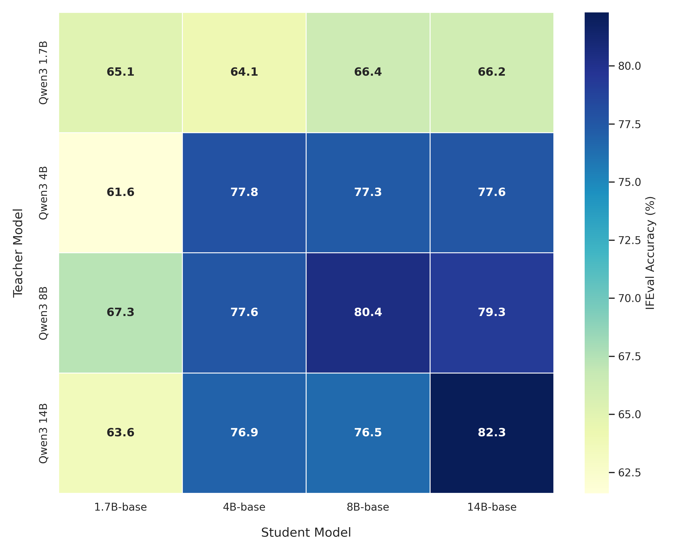 
      <b>(a)</b> IFEval
    </td>
    <td align="center" width="50%">
      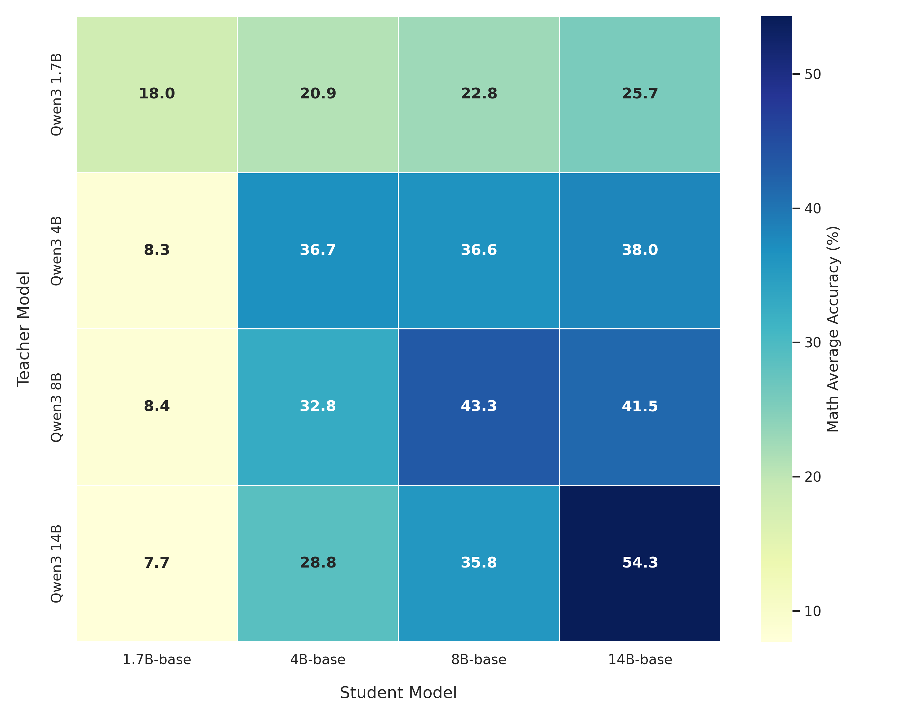 
      <b>(b)</b> Math Average
    </td>
  </tr>
  <tr>
    <td align="center" width="50%">
      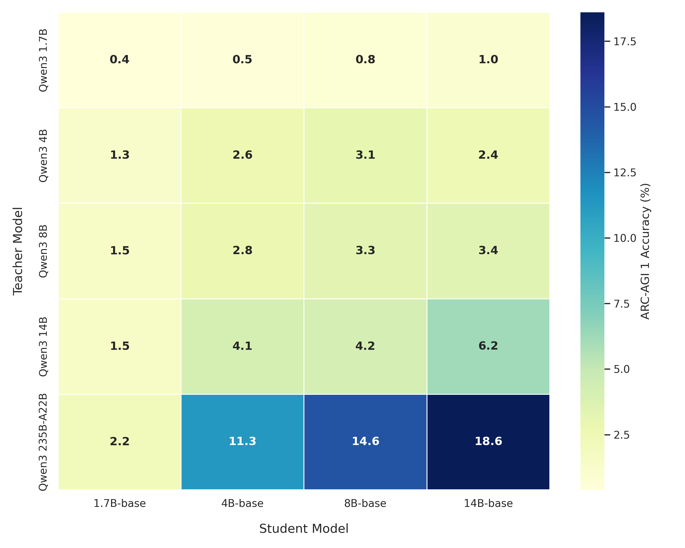 
      <b>(c)</b> ARC-AGI 1
    </td>
    <td align="center" width="50%">
      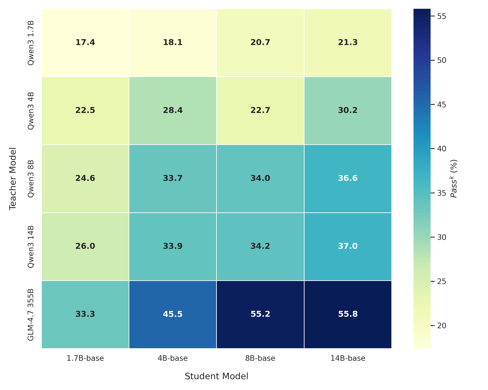 
      <b>(d)</b> &tau;2-bench
    </td>
  </tr>
</table>
<figcaption align="left">
<b>Figure 3: Teacher-Student Distillation Performance Matrices.</b> <i>A comparison of distillation outcomes across (a) IFEval, (b) Math, (c) ARC-AGI 1, and (d) &tau;2-bench benchmarks. The color intensity represents accuracy (%).</i>
</figcaption>

</figure>

Let $Q$ and $P$ denote the student and teacher distribution, and the student model class (e.g., all 8B models following the same architecture) is $\mathbf{Q}_{8B}$.

**Optimal teacher model in theory**

Suppose the student is an 8B model. The best teacher model is the optimal 8B model $Q^*$ where $Q^* \in \mathbf{Q}_{8B}$ for this task because if we have infinite data and perfect optimization, distillation can recover this optimal model exactly.

**Why a larger teacher can still help**

Now suppose the teacher is a larger model ($P_L$). The student solves

$$Q^* = \text{argmin}_{Q\in\mathbf{Q}_{8B}} \mathrm{KL}(P_L|Q)$$

This is the best 8B approximation of the larger teacher. Two competing effects appear:

1. **Approximation bias**

   Because the student is capacity-limited,

   $$\inf_{Q \in \mathbf{Q}_{8B}} \mathrm{KL}(P_L|Q) > 0$$

   So distillation from a very rich teacher may force the student to approximate a distribution it cannot represent well. This is the "mean-seeking / mass-covering" mentioned in the [Background](#background) section.

2. **Teacher suboptimality**

   In practice we rarely have $Q^*$, the true optimal 8B model. Instead we have a trained 8B model $\hat{Q}$, which contains optimization error and data error. A larger teacher ($P_L$) may actually be closer to the true distribution ($P^*$).
   If

   $$\mathrm{KL}(P^*|P_L) < \mathrm{KL}(P^*|\hat{Q})$$

   then projecting ($P_L$) onto the 8B class can produce a better 8B model than the original 8B model.

When an 8B student uses an 8B teacher, the projection error is inherently small due to matched capacity. However, if that 8B teacher is poorly optimized (e.g., on benchmarks like ARC-AGI and $\tau^2$-bench), its high **Teacher Error** dominates. Conversely, a massive model like Qwen3-235B or GLM 4.7, even if it has a higher **Projection Error** due to the size difference, can significantly lower the **Teacher Error** because it holds a more accurate approximation of the true distribution.

### Number of Rollouts per Prompt

We employ Monte Carlo sampling to approximate KL divergence, where expanding either the prompt set or the number of rollouts per prompt serves to reduce the variance of the estimate. However, high-fidelity prompts are often a finite resource—particularly in the Mathematics domain, which is constrained by the historical volume of competitive math problems. To compensate, we increase the number of teacher rollouts per prompt. This approach captures the teacher model’s **inherent uncertainty and multi-modal behavior** (e.g., discovering multiple valid reasoning paths to the same solution), enabling the student to map the full probability landscape rather than converging on a single, isolated trajectory.

<figure align="center" id="performance_vs_rollouts">

<table align="center" width="100%">
  <tr>
    <td align="center" width="50%">
      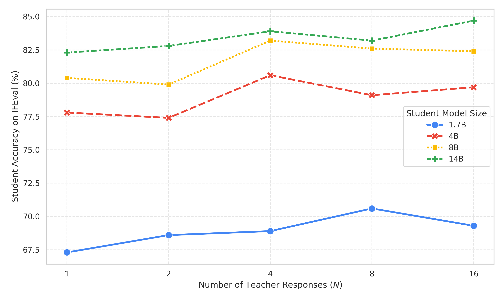 
      <b>(a)</b> IFEval
    </td>
    <td align="center" width="50%">
      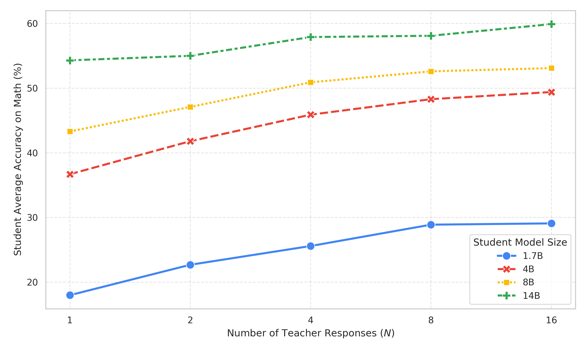 
      <b>(b)</b> Math Average
    </td>
  </tr>
  <tr>
    <td align="center" width="50%">
      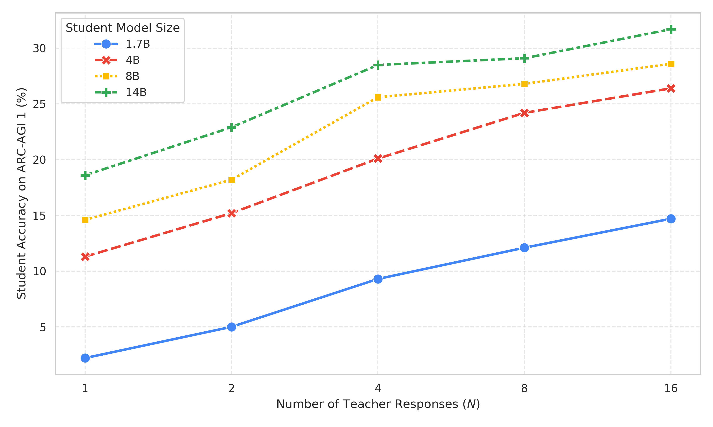 
      <b>(c)</b> ARC-AGI 1
    </td>
    <td align="center" width="50%">
      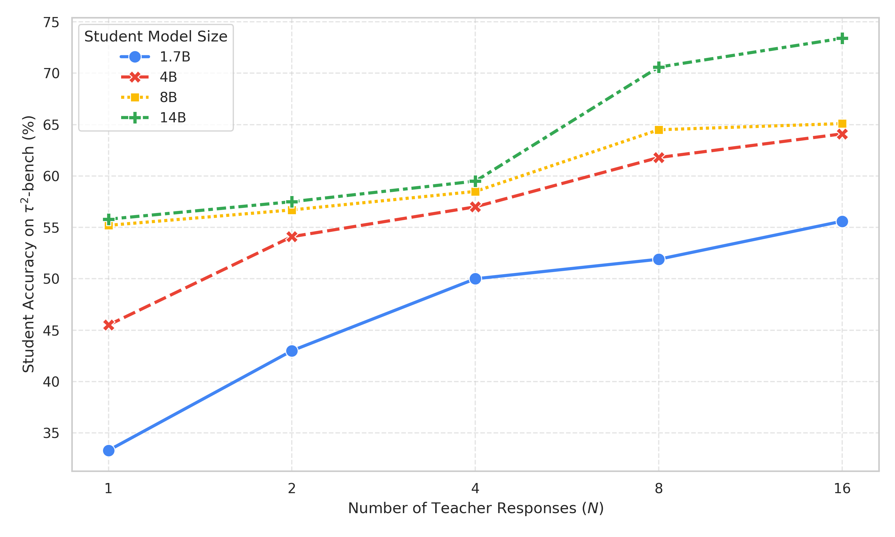 
      <b>(d)</b> &tau;2-bench
    </td>
  </tr>
</table>
<figcaption align="left">
<b>Figure 4: Performance vs. Number of Rollouts.</b> <i>A comparison across (a) IFEval, (b) Math, (c) ARC-AGI, and (d) &tau;2-bench benchmarks showing how performance scales as the number of teacher rollouts per prompt increases from 1 to 16.</i>
</figcaption>

</figure>

[Figure 4](#performance_vs_rollouts) demonstrates that performance on the Math, ARC-AGI 1, and &tau;2-bench domains monotonically increases as the number of rollouts increases, while IFEval performance saturates at 8 rollouts.

### Rejection Sampling

This section explores whether rejection sampling on teacher responses—specifically, pruning trajectories that yield incorrect answers—enhances distillation performance. Formally, this approach **minimizes the KL divergence** against a **reweighted teacher distribution**, where incorrect paths are zero-weighted and valid paths are renormalized. [Figure 5](#fig_rejection_sampling) evaluates three strategies: utilizing the full response set, randomly subsampling to match the count of correct responses, and isolating correct responses only. Detailed acceptance rates for these task-teacher pairings are cataloged in [Table 2](./appendix.md#acceptance-rates-for-rejection-sampling) within the Appendix.

<figure align="center" id="fig_rejection_sampling">

<table align="center" width="100%">
  <tr>
    <td align="center" width="50%">
      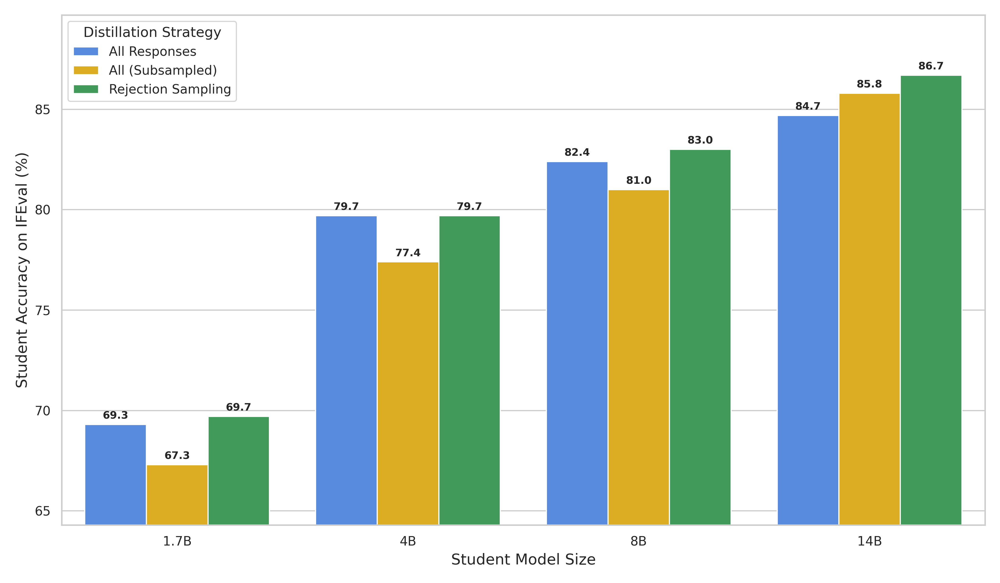 
      <b>(a)</b> IFEval
    </td>
    <td align="center" width="50%">
      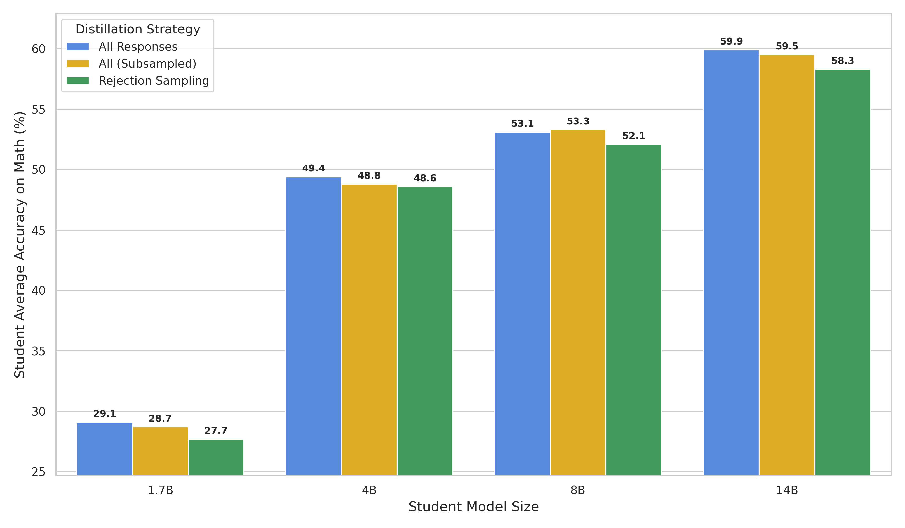 
      <b>(b)</b> Math Average
    </td>
  </tr>
  <tr>
    <td align="center" width="50%">
      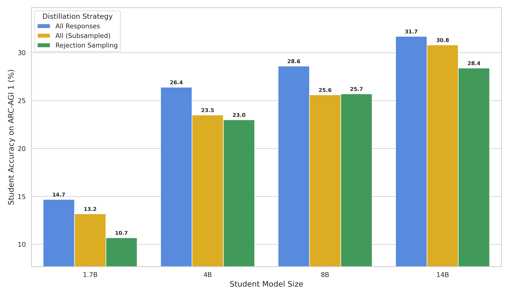 
      <b>(c)</b> ARC-AGI 1
    </td>
    <td align="center" width="50%">
      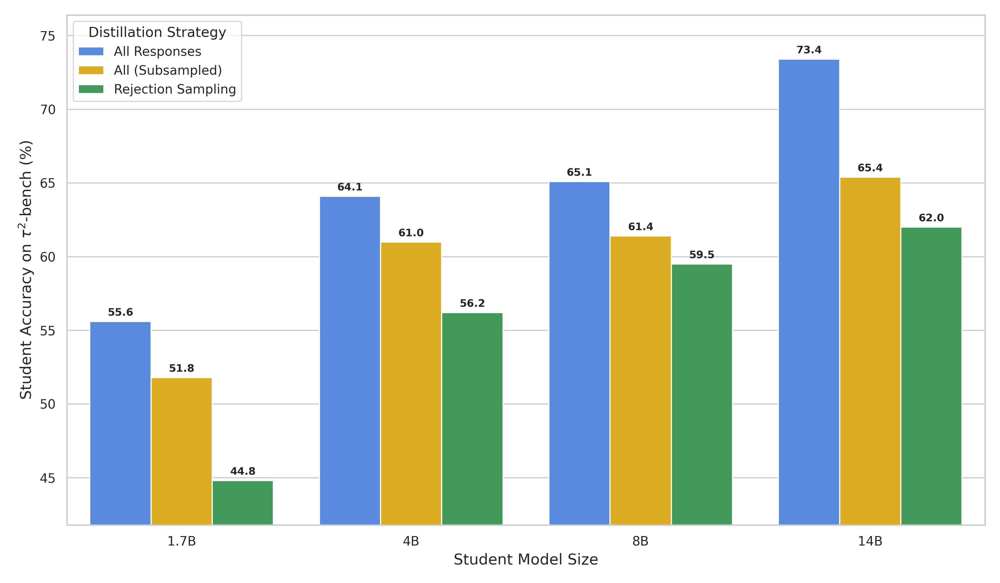 
      <b>(d)</b> &tau;2-bench
    </td>
  </tr>
</table>
<figcaption align="left">
<b>Figure 5: Performance with and without Rejection Sampling.</b> <i>A comparison across (a) IFEval, (b) Math, (c) ARC-AGI, and (d) &tau;2-bench benchmarks showing how distillation performance is impacted by the use of rejection sampling during data curation.</i>
</figcaption>

</figure>

For instruction following (IFEval), rejection sampling provides a significant performance uplift within the same-sample-count regime. Notably, at the 14B model scale, this technique improves the student model by 2 percentage points compared to training on the full response set, despite utilizing a smaller volume of data. Conversely, for the Mathematics, ARC-AGI 1, $\tau^2$-bench domains, rejection sampling does not yield performance gains, with the highest accuracy achieved by utilizing all available teacher responses. This suggests that while rejection sampling refines the training distribution, it may also inadvertently prune "near-miss" cases or highly challenging problems that are essential for developing robust reasoning capabilities in those specific domains. For synthetic datasets like $\tau^2$-bench, imperfections in automated evaluation criteria may also cause the rejection of trajectories that contain high-quality reasoning traces despite an incorrect final answer.

## Distillation Scaling Laws

In practice, development-phase experimentation rarely mirrors the scale of final model training. To accelerate iteration, developers often conduct ablation studies using reduced token budgets and smaller model architectures. To help bridge this gap, we have compiled several **key rules of thumb** for translating hyperparameters from these 'proxy' settings to your final, full-scale production runs. All scaling studies below are conducted using the [IFEval-like](#instruction-following) dataset.

### Scaling learning rates based on global batch size

To accelerate training throughput, the most direct lever is scaling GPU resources and increasing the **Global Batch Size (B)**. However, effective scaling requires more than just hardware; the learning rate ($\eta$) must be precisely adjusted in tandem with the batch size to maintain an optimal convergence trajectory.

<figure align="center" id="fig-lr-scale-gbs">
<table align="center" width="80%">
  <tr>
    <td align="center" width="100%">
      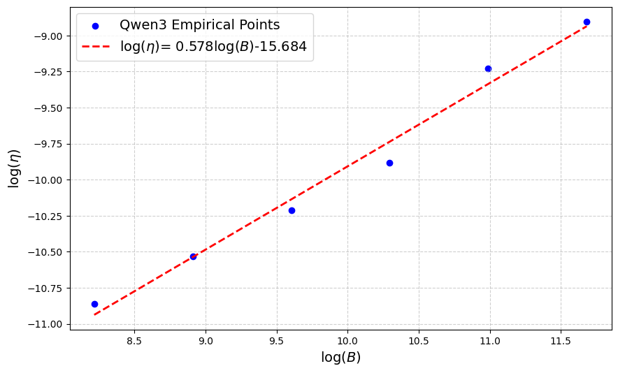 
    </td>
  </tr>
</table>
<figcaption align="left">
<b>Figure 6: Scaling of Optimal Learning Rate (&eta;) with Global Batch Size (B).</b> <i>Blue points represent empirical findings from Qwen3 training runs. The red dashed line shows a linear regression fit in log-log space, indicating a power-law relationship.</i>
</figcaption>
</figure>

To quantify this scaling relationship, we conducted a systematic hyperparameter sweep to identify the optimal learning rate across a broad spectrum of batch sizes. Analysis of these optimal pairings (illustrated in [Figure 6](#fig-lr-scale-gbs)) reveals a consistent logarithmic trend. Utilizing a least-squares fit, we derived a practical scaling law for production environments:

$$\log(\eta) = a \log(B) + b$$

For our specific configuration, we found $a = 0.578$ and $b = -15.684$. By exponentiating both sides, we can express the learning rate as a power function of the batch size:

$$\eta = B^a \cdot e^b$$

**The Scaling Factor:**
This relationship allows us to predict how the learning rate should change when the global batch size is scaled by a factor of $C$. If we define $\eta'$ as the new learning rate for a scaled batch size $(C \cdot B)$, the ratio of the new learning rate to the original is:

$$\frac{\eta'}{\eta} = \frac{(C \cdot B)^a \cdot e^b}{B^a \cdot e^b} = \left(\frac{C \cdot B}{B}\right)^a = C^a$$

**Practical Takeaway:**
This derivation provides a reliable heuristic for scaling your training runs on VTC. Essentially, when you scale your global batch size by $C$, you should scale your learning rate by $C^{0.578}$.

**Example:** If you double your global batch size ($C = 2$), your learning rate should increase by a factor of $2^{0.578} \approx 1.49$. This "1.5x rule" ensures that your model remains on the optimal convergence path even as you significantly increase compute throughput.

### Scaling learning rates based on model parameters

While scaling batch size helps with throughput, another fundamental factor influencing your learning rate is the scale of the model itself. As we transition from compact edge models to large-scale dense architectures, the optimal learning rate ($\eta$) shifts predictably.

<figure align="center" id="fig-lr-vs-val-loss">
<table align="center" width="80%">
  <tr>
    <td align="center" width="100%">
      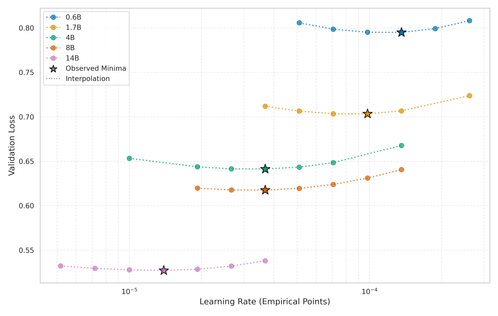 
    </td>
  </tr>
</table>
<figcaption align="left">
<b>Figure 7: Empirical Learning Rate Sweep across Model Scales.</b> <i>Validation loss is plotted against learning rate for five model sizes ranging from 0.6B to 14B parameters (embedding parameters are removed from the model size calculation). Stars indicate the observed minima for each configuration.</i>
</figcaption>
</figure>

To map this shift for the Qwen3 dense model family, we evaluated five distinct model scales: 0.6B, 1.7B, 4B, 8B, and 14B parameters. For each architecture, we performed a log-scale grid search to pinpoint the optimal learning rate (illustrated in [Figure 7](#fig-lr-vs-val-loss)). By applying a least-squares fit to these empirical data points, we established a power-law relationship between model parameters ($N$) and the learning rate ([Figure 8](#fig-lr-scale-model-size)):

$$\log(\eta) = -0.646 \log(N) + 4.133$$

**Scaling by Model Size:**
Following a similar derivation to our batch size analysis, this formula allows us to predict the necessary adjustment when increasing model capacity. If the number of model parameters ($N$) increases by a factor of $C$, the optimal learning rate should be scaled by $C^{-0.646}$.

**Practical Takeaway:**
This inverse relationship means that as your model grows larger, your learning rate must become more conservative to maintain stability.

**Example:** If you decide to double your model size ($C = 2$), the optimal learning rate should be multiplied by $2^{-0.646} \approx 0.639$.

<figure align="center" id="fig-lr-scale-model-size">
<table align="center" width="80%">
  <tr>
    <td align="center" width="100%">
      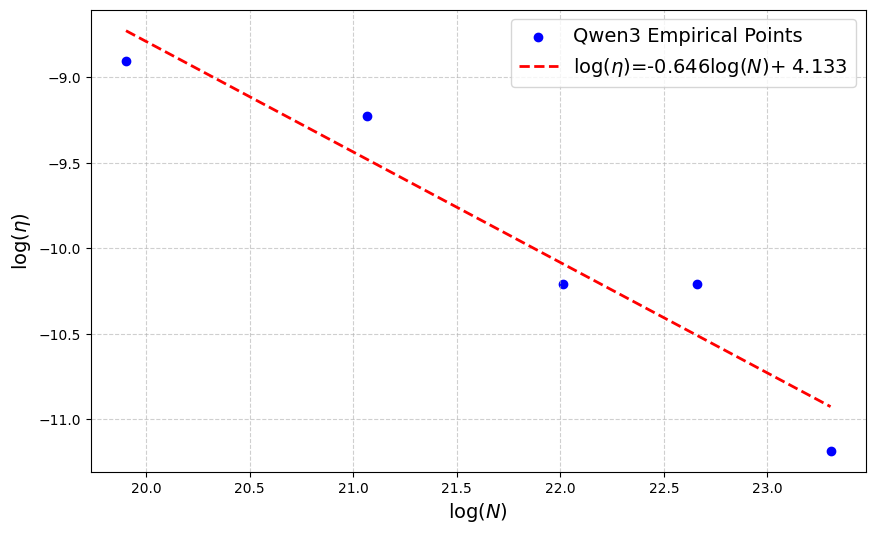 
    </td>
  </tr>
</table>
<figcaption align="left">
<b>Figure 8: Relationship between Optimal Learning Rate (&eta;) and Model Parameters (N).</b> <i>Empirical data points (blue) represent the best-performing learning rates across a parameter range of approximately **0.6B to 14B**. The red dashed line depicts the power-law scaling trend. The negative slope indicates that as parameter count increases, the learning rate must be scaled down according to a fixed ratio to maintain training efficiency.</i>
</figcaption>
</figure>

### Scaling learning rates based on token budget

This section examines the relationship between optimal learning rates and the total training token budget. In contrast to the power-law relationships observed in pre-training literature (e.g., the [Chinchilla scaling laws](https://arxiv.org/abs/2203.15556)), our empirical findings indicate that the optimal learning rate remains stable as the token budget increases (see [Figure 9](#fig-lr-vs-token-budget)). This divergence suggests that the hyperparameter dynamics of Supervised Fine-Tuning (SFT) differ from those of initial pre-training phases.

<figure align="center" id="fig-lr-vs-token-budget">
<table align="center" width="80%">
  <tr>
    <td align="center" width="100%">
      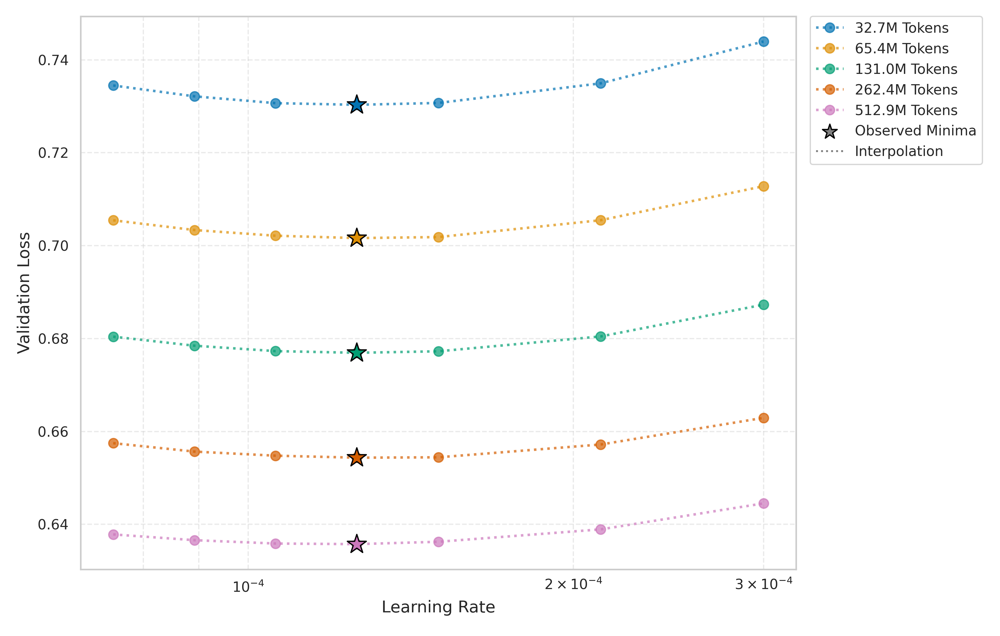 
    </td>
  </tr>
</table>
<figcaption align="left">
<b>Figure 9: Scaling of Optimal Learning Rate (&eta;) with Total Token Budget (T).</b> <i>Empirical data showing the relationship between the learning rate and the number of training tokens.</i>
</figcaption>
</figure>

**Practical Takeaway:**
Within an SFT framework, the optimal learning rate is largely invariant to changes in the training token budget, allowing for consistent hyperparameter application across varying dataset scales.

## Key Takeaways

Thanks for reading. We hope this distillation framework and these scaling insights help you achieve frontier-level performance for your own reasoning models on Vertex AI Training Cluster.

### Distillation Methodology & Teacher Selection

* **The "Capacity Matching" Nuance:** Bigger is not always better. For well-defined reasoning tasks (Mathematics and IFEval), **capacity-matched** (same-sized) teachers often outperform larger models. However, for novel or highly complex domains like ARC-AGI, massive teacher models remain superior.
* **Rollout Volume Matters:** Increasing the number of teacher rollouts per prompt captures the teacher’s inherent uncertainty and multiple valid reasoning paths. Performance generally increases with rollout count, though gains may saturate depending on the domain (e.g., IFEval saturates at 8 rollouts).
* **Rejection Sampling is Domain-Specific:** While rejection sampling (training only on correct answers) provides a significant uplift for **Instruction Following**, it does not yield gains in Mathematics, ARC-AGI, or $\tau^2$-bench. In complex reasoning domains, "near-miss" cases appear essential for building robustness.

### Distillation Scaling Laws

The blog establishes three critical "rules of thumb" for scaling Supervised Fine-Tuning (SFT) hyperparameters:

* **Batch Size Scaling:** When scaling the Global Batch Size ($B$) by a factor of $C$, the learning rate ($\eta$) should be scaled by $C^{0.578}$. For example, doubling the batch size suggests a **1.5x increase** in the learning rate.
* **Model Size Scaling:** As model parameters ($N$) increase, the learning rate must become more conservative. The optimal learning rate scales by $C^{-0.646}$ when the model size is increased by factor $C$.
* **Token Budget Stability:** Unlike initial pre-training, the optimal learning rate for SFT is **largely invariant** to the total training token budget, allowing for consistent application across different dataset scales.

## Acknowledgements

We would like to express our sincere gratitude to the NVIDIA NeMo RL team–specifically Terry Kong– as well as the NVIDIA NeMo Gym team–specifically Brian Yu and Chris Wing– for their invaluable support throughout this project.

We would also like to express our gratitude to our VTC teammates: Mohammadreza Mohseni, Mayank Sharan, Weiran Zhao, Jiuqiang Tang, Bo Wu, Lav Rai, and Minwoo Park for their infrastructure support, feedback, and insightful discussions throughout the project. We also thank Ting Yu, Shengyang Dai, Peng Xu, and Saurabh Tiwary for their leadership and support.