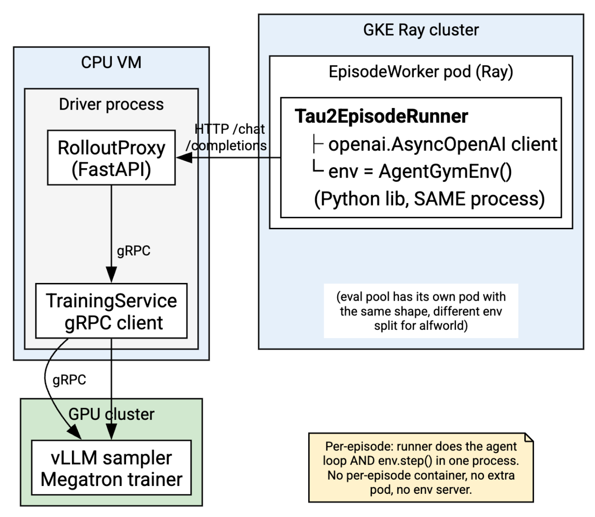
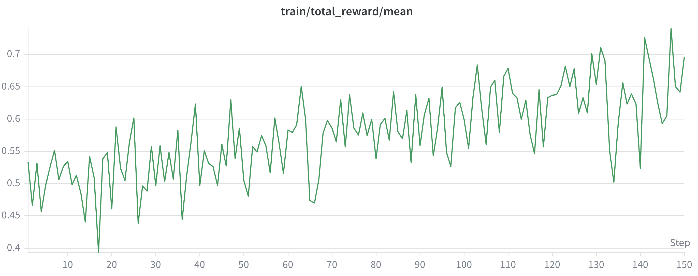

  

# Multi-Turn Reinforcement Learning for &tau;2-bench

**Authors:** [Fei Xia](mailto:feixia@google.com), [Genquan Duan](mailto:genquan@google.com), [Youbao Tang](mailto:tangyoubao@google.com), [Jingya Liu](mailto:leyajiu@google.com), [Jiuqiang Tang](mailto:jqtang@google.com), [Xuehan Xiong](mailto:xxman@google.com)

## Table of Contents

* [Intro](#intro)
* [Background](#background)
    * [Multi-Turn Tool-Calling Agents](#multi-turn-tool-calling-agents)
    * [GRPO](#grpo)
    * [&tau;2-bench](#2-bench)
* [Training Pipeline](#training-pipeline)
    * [Training Framework](#training-framework)
    * [User Simulator](#user-simulator)
    * [Training Data Synthesis](#training-data-synthesis)
* [Experiments](#experiments)
    * [Setup](#setup)
    * [Main Results](#main-results)
    * [Training Curves](#training-curves)
    * [Ablation Studies](#ablation-studies)
* [More Analysis](#more-analysis)
* [Key Takeaways](#key-takeaways)
* [Acknowledgements](#acknowledgements)

## Intro

This blog is the third installment of our blog series dedicated to model training best practices for Managed Training Cluster (MTC) customers. Building on the [off-policy distillation methodology](./model_distillation_best_practices.md) covered in the first installment, this article explores how **reinforcement learning (RL)** can further improve tool-calling agent capabilities through direct environment interaction and reward optimization.

Training tool-calling agents with RL on multi-turn tasks is heavily constrained by sparse outcome rewards and complex credit assignment across extended dialogues. In this blog, we leverage [&tau;2-bench](https://github.com/sierra-research/tau2-bench) to evaluate agent capabilities across realistic retail, airline, and telecom customer service domains. Our training architecture employs the [NeMo RL](https://github.com/NVIDIA-NeMo/RL) framework paired with the Group Relative Policy Optimization (GRPO) algorithm. In this setup, the policy model (agent) learns optimal dialogue and tool-utilization strategies by interacting with a dedicated user simulator model powered by separate LLM endpoints, while an automated verifier evaluates final task completion. To establish a strong baseline, we synthesized data using open-source models ([GLM-4.7](https://huggingface.co/zai-org/GLM-4.7-FP8)) to boost our Supervised Fine-Tuning (SFT) checkpoints from 65.5% to 70.2% on the &tau;2-bench evaluation dataset.

To support our MTC community in accelerating their own development, we release our complete synthetic datasets, codebase, and training recipes to enable reproducible RL pipelines.

## Background

### Multi-Turn Tool-Calling Agents

Multi-Turn Tool-Calling Agents are autonomous architectures that interact with external functions or APIs over extended, iterative dialogues to solve complex, multi-step tasks. Instead of generating a final answer in a single pass, these agents alternate between reasoning, executing a tool, processing the tool's output, and planning their next move over several sequential rounds. At each turn $t$, the agent maintains an internal state consisting of the initial user query $q$, the hidden text history $h_t$, and a list of all prior tool executions and results $z_0, \dots, z_{t-1}$:

$$s_t = (q, h_t, z_0, \dots, z_{t-1})$$

Using this state, the agent's policy executes a classic Observation &rarr; Planning &rarr; Action loop:
* **Planning:** The agent decides whether it has enough information to answer the user or if it needs to invoke an external tool.
* **Action (Tool Invocation):** It generates a structured API call (e.g., JSON parameters) targeting a specific tool.
* **Observation (Execution):** The environment runs the API, captures the output, and appends it back into the agent's context window as a new message turn.
* **Iterate or Terminate:** The loop repeats until the agent determines it has solved the problem and yields a final answer.

### GRPO

Group Relative Policy Optimization (GRPO) normalizes rewards within groups of $G$ rollouts per prompt. The Group Relative Advantage is calculated as $A_i = \frac{R_i - \bar{R}}{\sigma_R}$, where:
* $A_i$: The relative advantage of the $i$-th output in the group.
* $R_i$: The absolute reward score given to the $i$-th output.
* $\bar{R}$: The mean reward across all outputs in the sampled group ($G$): $\bar{R} = \frac{1}{G} \sum_{j=1}^G R_j$
* $\sigma_R$: The standard deviation of the rewards within the group: $\sigma_R = \sqrt{\frac{1}{G} \sum_{j=1}^G (R_j - \bar{R})^2}$

We apply the [decoupled clipped objective](https://arxiv.org/pdf/2110.00641):

$$L^{\text{CLIP}}_{\text{decoupled}}(\theta) := \hat{\mathbb{E}}_t \left[ \frac{\pi_{\theta_{\text{prox}}}(a_t \mid s_t)}{\pi_{\theta_{\text{behav}}}(a_t \mid s_t)} \min \left( r_t(\theta)\hat{A}_t, \text{clip}\left(r_t(\theta), 1-\epsilon, 1+\epsilon\right)\hat{A}_t \right) \right]$$

where $\hat{A}_t$ is an estimator of the advantage at timestep $t$, $\hat{\mathbb{E}}_t[\dots]$ indicates the empirical average over a finite batch of timesteps $t$, and the probability ratio $r_t(\theta)$ is defined as $r_t(\theta) := \frac{\pi_\theta(a_t \mid s_t)}{\pi_{\theta_{\text{prox}}}(a_t \mid s_t)}$.

### &tau;2-bench

[&tau;2-bench](https://github.com/sierra-research/tau2-bench), developed by Sierra Research, is an open-source evaluation framework designed to test LLM-based autonomous agents in realistic customer service environments. While the original benchmark focused on agents working entirely on their own, &tau;2-bench introduces a shared action space where the AI agent and a simulated user must collaborate to solve problems. It tests agents across complex, multi-step tasks in industries like retail, airlines, telecom, and banking knowledge.

#### Reward

For any given task scenario, the overall reward for a completed interaction sequence is binary, $R_{\text{episode}} \in \{0, 1\}$. To achieve a perfect reward of 1, the agent must simultaneously clear two distinct evaluation layers: State-Based Verification and Action-Based Verification:

$$R_{\text{episode}}=\mathbf{1}(\text{State Verified}) \times \mathbf{1}(\text{Actions Verified})$$

**State-Based Verification:** The state of the environment is represented as a database state, $S_{\text{db}}$. At the beginning of a task, the database is initialized to a specific state, $S_{\text{db}}^{\text{init}}$. The user simulator interacts with the agent to achieve an underlying goal state. At the end of the conversation, the evaluation engine extracts the final database state, $S_{\text{db}}^{\text{final}}$, and compares it against the pre-annotated ground-truth expected state, $S_{\text{db}}^{\text{target}}$.

$$\mathbf{1}(\text{State Verified}) = \begin{cases} 1 & \text{if } S_{\text{db}}^{\text{final}} = S_{\text{db}}^{\text{target}} \\ 0 & \text{otherwise} \end{cases}$$

This ensures that regardless of the exact phrasing or natural language drift during the conversation, the structural side-effects of the agent's tool executions match the exact user intent.

**Action-Based Verification:** Even if the final database matches the target state, the agent must not violate organizational logic or safety guidelines along the way. The evaluation engine validates the trajectory's sequence of actions against a set of constraints:
* **Policy Adherence:** The agent must respect conditional boundaries (e.g., checking user ID before pulling records or refusing to apply a discount if the user is ineligible).
* **Structural Correctness:** The agent cannot execute invalid combinations of tools, such as firing multiple database mutations in parallel when the system guidelines demand single, sequential turn boundaries.

$$\mathbf{1}(\text{Actions Verified}) = \begin{cases} 1 & \text{if } \forall a_t \in \tau, \mathcal{C}_{\text{policy}}(a_t) = \text{True} \\ 0 & \text{otherwise} \end{cases}$$

Where $\tau$ is the trajectory history and $\mathcal{C}_{\text{policy}}$ maps an action to its validity given the policy document.

#### Metric

Because LLM-based agents are inherently stochastic, evaluating a task a single time can lead to misleading variance in performance numbers. The fundamental metric reported on the benchmark leaderboards is Pass1. It represents the expected success rate across the evaluation dataset when running exactly one trial per task scenario. Given a dataset of $N$ unique task descriptions, Pass1 is computed as:

$$\text{Pass}^1 = \frac{1}{N} \sum_{i=1}^{N} R_{\text{episode}}^{(i)}$$

We report Pass1 with 4 trials in the evaluation below.

## Training Pipeline

### Training Framework

**Training Framework and System Architecture**

We utilize NVIDIA [NeMo RL](https://github.com/NVIDIA-NeMo/RL) as the primary training framework. We implement the &tau;2-bench sandbox environment inside NVIDIA [NeMo Gym](https://github.com/NVIDIA-NeMo/Gym), which provides a unified interface for building and scaling reinforcement learning environments and is seamlessly integrated with the NeMo RL library for RL training runs.

<figure align="center" id="fig-architecture">

<table align="center" width="90%">
  <tr>
    <td align="center" width="100%">
       
    </td>
  </tr>
</table>
<figcaption align="left">
<b>Figure 1: RL Training System Architecture.</b> <i>The system partitions workloads across three execution domains&mdash;a CPU VM, a CPU cluster for environment execution, and a GPU cluster for training/sampling&mdash;so that each scales independently and GPUs stay saturated on training and generation.</i>
</figcaption>

</figure>

We train on &tau;2-bench, a customer-service simulation benchmark spanning the airline, retail, and telecom domains. Each task instantiates a tool-augmented dialogue between a policy agent (the model under training) and an LLM-driven user simulator, grounded in a domain policy document and a per-domain tool/API suite. An episode is a multi-turn loop; at each turn the agent either replies to the user in natural language or issues a tool call against the domain backend, and the environment advances the user-simulator state, returns tool results and the user's next message. Rewards are produced by &tau;2's built-in verifier against each task's expected outcome, yielding the per-episode scalar that drives GRPO.

The system architecture deliberately partitions the workload across three execution domains&mdash;a CPU VM, a CPU cluster for environment execution, and a GPU cluster for the trainer/sampler&mdash;so that each scales independently and the GPUs stay saturated on the only work that needs them: training and generation. As shown in [Figure 1](#fig-architecture), a single Driver Program on the CPU VM owns the training loop and hosts two cooperating components.

The first is the **Training Service Client**, which talks to the MTC Training Service on the GPU cluster and provisions two modules&mdash;a policy Trainer and a rollout Sampler&mdash;colocated to share GPUs or disaggregated for async workload. The client issues train / compute_logprobs calls to the Trainer and pulls generations from the Sampler, and after each update synchronizes policy weights Trainer&rarr;Sampler over a dedicated weights group so the next round of rollouts is on-policy.

The second component is the **Rollout Proxy & Trajectory Manager**. Rather than letting environment code call the Sampler directly, all generation is funneled through an OpenAI-compatible `/chat/completions` proxy that fronts the Sampler endpoint. This buys three things at once: (i) environment code stays a stock LLM client&mdash;the Episode Worker on the CPU cluster runs an unmodified &tau;2 AgentGymEnv and reaches the model through a standard LiteLLM/OpenAI client pointed at the proxy URL; and (ii) because every agent turn transits the proxy, the Trajectory Manager records token-faithful prompt/completion segments and logprobs as they are generated, so trajectories are reconstructed exactly for the GRPO update instead of being re-tokenized after the fact.

This separation is what lets the environment tier scale horizontally and independently of the GPUs. Environment execution runs as a fleet of Ray actors on the CPU cluster, fanned out by the EnvRolloutDispatcher across two pools&mdash;a train pool and an eval pool&mdash;pinned to their respective Ray workergroups with the &tau;2 data corpus baked into the worker image. Each step dispatches `num_prompts × repeat_n` episodes onto the train pool, all of them generating concurrently against the shared Sampler through the rollout proxy; the driver then filters failed and length-truncated trajectories, computes leave-one-out GRPO advantages within each prompt group, applies a clipped policy-gradient update on the Trainer, and syncs weights back to the Sampler before the next step. Evaluation runs periodically on the eval pool, and best-N checkpoint retention is keyed on the eval reward. The net effect is that slow, CPU-bound, highly parallel environment simulation is kept off the GPU critical path, while the GPU cluster does nothing but generate and train.

### User Simulator

Unlike passive benchmarks where the user is merely a text prompt, &tau;2-bench introduces a dual-control architecture. The User Simulator functions as an active environment entity. To eliminate the chaotic hallucinations common in pure LLM simulations, &tau;2-bench tightly couples the user's behavior to the actual underlying state machine. The user cannot magically fix a setting or misrepresent device states; they must be accurately guided by the RL agent's communication policy, making coordination and explicit user-modeling a strict requirement for policy success. The user simulator endpoints use vLLM or SGLang with OpenAI-compatible formats.

### Training Data Synthesis

To train our RL agent within &tau;2-bench's dual-control environment, we developed an efficient data synthesis pipeline to produce high-quality training data for three customer-service domains: Telecom, Retail, and Airline. The pipeline uses an LLM to generate tasks, then iteratively refines and verifies them through multiple stages to ensure solvability and correctness, and finally converts the verified rollout results into training data.

<figure align="center" id="fig-pipeline">

<table align="center" width="90%">
  <tr>
    <td align="center" width="100%">
       
    </td>
  </tr>
</table>
<figcaption align="left">
<b>Figure 2: Training Data Synthesis Pipeline.</b> <i>The pipeline generates task bundles, refines them through crash-fixing and solvability checks, verifies across multiple rollouts, and exports categorized training data.</i>
</figcaption>

</figure>

The pipeline ([Figure 2](#fig-pipeline)) comprises the following stages:

* **Task Generation:** The process begins by prompting a large language model to generate a self-contained "Task Bundle". Each bundle contains a simulated database state, a concrete user scenario, and a list of machine-verifiable evaluation criteria. To prevent the LLM from generating repetitive tasks, a unique diversity seed is constructed for each call by randomly sampling:
    * *User Profiles:* Names, addresses, and contact info.
    * *Difficulty Levels:* Controlling the expected length and complexity (Easy, Medium, Hard).
    * *Scenarios:* Specific problems mapped from domain pools (e.g., billing disputes, cancellations, or connectivity issues).
* **Task Refinement:**
    * *Rollout Refinement (Crash Fixing):* Every task runs once in a live simulator. Tasks that crash are captured, and their stack tracebacks are sent back to the LLM for automated repair up to 3 rounds.
    * *Ground-Truth (GT) Refinement (Solvability):* A specialized "Golden Agent" with perfect knowledge of the correct resolution path attempts each task. If this expert agent cannot achieve a perfect reward (reward=1.0), the task's database state or evaluation criteria are fundamentally misaligned and are sent back to the LLM to be repaired. If the expert fails to solve the task after 2 rounds, then the task is marked as failed to check ground truth.
* **Task Verification:** The pipeline verifies each task across 16 independent, stochastic rollouts with standard agents. This stage calculates a statistical Pass Rate for each task to evaluate solvability: $\text{Pass Rate} = \frac{\text{num\_pass}}{\text{num\_trials}}$. If a task is unsolvable by standard agents and has a 0% pass rate, then the task is marked as failed to check ground truth.

* **Failure Refinement and Re-verify:** Rather than discarding failed tasks entirely, the pipeline takes a "fix the test, not the code" approach. The LLM reviews the best recorded trajectory and only modifies evaluation criteria to make them solvable but still meaningful. Refined tasks are verified again and merged with previously verified results.
* **Task Export:** Generated tasks are categorized into difficulty buckets based on their statistical pass rates: easy (9&ndash;12 correct rollouts), medium (5&ndash;8 correct rollouts), and hard (1&ndash;4 correct rollouts). Tasks with 13&ndash;16 correct rollouts are excluded because they are already well-solved and provide limited training signal.

We used [GLM-4.7-FP8](https://huggingface.co/zai-org/GLM-4.7-FP8) and achieved the following synthesized data distribution:

<table id="tab-synth-data" style="margin-left:auto; margin-right:auto;">
  <thead>
    <tr>
      <th>Difficulty</th>
      <th>Airline</th>
      <th>Retail</th>
      <th>Telecom</th>
      <th>Total Tasks</th>
    </tr>
  </thead>
  <tbody>
    <tr>
      <td>Easy</td>
      <td>170 (36.9%)</td>
      <td>255 (55.3%)</td>
      <td>36 (7.8%)</td>
      <td>461</td>
    </tr>
    <tr>
      <td>Medium</td>
      <td>190 (54.6%)</td>
      <td>143 (41.1%)</td>
      <td>15 (4.3%)</td>
      <td>348</td>
    </tr>
    <tr>
      <td>Hard</td>
      <td>346 (46.1%)</td>
      <td>388 (51.7%)</td>
      <td>16 (2.1%)</td>
      <td>750</td>
    </tr>
  </tbody>
  <caption style="text-align: left;"><b>Table 1:</b> Distribution of synthesized training data across domains and difficulty levels.</caption>
</table>

## Experiments

### Setup

#### User Simulator

The selected user simulator model for training and evaluation is [GLM-5-FP8](https://console.cloud.google.com/vertex-ai/publishers/zai-org/model-garden/glm-5). The user simulator endpoints can be deployed locally or in Vertex AI Model Garden. For easy reproduction, we provide sample scripts to deploy GLM-5-FP8 locally in clusters as well.

While our offline task generation pipeline utilized GLM-4.7 to efficiently scale the synthesis and verification of thousands of scenarios, utilizing a more powerful model as the live user simulator is essential to mitigate negative impacts on RL training stability. Specifically, GLM-5 outperforms GLM-4.7 in this role, providing a more robust and strictly compliant simulation environment. Furthermore, this decoupling mitigates self-reinforcing biases by ensuring the policy agent does not merely overfit to the linguistic quirks of the model used to generate its training data.

#### Training Configuration

* **Checkpoint:** Our SFT checkpoints were fine-tuned from Qwen3-8B, as described in the [Model Distillation Best Practices](./model_distillation_best_practices.md) blog.
* **Training Data:** Our synthesized data described [above](#training-data-synthesis).
* **Hyperparameters:**

<table id="tab-hyperparams" style="margin-left:auto; margin-right:auto;">
  <thead>
    <tr>
      <th>Parameter</th>
      <th>Value</th>
    </tr>
  </thead>
  <tbody>
    <tr>
      <td>Prompts per step</td>
      <td>64</td>
    </tr>
    <tr>
      <td>Generations per prompt</td>
      <td>16</td>
    </tr>
    <tr>
      <td>Global batch size</td>
      <td>1024</td>
    </tr>
    <tr>
      <td>Max turns</td>
      <td>40</td>
    </tr>
    <tr>
      <td>Optimizer</td>
      <td>Adam</td>
    </tr>
    <tr>
      <td>Max num steps</td>
      <td>150</td>
    </tr>
    <tr>
      <td>Temperature</td>
      <td>1.0</td>
    </tr>
  </tbody>
  <caption style="text-align: left;"><b>Table 2:</b> Training hyperparameters for RL experiments.</caption>
</table>

#### Evaluation

We use &tau;2-bench (v2) as our evaluation dataset. The &tau;2-bench community mainly reports Pass1 with 4 trials and averages across three different domains. The same models may produce different results across runs&mdash;this variance is by design in &tau;2-bench. Due to limited resources, we report the mean and standard deviation for the main results from 5 runs, and only report results from one run in ablation studies. Please refer to the [Background](#metric) section for a description of the evaluation metrics, and to [the original paper](https://arxiv.org/abs/2506.07982) for more details.

### Main Results

We compare our SFT and RL models against state-of-the-art models:

<table id="tab-main-results" style="margin-left:auto; margin-right:auto;">
  <thead>
    <tr>
      <th>Model</th>
      <th>Setup</th>
      <th>Stage</th>
      <th>Retail</th>
      <th>Airline</th>
      <th>Telecom</th>
      <th>Avg</th>
    </tr>
  </thead>
  <tbody>
    <tr>
      <td>Qwen3-8B-Base</td>
      <td>Qwen3 official pre-trained checkpoint</td>
      <td>Pre-trained</td>
      <td>6.1</td>
      <td>39.0</td>
      <td>15.4</td>
      <td>20.2</td>
    </tr>
    <tr>
      <td>Qwen3-8B</td>
      <td>Qwen3 official post-trained checkpoint</td>
      <td>Post-trained</td>
      <td>50.7</td>
      <td>30.0</td>
      <td>45.8</td>
      <td>42.2</td>
    </tr>
    <tr>
      <td>Qwen3-235B-A22B-Thinking-2507</td>
      <td>Qwen3 official flagship post-trained model</td>
      <td>Post-trained</td>
      <td>72.1</td>
      <td>56.5</td>
      <td>73.2</td>
      <td>67.3</td>
    </tr>
    <tr>
      <td><b>Cirrus-Agent-SFT 8B [Ours]</b></td>
      <td>Cirrus-0.5 8B, SFT with tool use data and rejection sampling</td>
      <td>SFT</td>
      <td>67.4 &plusmn; 3.0</td>
      <td>55.5 &plusmn; 3.3</td>
      <td>73.5 &plusmn; 1.3</td>
      <td>65.5 &plusmn; 1.5</td>
    </tr>
    <tr>
      <td><b>Cirrus-Agent-RL 8B [Ours]</b></td>
      <td>RL based on Cirrus-Agent-SFT 8B</td>
      <td>RL</td>
      <td>68.1 &plusmn; 0.8</td>
      <td>56.8 &plusmn; 3.2</td>
      <td>85.9 &plusmn; 2.2</td>
      <td>70.2 &plusmn; 1.4</td>
    </tr>
  </tbody>
  <caption style="text-align: left;"><b>Table 3:</b> Comparison of SFT and RL models against state-of-the-art models on &tau;2-bench (Pass1 with 4 trials, averaged over 5 runs for our models).</caption>
</table>

Key observations from our main results:

* **RL models improve Pass1 from 65.5 to 70.2 (+4.7) overall** and achieve a massive improvement on telecom tasks from 73.5 to 85.9 (+12.4), confidently demonstrating that RL helps improve model performance.
* **On retail tasks**, RL models improve Pass1 slightly (+0.7, within noise), but variance collapses from &plusmn;3.0 to &plusmn;0.8 (~73% reduction). This dramatic variance reduction means that while RL did not make the model more accurate on average, it made it far more consistent and predictable.
* **On airline tasks**, both the variances of SFT and RL models are large (~3) and the improvements of RL models are minor (+1.3, within noise).

#### Evaluation Details for SFT and RL Models

For better reproduction and understanding of evaluation results, here are detailed per-run results and a suggested interpretation guide. The evaluated RL model was trained with all synthetic data.

<table id="tab-eval-details" style="margin-left:auto; margin-right:auto;">
  <thead>
    <tr>
      <th>Model</th>
      <th>#Run</th>
      <th>Retail</th>
      <th>Airline</th>
      <th>Telecom</th>
      <th>Avg</th>
    </tr>
  </thead>
  <tbody>
    <tr>
      <td rowspan="7"><b>Cirrus-Agent-SFT 8B</b></td>
      <td>Run 1</td>
      <td>71.3</td>
      <td>51.0</td>
      <td>73.0</td>
      <td>65.1</td>
    </tr>
    <tr>
      <td>Run 2</td>
      <td>69.7</td>
      <td>59.0</td>
      <td>75.0</td>
      <td>67.9</td>
    </tr>
    <tr>
      <td>Run 3</td>
      <td>66.2</td>
      <td>58.5</td>
      <td>72.1</td>
      <td>65.6</td>
    </tr>
    <tr>
      <td>Run 4</td>
      <td>63.8</td>
      <td>55.0</td>
      <td>72.5</td>
      <td>63.8</td>
    </tr>
    <tr>
      <td>Run 5</td>
      <td>66.2</td>
      <td>54.0</td>
      <td>74.8</td>
      <td>65.0</td>
    </tr>
    <tr>
      <td><i>x&#772;</i></td>
      <td><i>67.4</i></td>
      <td><i>55.5</i></td>
      <td><i>73.5</i></td>
      <td><i>65.5</i></td>
    </tr>
    <tr>
      <td><i>&sigma;SFT</i></td>
      <td><i>3.0</i></td>
      <td><i>3.3</i></td>
      <td><i>1.3</i></td>
      <td><i>1.5</i></td>
    </tr>
    <tr>
      <td rowspan="7"><b>Cirrus-Agent-RL 8B</b></td>
      <td>Run 1</td>
      <td>67.5</td>
      <td>62.5</td>
      <td>87.1</td>
      <td>72.4</td>
    </tr>
    <tr>
      <td>Run 2</td>
      <td>68.6</td>
      <td>55.0</td>
      <td>82.7</td>
      <td>68.8</td>
    </tr>
    <tr>
      <td>Run 3</td>
      <td>69.1</td>
      <td>55.0</td>
      <td>84.6</td>
      <td>69.6</td>
    </tr>
    <tr>
      <td>Run 4</td>
      <td>67.8</td>
      <td>56.0</td>
      <td>88.2</td>
      <td>70.7</td>
    </tr>
    <tr>
      <td>Run 5</td>
      <td>67.3</td>
      <td>55.5</td>
      <td>86.8</td>
      <td>69.9</td>
    </tr>
    <tr>
      <td><i>x&#772;</i></td>
      <td><i>68.1</i></td>
      <td><i>56.8</i></td>
      <td><i>85.9</i></td>
      <td><i>70.2</i></td>
    </tr>
    <tr>
      <td><i>&sigma;RL</i></td>
      <td><i>0.8</i></td>
      <td><i>3.2</i></td>
      <td><i>2.2</i></td>
      <td><i>1.4</i></td>
    </tr>
    <tr style="border-top: 2px solid;">
      <td colspan="2"><b>&Delta;x&#772;</b></td>
      <td>0.7</td>
      <td>1.3</td>
      <td>12.4</td>
      <td>4.7</td>
    </tr>
    <tr>
      <td colspan="2"><b>&sigma;combined</b></td>
      <td>3.1</td>
      <td>4.6</td>
      <td>2.6</td>
      <td>2.0</td>
    </tr>
    <tr>
      <td colspan="2"><b>Significance</b></td>
      <td>0.2</td>
      <td>0.3</td>
      <td>4.8</td>
      <td>2.3</td>
    </tr>
  </tbody>
  <caption style="text-align: left;"><b>Table 4:</b> Detailed per-run evaluation results for SFT and RL models. &sigma;combined is defined as &radic;(&sigma;SFT&sup2; + &sigma;RL&sup2;). Significance is &Delta;x&#772; / &sigma;combined.</caption>
</table>

**Suggested Interpretation Guide:**

The significance of overall (2.3&times;) and telecom (4.8&times;) results confidently demonstrates that RL improves performance.

<table id="tab-significance" style="margin-left:auto; margin-right:auto;">
  <thead>
    <tr>
      <th>Significance Level</th>
      <th>Sigma</th>
      <th>Interpretation</th>
    </tr>
  </thead>
  <tbody>
    <tr>
      <td>Very High</td>
      <td>&gt;3&sigma;</td>
      <td>Definitive effect</td>
    </tr>
    <tr>
      <td>High</td>
      <td>&gt;2&sigma;</td>
      <td>Statistically significant</td>
    </tr>
    <tr>
      <td>Moderate</td>
      <td>1&sigma;&ndash;2&sigma;</td>
      <td>Suggestive but inconclusive</td>
    </tr>
    <tr>
      <td>Low</td>
      <td>&lt;1&sigma;</td>
      <td>Within random variation</td>
    </tr>
  </tbody>
  <caption style="text-align: left;"><b>Table 5:</b> Significance level interpretation guide.</caption>
</table>

### Training Curves

<figure align="center" id="fig-training-curve">

<table align="center" width="80%">
  <tr>
    <td align="center" width="100%">
       
    </td>
  </tr>
</table>
<figcaption align="left">
<b>Figure 3: RL Training Reward Curve.</b> <i>Example training reward curve showing the progression of the GRPO optimization over training steps.</i>
</figcaption>

</figure>

### Ablation Studies

We performed ablation studies on different learning rates, KL penalties, and data combinations. Due to limited resources, we only report Pass1 with 4 trials from a single run.

<table id="tab-ablation" style="margin-left:auto; margin-right:auto;">
  <thead>
    <tr>
      <th>Data</th>
      <th>Step</th>
      <th>LR</th>
      <th>KL</th>
      <th>Retail</th>
      <th>Airline</th>
      <th>Telecom</th>
      <th>Avg</th>
    </tr>
  </thead>
  <tbody>
    <tr>
      <td>Easy</td>
      <td>70</td>
      <td>1.0E-6</td>
      <td>n/a</td>
      <td>70.6</td>
      <td>58.5</td>
      <td>84.9</td>
      <td>71.3</td>
    </tr>
    <tr>
      <td>Easy</td>
      <td>70</td>
      <td>5.0E-7</td>
      <td>n/a</td>
      <td>68.2</td>
      <td>57.5</td>
      <td>79.2</td>
      <td>68.3</td>
    </tr>
    <tr>
      <td>Easy</td>
      <td>70</td>
      <td>1.5E-6</td>
      <td>n/a</td>
      <td>67.3</td>
      <td>58.0</td>
      <td>88.2</td>
      <td>71.1</td>
    </tr>
    <tr>
      <td>Easy</td>
      <td>75</td>
      <td>2.0E-6</td>
      <td>n/a</td>
      <td>72.4</td>
      <td>56.0</td>
      <td>84.9</td>
      <td>71.1</td>
    </tr>
    <tr>
      <td>Easy</td>
      <td>135</td>
      <td>1.0E-6</td>
      <td>0.01</td>
      <td>69.1</td>
      <td>58.0</td>
      <td>85.0</td>
      <td>70.7</td>
    </tr>
    <tr>
      <td>Easy</td>
      <td>140</td>
      <td>1.0E-6</td>
      <td>0.02</td>
      <td>67.3</td>
      <td>58.0</td>
      <td>81.4</td>
      <td>68.9</td>
    </tr>
    <tr>
      <td>Easy</td>
      <td>115</td>
      <td>1.0E-6</td>
      <td>0.05</td>
      <td>71.7</td>
      <td>58.0</td>
      <td>83.3</td>
      <td>71.0</td>
    </tr>
    <tr>
      <td>Easy</td>
      <td>105</td>
      <td>1.0E-6</td>
      <td>0.1</td>
      <td>69.5</td>
      <td>58.5</td>
      <td>82.9</td>
      <td>70.3</td>
    </tr>
    <tr>
      <td>Easy+Medium</td>
      <td>45</td>
      <td>2.0E-6</td>
      <td>n/a</td>
      <td>69.3</td>
      <td>59.0</td>
      <td>84.2</td>
      <td>70.9</td>
    </tr>
    <tr>
      <td>Easy+Medium+Hard</td>
      <td>50</td>
      <td>2.0E-6</td>
      <td>n/a</td>
      <td>67.5</td>
      <td>62.5</td>
      <td>87.1</td>
      <td>72.4</td>
    </tr>
  </tbody>
  <caption style="text-align: left;"><b>Table 6:</b> Ablation study results across learning rates, KL penalties, and data combinations (Pass1 with 4 trials, single run).</caption>
</table>

Key observations from the ablation studies:

* Using the easy data, models trained with learning rates 1.0E-6, 1.5E-6, and 2.0E-6, or KL penalty 0.05, achieved similar results and outperformed other configurations.
* Mixing easy and medium data produced similar results to using only easy data.
* **Mixing easy, medium, and hard data yielded the best results**, outperforming both easy-only and easy+medium configurations.
* The best results occurred after training 45&ndash;75 steps (approximately 2&ndash;10 epochs) for training without KL. Training may overfit to the training data when running for additional steps.

## More Analysis

**Failure Patterns.** In the evaluation dataset, there are tasks with simple tool-call sequences&mdash;simple state toggles and straightforward procedures&mdash;such as all telecom tasks and partial airline/retail tasks. Other tasks require correct multi-step tool-call chains with multi-entity reasoning and constraints, such as the majority of airline/retail tasks. SFT models generally understand what to do and maintain strong user communication, but sometimes struggle to execute the correct tool-call sequences. RL models directly optimize tool-calling behavior through reward signals, improving performance overall, but exhibit some common failure patterns:

* **Skipped tool calls:** The model converses correctly but omits necessary actions (e.g., `modify_pending_order_items`, `get_reservation_details`), resulting in the database not being updated correctly.
* **Incorrect tool parameters:** The model calls the correct tools but with wrong arguments (e.g., wrong item IDs, order IDs), leaving the database in the wrong state.
* **Over-action:** Instead of refusing disallowed operations or escalating to a human agent (`transfer_to_human_agents`), the model proceeds with actions that should be declined, becoming more "action-biased."

**Data Paradox.** Telecom has 10&times; less training data than airline and retail, but achieves significantly better performance:

<table id="tab-data-paradox" style="margin-left:auto; margin-right:auto;">
  <thead>
    <tr>
      <th>Domain</th>
      <th>% of Training Data</th>
      <th>Pass1</th>
    </tr>
  </thead>
  <tbody>
    <tr>
      <td>Retail</td>
      <td>50.4%</td>
      <td>68.1</td>
    </tr>
    <tr>
      <td>Airline</td>
      <td>45.3%</td>
      <td>56.8</td>
    </tr>
    <tr>
      <td>Telecom</td>
      <td>4.3%</td>
      <td>85.9</td>
    </tr>
  </tbody>
  <caption style="text-align: left;"><b>Table 7:</b> The data paradox&mdash;telecom achieves the highest performance despite having the least training data.</caption>
</table>

This telecom performance advantage is likely driven by a more deterministic tool graph, structured slot-filling parameters, and lower linguistic variance from the simulator compared to the other more open-ended domains. We analyze airline and retail failures further:
* There are many airline failures for complex tasks (3+ actions), indicating that trained models should improve their ability to chain multi-step workflows.
* The retail failures are more long-tail in nature&mdash;various small failures where trained models make occasional mistakes on many different actions.

**Known Issues for Airline and Retail Evaluations.** The community has been invaluable in identifying issues&mdash;from annotation errors to underspecified tasks&mdash;in the original airline and retail domains. 50+ tasks were fixed in [&tau;3-bench releases](https://taubench.com/blog/tau3-task-fixes.html).

**Top Directions for Addressing Remaining Error Patterns:**
1. Add action-sequence SFT pre-training before RL to learn tool-calling patterns, which may accelerate RL convergence.
2. Enable light reward shaping (e.g., 0.15 format weight) to provide learning signal on total failures instead of pure 0 reward.
3. Use &tau;3-bench as evaluations.

## Key Takeaways

Thanks for reading. We hope this RL training framework and these insights help you build better tool-calling agents on Managed Training Clusters.

* **Performance Gains from RL:** RL training increases the overall Pass1 success rate from 65.5 to 70.2 (+4.7), highlighted by a massive +12.4 performance boost on telecom tasks.
* **Variance Reduction in Retail:** While average performance gains on retail tasks are minor, RL reduces variance by roughly 73% (from &plusmn;3.0 to &plusmn;0.8), ensuring much more consistent and predictable agent behavior.
* **The Data Paradox:** Despite having 10&times; less training data than other domains, telecom achieves the highest performance (85.9 Pass1), demonstrating that domain clarity and data quality are far more critical than raw quantity.
* **Actionable Future Directions:** To address complex workflow failures and long-tail action errors, future iterations should incorporate action-sequence SFT pre-training to accelerate RL convergence and implement light reward shaping to provide a stronger learning signal.

## Acknowledgements

We would like to express our sincere gratitude to the NVIDIA NeMo RL team for their invaluable support throughout this project.

We would also like to express our gratitude to our MTC teammates: Mohammadreza Mohseni, Weiran Zhao, and Bo Wu for their infrastructure support, feedback, and insightful discussions throughout the project. We also thank Ting Yu, Shengyang Dai, Peng Xu, and Aparna Ramani for their leadership and support.
