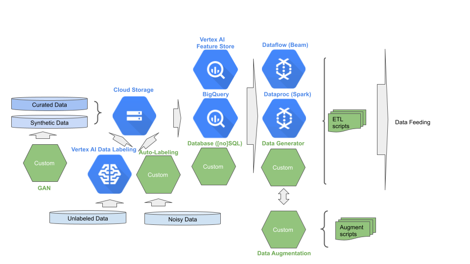

# Stage 1: Data Management

## Purpose

Progressively improve the quality of the data and the performance in delivering the data for model training.

## Recommendations  

The first stage in MLOps is the collection and preparation for the purpose of delivering data (model feeding). We recommend:

- Data is stored in GCS buckets and/or BigQuery tables. 
- Data sources partitioned by level of data wrangling. Typically these are:
  - Curated data – real-world data for training.
  - Synthetic data - synthetically generated data for pre-training. 
  - Unlabeled data - data that needs to be labeled, which optionally can be labeled using Vertex Data Labeling service. Some of this data may come from production.
  - Noisy - labeled data that needs cleansing.
- Data examples are searchable by feature conditions, labeling and metadata – such as the labeling source.
- Data examples can be tagged for train/eval slicing.
- Statistics are collected and stored on the data distribution.
- Data sources are under version control.
- Features that dynamically change per example (e.g., bank balance) are stored in Vertex Feature Store.
- Data is preprocessed for training and evaluation using Dataflow.
- Data augmentation is performed on-the-fly and is coupled with model feeding.



## Notebooks

### Get Started


[Get started with Dataflow](get_started_dataflow.ipynb)


```
Learn how to use `Dataflow` for training with `Vertex AI`.

The steps performed include:

- Offline preprocessing of data:
    - Serially - w/o dataflow
    - Parallel - with dataflow
- Upstream preprocessing of data:
    - tabular data
    - image data
```


[Get started with Vertex AI datasets](get_started_vertex_datasets.ipynb)


```
Learn how to use `Vertex AI Dataset` for training with `Vertex AI`.

The steps performed include:

- Create a Vertex AI `Dataset` resource for:
    - image data
    - text data
    - video data
    - tabular data
    - forecasting data


- Search `Dataset` resources using a filter.
- Read a sample of a `BigQuery` dataset into a dataframe.
- Generate statistics and data schema using TensorFlow Data Validation from the samples in the dataframe.
- Detect anomalies in new data using TensorFlow Data Validation.
- Generate a TFRecord feature specification using TensorFlow Transform from the data schema.
- Export a dataset and convert to TFRecords.
```


[Get started with BigQuery datasets](get_started_bq_datasets.ipynb)


```
Learn how to use `BigQuery` as a dataset for training with `Vertex AI`.

The steps performed include:

- Create a Vertex AI `Dataset` resource from `BigQuery` table -- compatible for `AutoML` training.
- Extract a copy of the dataset from `BigQuery` to a CSV file in Cloud Storage -- compatible for `AutoML` or custom training.
- Select rows from a `BigQuery` dataset into a `pandas` dataframe -- compatible for custom training.
- Select rows from a `BigQuery` dataset into a `tf.data.Dataset` -- compatible for custom training `TensorFlow` models.
- Select rows from extracted CSV files into a `tf.data.Dataset` -- compatible for custom training `TensorFlow` models.
- Create a `BigQuery` dataset from CSV files.
- Extract data from `BigQuery` table into a `DMatrix` -- compatible for custom training `XGBoost` models.
```


[Get started with Vertex AI Data Labeling](get_started_with_data_labeling.ipynb)


```
Learn how to use the `Vertex AI Data Labeling` service/

The steps performed include:

- Create a Specialist Pool for data labelers.
- Create a data labeling job.
- Submit the data labeling job.
- List data labeling jobs.
- Cancel a data labeling job.
```


[Create an unlabelled Vertex AI AutoML text entity extraction dataset from PDFs using Vision API](get_started_with_visionapi_and_vertex_datasets.ipynb)

In this tutorial, you learn to use `Vision API` to extract text from PDF files stored on a Cloud Storage bucket. You then process the results and create an unlabelled `Vertex AI Dataset`, compatible with `AutoML`, for text entity extraction.

```
Learn to use `Vision API` to extract text from PDF files stored on a Cloud Storage bucket.


The steps performed include:

1. Using `Vision API` to perform Optical Character Recognition (OCR) to extract text from PDF files.
2. Processing the results and saving them to text files.
3. Generating a `Vertex AI Dataset` import file.
4. Cr
```

### E2E Stage Example

[Data management](mlops_data_management.ipynb)

```
In this tutorial, you create a MLOps stage 1: data management process.

The steps performed include:

- Explore and visualize the data.
- Create a Vertex AI `Dataset` resource from `BigQuery` table -- for AutoML training.
- Extract a copy of the dataset to a CSV file in Cloud Storage.
- Create a Vertex AI `Dataset` resource from CSV files -- alternative for AutoML training.
- Read a sample of the `BigQuery` dataset into a dataframe.
- Generate statistics and data schema using TensorFlow Data Validation from the samples in the dataframe.
- Generate a TFRecord feature specification using TensorFlow Data Validation from the data schema.
- Preprocess a portion of the BigQuery data using `Dataflow` -- for custom training.
```