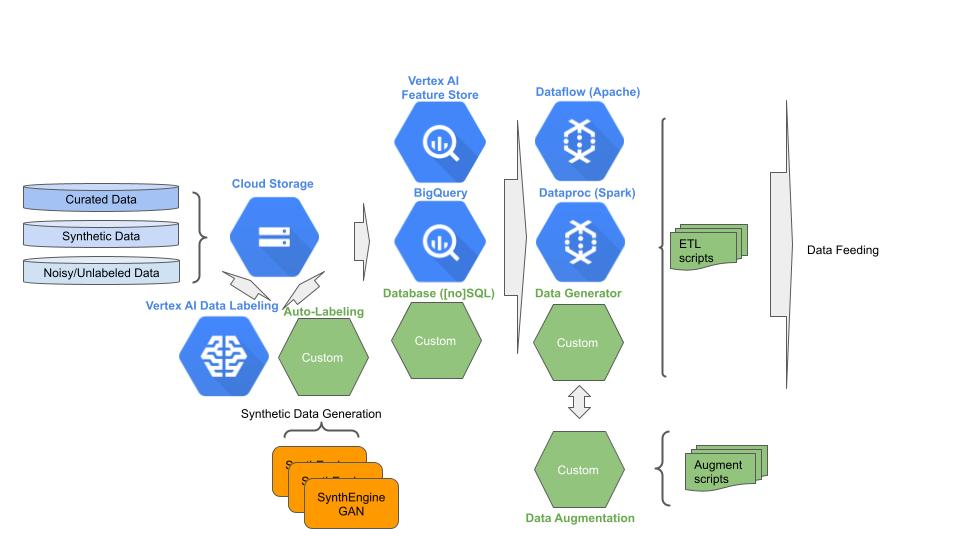

# Stage 1: Data Management

## Purpose

Progressively improve the quality of the data and the performance in delivering the data for model training.

## Recommendations  

The first stage in MLOps is the collection and preparation for the purpose of delivering data (model feeding). We recommend:

- Data is stored in GCS buckets and/or BigQuery tables. 
- Data sources partitioned by level of data wrangling. Typically these are:
- Curated data – real-world data for training.
- Synthetic data - synthetically generated data for pre-training. 
- Unlabeled data - data that needs to be labeled, which optionally can be labeled using Vertex Data Labeling service. Some of this data may come from production.
- Noisy - labeled data that needs cleansing.
- Data examples are searchable by feature conditions, labeling and metadata – such as the labeling source.
- Data examples can be tagged for train/eval slicing.
- Statistics are collected and stored on the data distribution.
- Data sources are under version control.
- Features that dynamically change per example (e.g., bank balance) are stored in Vertex Feature Store.
- Data is preprocessed for training and evaluation using Dataflow.
- Data augmentation is performed on-the-fly and is coupled with model feeding.

## Notebooks

### Get Started

[Get Started with BQ datasets](get_started_bq_datasets.ipynb)

[Get Started with Vertex datasets](get_started_vertex_datasets.ipynb)

[Get Started with Dataflow](get_started_dataflow.ipynb)

### E2E Stage Example

