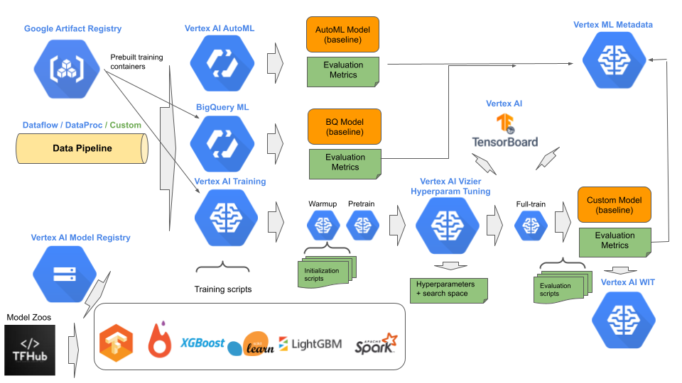

# Stage 2: Experimentation

## Purpose

Progressively develop data requirements, model architecture, training procedures and evaluation metrics to transition model experimentation into a production environment.

## Recommendations  

The second stage in MLOps is experimenting in developing one or more baseline models. This stage may be done entirely by data scientists. Typically, there is a lot of try this and try that, with variance in the amount of experimental results that are not tracked (dropped on the floor). Flexibility is a key here, where the expectation is DIY (custom) and automatic methods are seamlessly interchangeable. We recommend:

- Use a data pipeline for feeding data to a model.
- Construct the data pipeline using Dataflow.
- Train a baseline model using Vertex AutoML or Vertex NAS
- Improve on the baseline with custom models/training using Vertex Training.
- For custom training, retrieve model architecture from internal or external model hub
- For domain specific custom models, retrieve domain specific initialized weights from model garden.
- For non-domain specific custom training, use warmup procedure to stabilize the weight initialization (or reuse previous cached warmup initialization).
- For custom training, use pre-training after warmup initialization for synthetic data.
- After warmup/pretrain is complete, do hyperparameter tuning with Vertex Vizier.
- Do full training with Vertex Training and Vertex Tensorboard.
- Hyperparameter tuning and full training is done with the same training script.
- Track training experiments with Vertex Experiments.
- For experiments that are preserved, track the artifacts, hyperparameters and evaluations in Vertex ML Metadata
- Use the What-if-Tool (WIT) to explore how the trained model would make predictions in different scenarios.

## Notebooks

### Get Started

[Get Started with Vertex Experiments and Vertex ML Metadata](get_started_vertex_experiments.ipynb)

[Get Started with Vertex TensorBoard](get_started_vertex_tensorboard.ipynb)

[Get Started with Custom Training Packages](get_started_vertex_training.ipynb)

[Get Started with Distributed Training](get_started_vertex_distributed_training.ipynb)

[Get Started with Vizier Hyperparameter Tuning](get_started_vertex_vizier.ipynb)

[Get Started with AutoML Training](get_started_automl_training.ipynb)

[Get Started with BQML Training](get_started_bqml_training.ipyn)

[Get Started with Vertex Feature Store](get_started_vertex_feature_store.ipynb)

### E2E Stage Example

[Stage 2: Experimentation](mlops_experimentation.ipynb)
