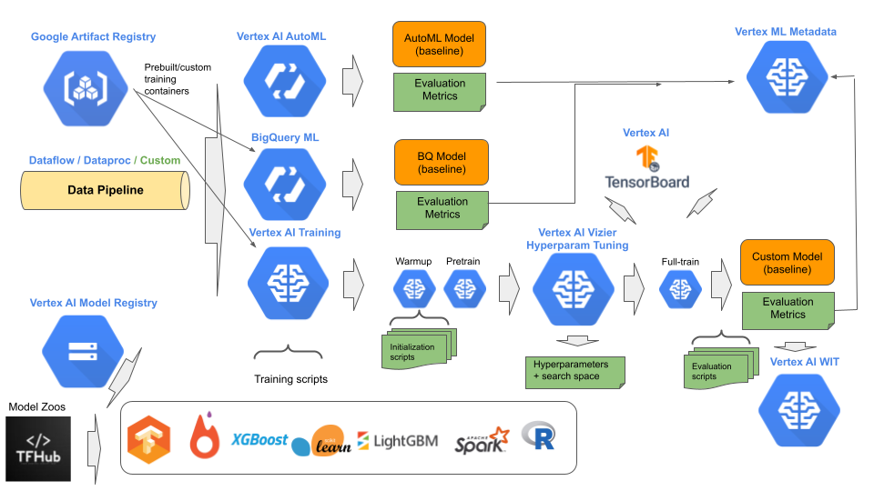
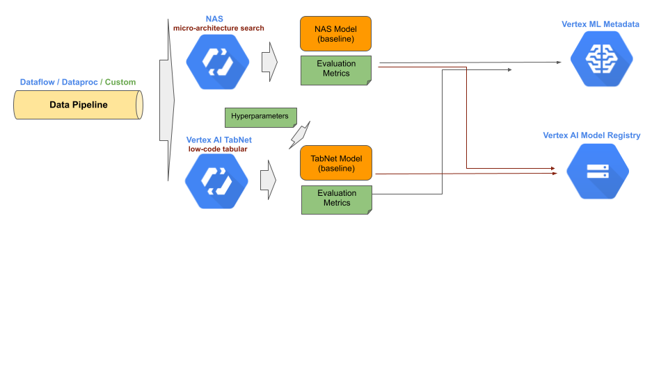

# Stage 2: Experimentation

## Purpose

Progressively develop data requirements, model architecture, training procedures and evaluation metrics to transition model experimentation into a production environment.


## Recommendations  

The second stage in MLOps is experimenting in developing one or more baseline models. This stage may be done entirely by data scientists. Typically, there is a lot of try this and try that, with variance in the amount of experimental results that are not tracked (dropped on the floor). Flexibility is a key here, where the expectation is DIY (custom) and automatic methods are seamlessly interchangeable. We recommend:

- Use a data pipeline for feeding data to a model.
- Construct the data pipeline using Dataflow.
- Train a baseline model using Vertex AutoML or Vertex NAS
- Improve on the baseline with custom models/training using Vertex Training.
- For custom training, retrieve model architecture from internal or external model hub
- For domain specific custom models, retrieve domain specific initialized weights from model garden.
- For non-domain specific custom training, use warmup procedure to stabilize the weight initialization (or reuse previous cached warmup initialization).
- For custom training, use pre-training after warmup initialization for synthetic data.
- After warmup/pretrain is complete, do hyperparameter tuning with Vertex Vizier.
- Do full training with Vertex Training and Vertex Tensorboard.
- Hyperparameter tuning and full training is done with the same training script.
- Track training experiments with Vertex Experiments.
- For experiments that are preserved, track the artifacts, hyperparameters and evaluations in Vertex ML Metadata
- Use the What-if-Tool (WIT) to explore how the trained model would make predictions in different scenarios.



<br/>
<br/>
<br/>


## Notebooks

### Get Started

[Get started with Vertex AI Training for R](community/ml_ops/stage2/get_started_vertex_training_r.ipynb)

In this tutorial, you learn how to use `Vertex AI Training` for training a R custom model.

The steps performed include:

- Locally train an R model in a notebook using %%R magic commands
- Create a deployment image with trained R model and serving functions.
- Test the deployment image locally.
- Create a `Vertex AI Model` resource for the deployment image with embedded R model.
- Deploy the deployment image with embedded R model to a `Vertex AI Endpoint` resource.
- Test the deployment image with embedded R model.
- Create a R-to-Python training package.
- Create a training image for training the model.
- Train a R model using `Vertex AI Trainingh` service with the R-to-Python training package.

[Get started with Logging](community/ml_ops/stage2/get_started_with_logging.ipynb)

In this tutorial, you learn how to use Python and Cloud logging awhen training with `Vertex AI`.

The steps performed include:

- Use Python logging to log training configuration/results locally.
- Use Google Cloud Logging to log training configuration/results in cloud storage.

[Get started with Vertex AI Hyperparameter Tuning for XGBoost] (community/ml_ops/stage2/get_started_vertex_hpt_xgboost.ipynb)

In this tutorial, you learn how to use `Vertex AI Hyperparameter Tuning` for training a XGBoost custom model.

The steps performed include:

- Training using a Python package.
- Report accuracy when hyperparameter tuning.
- Save the model artifacts to Cloud Storage using GCSFuse.
- Create a `Vertex AI Model` resource.

[Get started with Vertex AI Training for XGBoost](community/ml_ops/stage2/get_started_vertex_training_xgboost.ipynb)

In this tutorial, you learn how to use `Vertex AI Training` for training a XGBoost custom model.

The steps performed include:

- Training using a Python package.
- Report accuracy when hyperparameter tuning.
- Save the model artifacts to Cloud Storage using GCSFuse.
- Create a `Vertex AI Model` resource.

[Get started with TabNet builtin algorithm for training tabular models](community/ml_ops/stage2/get_started_with_tabnet.ipynb)

In this notebook, you learn how to run `Vertex AI TabNet` built algorithm for training custom tabular models.

The steps performed include:

- Get the training data.
- Configure training parameters for the `Vertex AI TabNet` container.
- Train the model using `Vertex AI Training` using CSV data.
- Upload the model as a `Vertex AI Model` resource.
- Deploy the `Vertex AI Model` resource to a `Vertex AI Endpoint` resource.
- Make a prediction with the deployed model.
- Hyperparameter tuning the `Vertex AI TabNet` model.
- Train the model using `Vertex AI Training` using BigQuery table.

[Get started with prebuilt TFHub models](community/ml_ops/stage2/get_started_with_tfhub_models.ipynb)

In this tutorial, you learn how to use `Vertex AI Training` with prebuilt models from TensorFlow Hub.

The steps performed include:

- Download a TensorFlow Hub prebuilt model.
- Add the task component as a classifier for the CIFAR-10 dataset.
- Fine tune locally the model with transfer learning training.
- Construct a custom training script:
    - Get training data from TensorFlow Datasets
    - Get model architecture from TensorFlow Hub
    - Train then model
    - Save model artifacts and upload as Vertex AI Model resource.

[Get started with BigQuery ML Training](community/ml_ops/stage2/get_started_bqml_training.ipynb)

In this tutorial, you learn how to use `BigQueryML` (BQML) for training with `Vertex AI`.

The steps performed include:

- Create a local BigQuery table in your project
- Train a BQML model
- Evaluate the BQML model
- Export the BQML model as a cloud model
- Upload the exported model as a `Vertex AI Model` resource
- Hyperparameter tune a BQML model with `Vertex AI Vizier`
- Automatically register a BQML model to `Vertex AI Model Registry`

[Get started with Vertex AI Vizier](community/ml_ops/stage2/get_started_vertex_vizier.ipynb)

In this tutorial, you learn how to use `Vertex AI Vizier` for when training with `Vertex AI`.

The steps performed include:

- Hyperparameter tuning with Random algorithm.
- Hyperparameter tuning with Vizier (Bayesian) algorithm.
- Suggesting trials and updating results for Vizier study

[Get started with distributed training using DASK](community/ml_ops/stage2/get_started_with_distributed_training_xgboost.ipynb)

In this tutorial, you learn how to use `Vertex AI Training` for distributed training of XGBoost model using the OSS package DASK. Additionally, you learn to construct and deploy a custom serving container using a Flask web server.

The steps performed include:

- Construct an XGBoost training script using DASK for distributed training.
- Construct a custom training container.
- Configure a distributed custom training job.
- Execute the custom training job.
- Construct a custom serving container using Flask.
- Upload the trained XGBoost model as a `Vertex AI Model` resource.
- Create a `Vertex AI Endpoint` resource.
- Deploy the `Vertex AI Model` resource to `Vertex AI Endpoint` resource.
- Make a prediction.

[Get started with Vertex AI TensorBoard](community/ml_ops/stage2/get_started_vertex_tensorboard.ipynb)

In this tutorial, you learn how to use `Vertex AI TensorBoard` when training with `Vertex AI`.

The steps performed include:

- Create a TensorBoard callback when training a model.
- Using TensorBoard with locally trained model.
- Using Vertex AI TensorBoard with Vertex AI Training.

[Get started with Vertex AI Training for R using R Kernel](community/ml_ops/stage2/get_started_vertex_training_r_using_r_kernel.ipynb)

In this tutorial, you learn how to use `Vertex AI`, using an R kernel, for training and deploying an R custom model.

The steps performed include:

- Create a custom R training script
- Create a custom R serving script
- Create a custom R deployment (serving) container.
- Train the model using `Vertex AI` custom training.
- Create an `Endpoint` resouce.
- Deploy the `Model` resource (trained R model) to the `Endpoint` resource.
- Make an online prediction.


[Get started Vision API test preprocessing and AutoML text model generation](community/ml_ops/stage2/get_started_with_visionapi_and_automl.ipynb)

In this tutorial, you create an `AutoML` text entity extraction model pre-existing extracted data by generating a custom import file. You deploy this mode for online prediction from a Python script using the `BigQuery`, `Vision AI`, Cloud Storage and `Vertex AI SDK` for Python. 

The steps performed include:

- Preprocess training files using `Vision AI` APIs to extract the text from PDF files.
- Create a custom import file that includes annotation data based on the sample `BigQuery` dataset.
- Create a `Vertex AI Dataset` resource.
- Train the model.
- View the model evaluation.
- Deploy the `Vertex AI Model` resource to a serving `Endpoint` resource.
- Make a prediction.
- Undeploy the `Model`.

[Get started with Vertex AI Experiments](community/ml_ops/stage2/get_started_vertex_experiments.ipynb)

In this tutorial, you learn how to use `Vertex AI Experiments` when training with `Vertex AI`.

The steps performed include:

- Local (notebook) Training
    - Create an experiment
    - Create a first run in the experiment
    - Log parameters and metrics
    - Create artifact lineage
    - Visualize the experiment results
    - Execute a second run
    - Compare the two runs in the experiment
- Cloud (`Vertex AI`) Training
    - Within the training script:
        - Create an experiment
        - Log parameters and metrics
        - Create artifact lineage
    - Create a `Vertex AI Training` custom job
    - Execute the custom job
    - Visualize the experiment results

[AutoML Image Classfication Training with Customer Managed Encryption Keys (CMEK)](community/ml_ops/stage2/get_started_with_cmek_training.ipynb)

In this tutorial, you learn how to use a customer managed encryption key (CMEK) for `Vertex AI AutoML` training.

The steps performed include:

- Creating a customer managed encryption key.
- Creating an image dataset with CMEK encryption.
- Train an AutoML model with CMEK encryption.

[Get started with Vertex AI Feature Store](community/ml_ops/stage2/get_started_vertex_feature_store.ipynb)

In this tutorial, you learn how to use `Vertex AI Feature Store` when training and predicting with `Vertex AI`.

The steps performed include:

- Creating a Vertex AI `Featurestore` resource.
    - Creating `EntityType` resources for the `Featurestore` resource.
    - Creating `Feature` resources for each `EntityType` resource.
- Import feature values (entity data items) into `Featurestore` resource.
    - From a Cloud Storage location.
    - From a pandas DataFrame.
- Perform online serving from a `Featurestore` resource.
- Perform batch serving from a `Featurestore` resource.

[Get started with AutoML Training](community/ml_ops/stage2/get_started_automl_training.ipynb)

In this tutorial, you learn how to use `AutoML` for training with `Vertex AI`.

The steps performed include:

- Train an image model
- Export the image model as an edge model
- Train a tabular model
- Export the tabular model as a cloud model
- Train a text model
- Train a video model

[Get started with Vertex AI Training for LightGBM](community/ml_ops/stage2/get_started_vertex_training_lightgbm.ipynb)

In this tutorial, you learn how to use `Vertex AI Training` for training a LightGBM custom model.

The steps performed include:

- Training using a Python package.
- Save the model artifacts to Cloud Storage using GCSFuse.
- Construct a FastAPI prediction server.
- Construct a Dockerfile deployment image.
- Test the deployment image locally.
- Create a `Vertex AI Model` resource.

[Get started with Vertex AI Training for Scikit-Learn](community/ml_ops/stage2/get_started_vertex_training_sklearn.ipynb)

In this tutorial, you learn how to use `Vertex AI Training` for training a Scikit-Learn custom model.

The steps performed include:

- Training using a Python package.
- Report accuracy when hyperparameter tuning.
- Save the model artifacts to Cloud Storage using GCSFuse.
- Create a `Vertex AI Model` resource.

[Get started with Vertex AI Training](community/ml_ops/stage2/get_started_vertex_training.ipynb)

In this tutorial, you learn how to use `Vertex AI Training` for custom models when training with `Vertex AI`.

The steps performed include:

- Training using a single Python script.
- Training using a Python package.
- Training using a custom training image.
- Laying out a training package.


[Get started with Vertex AI Training for Pytorch](community/ml_ops/stage2/get_started_vertex_training_pytorch.ipynb)

In this tutorial, you learn how to use `Vertex AI Training` for training a Pytorch custom model.

The steps performed include:

- Single node training using a Python package.
- Report accuracy when hyperparameter tuning.
- Save the model artifacts to Cloud Storage using GCSFuse.
- Create a `Vertex AI Model` resource.

[Get started with Vertex AI Distributed Training](community/ml_ops/stage2/get_started_vertex_distributed_training.ipynb)

In this tutorial, you learn how to use `Vertex AI Distributed Training` for when training with `Vertex AI`.

The steps performed include:

- `MirroredStrategy`: Train on a single VM with multiple GPUs.
- `MultiWorkerMirroredStrategy`: Train on multiple VMs with automatic setup of replicas.
- `MultiWorkerMirroredStrategy`: Train on multiple VMs with fine grain control of replicas.
- `ReductionServer`: Train on multiple VMS and sync updates across VMS with `Vertex AI Reduction Server`.
- `TPUTraining`: Train with multiple Cloud TPUs.

### E2E Stage Example

[Stage 2: Experimentation](mlops_experimentation.ipynb)

```
The steps performed include:
- Review the `Dataset` resource created during stage 1.
- Train an AutoML tabular binary classifier model in the background.
- Build the experimental model architecture.
- Construct a custom training package for the `Dataset` resource.
- Test the custom training package locally.
- Test the custom training package in the cloud with Vertex AI Training.
- Hyperparameter tune the model training with Vertex AI Vizier.
- Train the custom model with Vertex AI Training.
- Add a serving function for online/batch prediction to the custom model.
- Test the custom model with the serving function.
- Evaluate the custom model using Vertex AI Batch Prediction
- Wait for the AutoML training job to complete.
- Evaluate the AutoML model using Vertex AI Batch Prediction with the same evaluation slices as the custom model.
- Set the evaluation results of the AutoML model as the baseline.
- If the evaluation of the custom model is below baseline, continue to experiment with the custom model.
- If the evaluation of the custom model is above baseline, save the model as the first best model.
```
