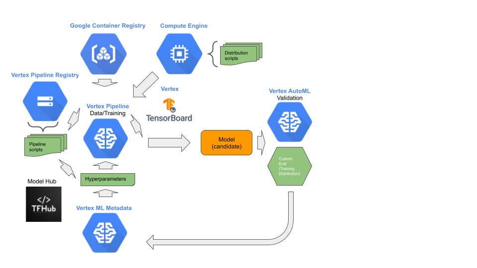

# Stage 3: Formalization

## Purpose

Automate the production pipeline for continuous integration into ML operations, and where the pipeline continuously develops higher performing candidate models.

## Recommendations  

The third stage in MLOps is formalization to develop an automated pipeline process to generate candidate models. This stage may be done entirely by ML engineers, with the assistance of data scientists. We recommend:

- Encapsulate data and training procedures into automated pipelines using Vertex AI Pipelines.
- Use KFP for pipeline DAG generation, with the exception of a vast amount of unstructured data, we recommend TFX.
- Formalization is constructed as two independent, version controlled, pipelines: 1) data pipeline, 2) training pipeline.
- The model feeder in the data pipeline is a generator, which can take feedback from the training pipeline, for dynamically changing:
  - The batch size.
  - The subpopulation distribution to draw batches from.
  - The number of batches to prefetch.
  - Load balancing across mirrored data sources and shards – if not handled further upstream.
- Use Vertex AI ML Metadata for retrieving hyperparameters.
- Use Google Container Registry for custom training containers.
- Use Vertex AI Tensorboard for visualizing and monitoring training progress.
- Data and training scripts are versioned controlled.
- If the dataset statistics change (beyond a threshold), retune the hyperparameters.
- If domain-specific weight initialization changes, fine-tune the hyperparameters.
- If the model architecture changes, redo the formalization stage.
- Use early stop procedure in training script to detect failure to achieve training objective.
- Store the results of the trained model evaluation in Vertex AI ML Metadata.

## Notebooks

### Get Started

[Get Started with Kubeflow pipelines](get_started_with_kubeflow_pipelines.ipynb)

[Get Started with BQ and TFDV components](get_started_with_bq_tfdv_pipeline_components.ipynb)

[Get Started with Dataflow components](get_started_with_dataflow_pipeline_components.ipynb)

[Get Started with Vertex AI AutoML components](get_started_with_automl_pipeline_components.ipynb)

[Get Started with Vertex AI Custom Training components](get_started_with_custom_training_pipeline_components.ipynb)

[Get Started with BQML components](get_started_with_bqml_pipeline_components.ipynb)

### E2E Stage Example

[Stage 3: Formalization](mlops_formalization.ipynb)
