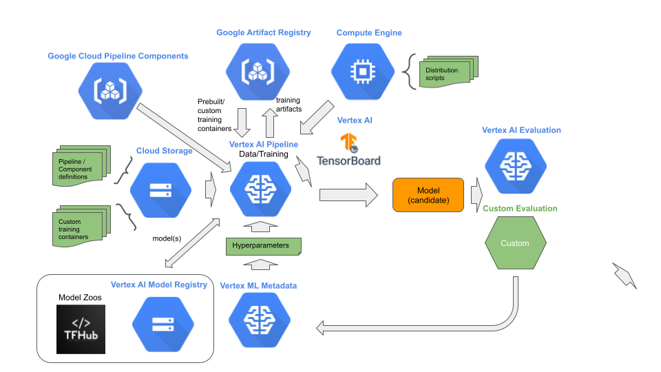

# Stage 3: Formalization

## Purpose

Automate the production pipeline for continuous integration into ML operations, and where the pipeline continuously develops higher performing candidate models.


## Recommendations  

The third stage in MLOps is formalization to develop an automated pipeline process to generate candidate models. This stage may be done entirely by ML engineers, with the assistance of data scientists. We recommend:

- Encapsulate data and training procedures into automated pipelines using Vertex AI Pipelines.
- Use KFP for pipeline DAG generation, with the exception of a vast amount of unstructured data, we recommend TFX.
- Formalization is constructed as two independent, version controlled, pipelines: 1) data pipeline, 2) training pipeline.
- The model feeder in the data pipeline is a generator, which can take feedback from the training pipeline, for dynamically changing:
  - The batch size.
  - The subpopulation distribution to draw batches from.
  - The number of batches to prefetch.
  - Load balancing across mirrored data sources and shards – if not handled further upstream.
- Use Vertex AI ML Metadata for retrieving hyperparameters.
- Use Google Container Registry for custom training containers.
- Use Vertex AI Tensorboard for visualizing and monitoring training progress.
- Data and training scripts are versioned controlled.
- If the dataset statistics change (beyond a threshold), retune the hyperparameters.
- If domain-specific weight initialization changes, fine-tune the hyperparameters.
- If the model architecture changes, redo the formalization stage.
- Use early stop procedure in training script to detect failure to achieve training objective.
- Store the results of the trained model evaluation in Vertex AI ML Metadata.



## Notebooks

### Get Started

[Get started with AutoML Tabular Pipeline Workflows](get_started_with_automl_tabular_pipeline_workflow.ipynb)

```
The steps performed include:
- Define training specification.
    - Dataset specification
    - Hyperparameter overide specification
    - machine specifications
- Construct tabular workflow pipeline.
- Compile and execute pipeline.
- View evaluation metrics artifact.
- Export AutoML model as an OSS TF model.
- Create `Endpoint` resource.
- Deploy exported OSS TF model.
- Make a prediction.

```

[Get started with Vertex AI Model Registry](get_started_with_model_registry.ipynb)

```
The steps performed include:
- Create and register a first version of a model to `Vertex AI Model Registry`.
- Create and register a second version of a model to `Vertex AI Model Registry`.
- Updating the model version which is the default (blessed).
- Deleting a model version.
- Retraining the next model version.
```

[Get started with Dataproc serverless pipeline components](get_started_with_dataproc_serverless_pipeline_components.ipynb)

```
The steps performed include:
- `DataprocPySparkBatchOp` for running PySpark batch workloads.
- `DataprocSparkBatchOp` for running Spark batch workloads.
- `DataprocSparkSqlBatchOp` for running Spark SQL batch workloads.
- `DataprocSparkRBatchOp` for running SparkR batch workloads.

```

[Get started with TFX pipelines](get_started_with_tfx_pipeline.ipynb)

```
The steps performed include:
- Create a TFX e2e pipeline.
- Execute the pipeline locally.
- Execute the pipeline on Google Cloud using `Vertex AI Training`
- Execute the pipeline using `Vertex AI Pipelines`.
```

[Get started with Vertex AI Hyperparameter Tuning pipeline components](get_started_with_hpt_pipeline_components.ipynb)

```
The steps performed include:
- Construct a pipeline for:
    - Hyperparameter tune/train a custom model.
    - Retrieve the tuned hyperparameter values and metrics to optimize.
    - If the metrics exceed a specified threshold.
      - Get the location of the model artifacts for the best tuned model.
      - Upload the model artifacts to a `Vertex AI Model` resource.
- Execute a Vertex AI pipeline.

```

[Get started with Apache Airflow and Vertex AI Pipelines](get_started_with_airflow_and_vertex_pipelines.ipynb)

```
The steps performed include:
- Create Cloud Composer environment.
- Upload Airflow DAG to Composer environment that performs data processing -- i.e., creates a BigQuery table from a CSV file.
- Create a `Vertex AI Pipeline` that triggers the Airflow DAG.
- Execute the `Vertex AI Pipeline`.

```

[Get started with Vertex AI custom training pipeline components](get_started_with_custom_training_pipeline_components.ipynb)

```
The steps performed include:
- Construct a pipeline for:
    - Training a Vertex AI custom trained model.
    - Test the serving binary with a batch prediction job.
    - Deploying a Vertex AI custom trained model.
- Execute a Vertex AI pipeline.
- Construct a pipeline for:
     - Construct a custom training component.
     - Convert custom training component to CustomTrainingJobOp.
     - Training a Vertex AI custom trained model using the converted component.
    - Deploying a Vertex AI custom trained model.
- Execute a Vertex AI pipeline.
```

[Get started with AutoML pipeline components](get_started_with_automl_pipeline_components.ipynb)

```
The steps performed include:
- Construct a pipeline for:
    - Training a Vertex AI AutoML trained model.
    - Test the serving binary with a batch prediction job.
    - Deploying a Vertex AI AutoML trained model.
- Execute a Vertex AI pipeline.

```

[Get started with Kubeflow pipelines](get_started_with_kubeflow_pipelines.ipynb)

```
The steps performed include:
- Building KFP lightweight Python function components.
- Assembling and compiling KFP components into a pipeline.
- Executing a KFP pipeline using Vertex AI Pipelines.
- Loading component and pipeline definitions from a source code repository.
- Building sequential, parallel, multiple output components.
- Building control flow into pipelines.

```

[Get started with machine management for Vertex AI Pipelines](get_started_with_machine_management.ipynb)

```
The steps performed in this tutorial include:
- Create a custom component with a self-contained training job.
- Execute pipeline using component-level settings for machine resources
- Convert the self-contained training component into a `Vertex AI CustomJob`.
- Execute pipeline using customjob-level settings for machine resources 

```

[Get started with BigQuery and TFDV pipeline components](get_started_with_bq_tfdv_pipeline_components.ipynb)

```
The steps performed include:
- Build and execute a pipeline component for creating a Vertex AI Tabular Dataset from a BigQuery table.
- Build and execute a pipeline component for generating TFDV statistics and schema from a Vertex AI Tabular Dataset.
- Execute a Vertex AI pipeline.
```

[Get started with Dataflow pipeline components](get_started_with_dataflow_pipeline_components.ipynb)

```
The steps performed include:
- Build an Apache Beam data pipeline.
- Encapsulate the Apache Beam data pipeline with a Dataflow component in a Vertex AI pipeline.
- Execute a Vertex AI pipeline.
```

[Get started with BigQuery ML pipeline components](get_started_with_bqml_pipeline_components.ipynb)

```
The steps performed include:
- Construct a pipeline for:
    - Training BigQuery ML model.
    - Evaluating the BigQuery ML model.
    - Exporting the BigQuery ML model.
    - Importing the BigQuery ML model to a Vertex AI model.
    - Deploy the Vertex AI model.
- Execute a Vertex AI pipeline.
- Make a prediction with the deployed Vertex AI model.
```

[Get started with rapid prototyping with AutoML and BigQuery ML](get_started_with_rapid_prototyping_bqml_automl.ipynb)

```
The steps performed include:
- Creating a BigQuery and Vertex AI training dataset.
- Training a BigQuery ML and AutoML model.
- Extracting evaluation metrics from the BigQueryML and AutoML models.
- Selecting the best trained model.
- Deploying the best trained model.
- Testing the deployed model infrastructure.
```


### E2E Stage Example

[Stage 3: Formalization](mlops_formalization.ipynb)

```
The steps performed include:
- Obtain resources from the experimentation stage.
    - Baseline model.
    - Dataset schema/statistics for baseline model.
- Formalize a data preprocessing pipeline.
    - Extract columns/rows from BigQuery table to local BigQuery table.
    - Use Tensorflow Data Validation library to determine statistics, schema, and features.
    - Use Dataflow to preprocess the data.
    - Create a Vertex AI Dataset.
- Formalize a build model architecture pipeline.
    - Create the Vertex AI Model base model.
- Formalize a training pipeline.
```

