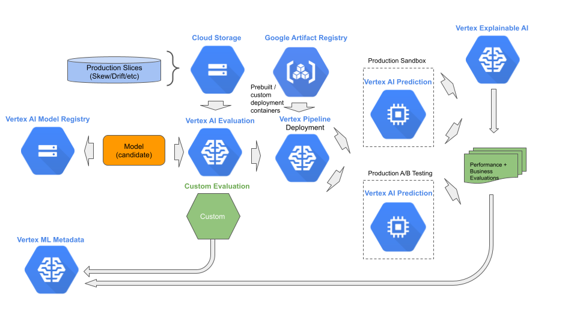

# Stage 4: Evaluation

## Purpose

Evaluate a candidate model for exceeding performance and business objectives to become the next blessed model.

## Recommendations  

The fourth stage in MLOps is evaluation where a candidate model is evaluated to be the next deployed “blessed” version of the model in production. The candidate model may be either the first candidate version or a subsequent update. In the former, the model is evaluated against a preset baseline. In the latter, the model is evaluated against the existing deployed “blessed” model. If the evaluation slices have not changed since the existing deployed “blessed” model was evaluated, it’s previous evaluation data is used for comparison. Otherwise, the existing deployed “blessed” model is evaluated on the existing evaluation slices.

In the case were a custom model and AutoML model are compared, the “apples-to-apples” evaluation is handled through a batch script, which does the following:

1. Fetches the custom evaluation slices.
2. Creates a batch prediction job for each custom evaluation slice.
3. Applies custom evaluation on the results from the batch prediction job.


Once this static evaluation is completed, one or more dynamic evaluations are performed before deploying a candidate model as the next blessed model. These include evaluating for:

1. Resource utilization and latency in a sandbox environment. 
2. A business objective using A/B testing.

This stage may be done entirely by MLOps. We recommend:

- Store and retrieve candidate models in Vertex Model Registry.
- Use Vertex ML Metadata to retain past and present evaluations, per candidate and blessed versions, as part of the model metadata.
- Tag the evaluations by evaluation slice and version of the slice.
- Evaluate with the most recent evaluation slices.
- Use Vertex Batch Prediction to perform a batch prediction request on each evaluation slice.
- Use a Python batch script to compute custom evaluations from the results of the batch prediction request.
- Use the Vertex pipeline resource developed during formalization to perform the above.
- Before blessing a candidate model, deploy the model to an sandbox environment that is identical (or comparable) to the production environment of the existing blessed model. Send copies of live product request traffic to the sandbox environment. Measure and comparable resource utilization and latency. Use Vertex ML - Metadata to retain past and present sandbox performance results.
- Collect a random sample of prediction requests/results from the sandbox environment. Use Vertex Explainable AI to inspect the reason the prediction was made. This is generally a manual inspection process. Look for things like the right prediction for the wrong reason, and biases.
- Use Vertex Endpoint resource with traffic split to perform A/B testing between the existing blessed model and candidate model against a business objective.  - - Use Vertex ML Metadata to retain past and present A/B testing results.




## Notebooks

### Get Started


[Get started with Vertex ML Metadata](https://github.com/GoogleCloudPlatform/vertex-ai-samples/blob/main/notebooks/community/ml_ops/stage4/get_started_with_vertex_ml_metadata.ipynb)

```
Learn how to use `Vertex ML Metadata`.

The steps performed include:

- Create a `Metadatastore` resource.
- Create (record)/List an `Artifact`, with artifacts and metadata.
- Create (record)/List an `Execution`.
- Create (record)/List a `Context`.
- Add `Artifact` to `Execution` as events.
- Add `Execution` and `Artifact` into the `Context`
- Delete `Artifact`, `Execution` and `Context`.
- Create and run a `Vertex AI Pipeline` ML workflow to train and deploy a scikit-learn model.
    - Create custom pipeline components that generate artifacts and metadata.
    - Compare Vertex AI Pipelines runs.
    - Trace the lineage for pipeline-generated artifacts.
    - Query your pipeline run metadata.

```


[Get started with Google Artifact Registry](https://github.com/GoogleCloudPlatform/vertex-ai-samples/blob/main/notebooks/community/ml_ops/stage4/get_started_with_google_artifact_registry.ipynb)

```
Learn how to use `Google Artifact Registry`.

The steps performed include:

- Creating a private Docker repository.
- Tagging a container image, specific to the private Docker repository.
- Pushing a container image to the private Docker repository.
- Pulling a container image from the private Docker repository.
- Deleting a private Docker repository.

```


[Get started with Vertex AI Model Evaluation](https://github.com/GoogleCloudPlatform/vertex-ai-samples/blob/main/notebooks/community/ml_ops/stage4/get_started_with_model_evaluation.ipynb)

```
Learn how to use `Vertex AI Model Evaluation`.

The steps performed include:

```


[Get started with Vertex Explainable AI](https://github.com/GoogleCloudPlatform/vertex-ai-samples/blob/main/notebooks/community/ml_ops/stage4/get_started_with_vertex_xai.ipynb)

```
Learn how to use `Vertex AI Explainable AI`.

The steps performed include:

- Train an AutoML tabular model.
    - Do a batch prediction with explanations.
    - Do an online prediction with explanations.
- Train an custom TensorFlow tabular model.
    - Manually set configuration metadata.
    - Do a batch prediction with explanations.
    - Do an online prediction with explanations.
    - Automatically set configuration metadata.
- Train an custom TensorFlow image model.
    - Manually set configuration metadata.
    - Do a batch prediction with explanations.
    - Do an online prediction with explanations.
- Train an custom XGBoost tabular model.
    - Manually set configuration metadata.
    - Do an online prediction with explanations.
- Train an custom scikit-learn tabular model.
    - Manually set configuration metadata.
    - Do an online prediction with explanations.

```


[Get started with AutoML Training and ML Metadata](https://github.com/GoogleCloudPlatform/vertex-ai-samples/blob/main/notebooks/community/ml_ops/stage4/get_started_with_vertex_ml_metadata_and_automl.ipynb)

```
Learn how to use `AutoML` for training and assemble the corresponding artifact linkage for `Vertex ML Metadata`.

The steps performed include:

- Create a `Dataset` resource.
- Create a corresponding `google.VertexDataset` artifact.
- Train a model using `AutoML`.
- Create a corresponding `google.VertexModel` artifact.
- Create an `Endpoint` resource.
- Create a corresponding `google.Endpoint` artifact.
- Deploy the train model to the `Endpoint`.
- Create an execution and context for the `AutoML` training job and deployment.
- Add the corresponding artifacts and context to the execution.
- Add artifact links (event) to the execution.
- Display the execution graph.

```

### E2E Stage Example

