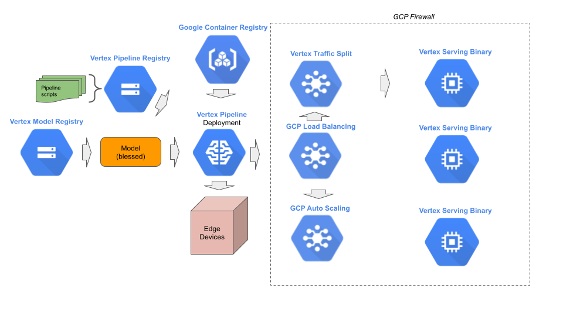

# Stage 5: Deployment

## Purpose


## Recommendations  




## Notebooks

### Get Started


[Get started with Vertex AI Endpoints](get_started_with_vertex_endpoints.ipynb)

```
The steps include:

- Creating an `Endpoint` resource.
- List all `Endpoint` resources.
- List `Endpoint` resources by query filter.
- Configuring the serving binary of a `Model` resource for deployment to an `Endpoint` resource.
- Deploying a single `Model` resource to an `Endpoint` resource.
- Get deployment settings for a deployed `Model` resource.
- Configuring auto-scaling.
- Deploying multiple `Model` resources to an `Endpoint` resource and configuring a traffic split.
- Dynamically change the traffic split for an `Endpoint` resource.
- Undeploy a single `Model` resource to an `Endpoint` resource.
- Undeploy all `Model` resources from an `Endpoint` resource.
- Delete an `Endpoint` resource.
- In pipeline: Create an `Endpoint` resource and deploy an existing `Model` resource to the `Endpoint` resource.
- In pipeline: Deploy an existing `Model` resource to an existing `Endpoint` resource.
```

[Get started with Vertex AI Private Endpoints](get_started_with_vertex_private_endpoints.ipynb)

```
The steps performed include:

- Creating a `Private Endpoint` resource.
- Configure a VPC peering connection.
- Configuring the serving binary of a `Model` resource for deployment to a `Private Endpoint` resource.
- Deploying a `Model` resource to a `Private Endpoint` resource.
- Send a prediction request to a `Private Endpoint`
```
