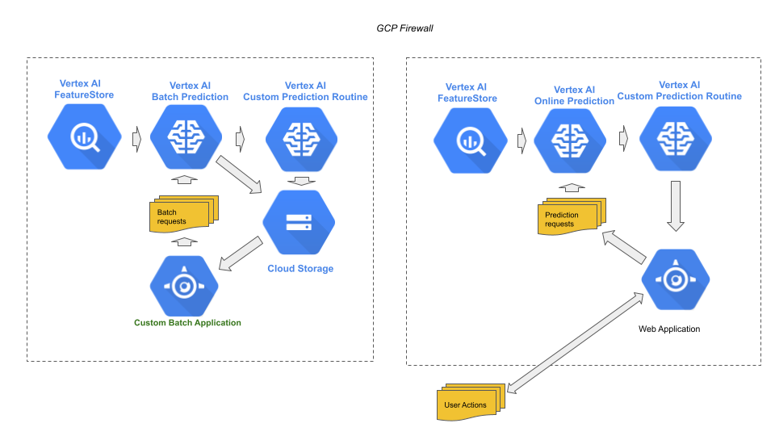

# Stage 6: Serving

## Purpose

Process prediction requests and return corresponding predictions in a timely manner consistent with the business requirement, whether online, on-demand or batch predictions

## Recommendations  

The sixth stage in MLOps is serving predictions from the blessed model deployed to production. The serving methods, depending on business requirements may be one or more of the following:

- Batch predictions – prediction requests that are queued and handled offline. This is done entirely with Google Cloud core infrastructure.

- Online predictions - prediction requests that are received externally over the Internet and processed in (near) real-time. The serving of the requests/responses is done entirely with Google Cloud core infrastructure, the requesting web application/clients may originate anywhere on the Internet. If the request originates outside of the Google Cloud core infrastructure, a proxy is needed to traverse through the firewall.

- On-demand predictions - prediction requests that are received internally with Google Cloud core infrastructure, or direct via an edge device. The prediction response to the requestor must be near instantaneous. The serving of the requests/responses may be either within Google Cloud core infrastructure, or externally on an edge device. An example of the former is an emergency sensor and on the later a medical sensor.

This stage may be done entirely by MLOps. We recommend:

- Use Google Cloud core infrastructure for online serving and batch serving, and on-demand serving where it meets the speed requirements for how the responses are utilized.
- Use IAM role settings for access control in cross-project when the application and the serving binaries are entirely within Google Cloud core infrastructure, but in different projects.
- Deploy serving binaries within regions that are the closest to where the requests originate. Deploy in multiple regions, when requests span regional boundaries.
- Use Cloud Functions as a proxy when prediction requests originate externally to Google Cloud core infrastructure, or must otherwise cross firewall boundaries that cannot not otherwise be handled by IAM role settings.
- Features that dynamically change per example (e.g., bank balance) are stored in Vertex Feature Store.




## Notebooks

### Get Started


[Get started with Vertex AI Batch Prediction for AutoML image models](https://github.com/GoogleCloudPlatform/vertex-ai-samples/blob/main/notebooks/community/ml_ops/stage6/get_started_with_automl_image_model_batch.ipynb)

```
Learn how to create an AutoML image classification model from a Python script, and then do a batch prediction using the Vertex AI SDK.

The steps performed include:

- Create a Vertex `Dataset` resource.
- Train an `AutoML` image classification model.
- Make a batch prediction with JSONL input.
```


[Get started with Vertex AI Matching Engine and Swivel builtin algorithm](https://github.com/GoogleCloudPlatform/vertex-ai-samples/blob/main/notebooks/community/ml_ops/stage6/get_started_with_matching_engine_swivel.ipynb)

```
Learn how to train custom embeddings using Vertex AI Pipelines and subsequently train and deploy a matching engine index using the embeddings.

The steps performed include:

1. Train the `Swivel` algorithm to generate embeddings (encoder) for the dataset.
2. Make example predictions (embeddings) from then trained encoder.
3. Generate embeddings using the trained `Swivel` builtin algorithm.
4. Store embeddings to format supported by `Matching Engine`.
5. Create a `Matching Engine Index` for the embeddings.
6. Deploy the `Matching Engine Index` to a `Index Endpoint`.
7. Make a matching engine prediction request.

```


[Get started with Vertex AI Matching Engine](https://github.com/GoogleCloudPlatform/vertex-ai-samples/blob/main/notebooks/community/ml_ops/stage6/get_started_with_matching_engine.ipynb)

```
Learn how to create Approximate Nearest Neighbor (ANN) Index, query against indexes.

The steps performed include:

- Create ANN Index.
- Create an IndexEndpoint with VPC Network
- Deploy ANN Index
- Perform online query
- Deploy brute force Index.
- Perform calibration between ANN and brute force index.

```


[Get started with Vertex AI Matching Engine and Two Towers builtin algorithm](https://github.com/GoogleCloudPlatform/vertex-ai-samples/blob/main/notebooks/community/ml_ops/stage6/get_started_with_matching_engine_twotowers.ipynb)

```
Learn how to use the `Two-Tower` builtin algorithms for generating embeddings for a dataset, for use with generating an `Matching Engine Index`, with the `Vertex AI Matching Engine` service.

The steps performed include:

1. Train the `Two-Tower` algorithm to generate embeddings (encoder) for the dataset.
2. Hyperparameter tune the trained `Two-Tower` encoder.
3. Make example predictions (embeddings) from then trained encoder.
4. Generate embeddings using the trained `Two-Tower` builtin algorithm.
5. Store embeddings to format supported by `Matching Engine`.
6. Create a `Matching Engine Index` for the embeddings.
7. Deploy the `Matching Engine Index` to a `Index Endpoint`.
8. Make a matching engine prediction request.

```


[Get started with TensorFlow Serving with Vertex AI Prediction](https://github.com/GoogleCloudPlatform/vertex-ai-samples/blob/main/notebooks/community/ml_ops/stage6/get_started_with_tf_serving_tabular.ipynb)

```
Learn how to use `Vertex AI Prediction` on a `Vertex AI Endpoint` resource with `TensorFlow Serving` serving binary.

The steps performed include:

- Download a pretrained TensorFlow tabular model.
- Upload the TensorFlow model as a `Vertex AI Model` resource.
- Creating an `Endpoint` resource.
- Deploying the `Model` resource to an `Endpoint` resource with `TensorFlow Serving` serving binary.
- Make an online prediction to the `Model` resource instance deployed to the `Endpoint` resource.
- Make a batch prediction to the `Model` resource instance.

```


[Get started with Vertex AI Batch Prediction for custom tabular models](https://github.com/GoogleCloudPlatform/vertex-ai-samples/blob/main/notebooks/community/ml_ops/stage6/get_started_with_custom_tabular_model_batch.ipynb)

```
Learn how to use `Vertex AI Batch Prediction`  with a custom tabular model.

The steps performed include:

- Upload a pretrained tabular model as a `Vertex AI Model` resource.
- Make batch prediction to the `Model` resource, in JSONL format.
- Make batch prediction to the `Model` resource, in CSV format.
- Make batch prediction to the `Model` resource, in BigQuery format.
```


[Get started with Optimized TensorFlow Enterprise container with Vertex AI Prediction / text models](https://github.com/GoogleCloudPlatform/vertex-ai-samples/blob/main/notebooks/community/ml_ops/stage6/get_started_with_optimized_tfe_bert.ipynb)

```
Learn how to use `TensorFlow Enterprise Optimized` container for TensorFlow models deployed to a `Vertex AI Endpoint` resource.

The steps performed include:

- Download a pretrained BERT model from TensorFlow Hub.
- Fine-tune (transfer learning) the BERT model as a binary classifier.
- Upload the TensorFlow Hub model as a `Vertex AI Model` resource, with standard TensorFlow serving container.
- Upload the TensorFlow Hub model as a `Vertex AI Model` resource, with TensorFlow Enterprise Optimized container
- Create two `Endpoint` resources.
- Deploying both `Model` resources to separate `Endpoint` resources.
- Make the same online prediction requests to both `Model` resource instances deployed to the `Endpoint` resources.
- Compare the prediction accuracy between the two deployed `Model` resources.
- Configuring container settings for fine-tune control of optimizations.
- Create a `Private Endpoint` resource.
- Deploy the `Model` resoure with then `TensorFlow Enterprise Optimized` to the `Private Endpoint` resource.
- Make an online prediction request to the `Private Endpoint` resource.

```


[Get started with Vertex AI Batch Prediction and Explainable AI for AutoML tabular models](https://github.com/GoogleCloudPlatform/vertex-ai-samples/blob/main/notebooks/community/ml_ops/stage6/get_started_with_automl_tabular_model_batch.ipynb)

```
In this tutorial, you create an AutoML tabular binary classification model from a Python script, and then do a batch prediction with Explainable AI using the Vertex AI SDK.

The steps performed include:

- Create a Vertex `Dataset` resource.
- Train an `AutoML` tabular model.
- Make a batch prediction with CSV input.
- Make a batch prediction with JSONL objects input.
- Make a batch prediction with JSONL list input.
- Make a batch prediction with BigQuery table input.
- Make a batch prediction with explanations.
```


[Get started with re-importing AutoML tabular models](https://github.com/GoogleCloudPlatform/vertex-ai-samples/blob/main/notebooks/community/ml_ops/stage6/get_started_with_automl_tabular_exported_deploy.ipynb)

```
Learn how to use `AutoML Tabular` for re-importing exported model artifacts as a `Model` resource.

The steps performed include:

- Importing a pretrained AutoML tabular exported model artifacts, as a `Model` resource.
- Create an `Endpoint` resource.
- Deploy the `Model` resource to the `Endpoint` resource.
- Make a prediction.

```


[Get started with Vertex AI Online Prediction for XGBoost custom models](https://github.com/GoogleCloudPlatform/vertex-ai-samples/blob/main/notebooks/community/ml_ops/stage6/get_started_with_xgboost_model_online.ipynb)

```
In this tutorial, you deploy an XGBoost model, and then do an online prediction using the Vertex AI SDK.

The steps performed include:

- Upload an XGBoost model as a Vertex AI Model resource.
- Deploy the model to a Vertex AI Endpoint resource.
- Make an online prediction.
- Construct a Vertex AI Pipeline:
    - Upload an XGBoost model as a Vertex AI Model resource.
    - Deploy the model to a Vertex AI Endpoint resource.
- Make an online prediction

```


[Get started with Vertex AI Batch Prediction for AutoML text models](https://github.com/GoogleCloudPlatform/vertex-ai-samples/blob/main/notebooks/community/ml_ops/stage6/get_started_with_automl_text_model_batch.ipynb)

```
Learn how to use `Vertex AI Batch Prediction`  with a `AutoML` text model.

The steps performed include:

- Create a Vertex `Dataset` resource.
- Train an `AutoML` model.
- Make a batch prediction with JSONL input
```


[Get started with Vertex AI Prediction for AutoML text models](https://github.com/GoogleCloudPlatform/vertex-ai-samples/blob/main/notebooks/community/ml_ops/stage6/get_started_with_automl_text_model_online.ipynb)

```
Learn how to use `Vertex AI Prediction`  with a `AutoML` text model.

The steps performed include:

- Create a Vertex `Dataset` resource.
- Train an `AutoML` model.
- Deploy the model to an `Endpoint` resource.
- Make an online prediction.

```


[Get started with TensorFlow serving functions with Vertex AI Raw Prediction](https://github.com/GoogleCloudPlatform/vertex-ai-samples/blob/main/notebooks/community/ml_ops/stage6/get_started_with_raw_predict.ipynb)

```
Learn how to use `Vertex AI Raw Prediction` on a `Vertex AI Endpoint` resource.

The steps performed include:

- Download a pretrained tabular classification model artifacts for a TensorFlow 1.x estimator.
- Upload the TensorFlow estimator model as a `Vertex AI Model` resource.
- Creating an `Endpoint` resource.
- Deploying the `Model` resource to an `Endpoint` resource.
- Make an online raw prediction to the `Model` resource instance deployed to the `Endpoint` resource.

```


[Get started with TensorFlow serving functions with Vertex AI Prediction](https://github.com/GoogleCloudPlatform/vertex-ai-samples/blob/main/notebooks/community/ml_ops/stage6/get_started_with_tf_serving_function.ipynb)

```
Learn how to use `Vertex AI Prediction` on a `Vertex AI Endpoint` resource with a serving function.

The steps performed include:

- Download a pretrained image classification model from TensorFlow Hub.
- Create a serving function to receive compressed image data, and output decomopressed preprocessed data for the model input.
- Upload the TensorFlow Hub model and serving function as a `Vertex AI Model` resource.
- Creating an `Endpoint` resource.
- Deploying the `Model` resource to an `Endpoint` resource.
- Make an online prediction to the `Model` resource instance deployed to the `Endpoint` resource.

```


[Get started with Vertex Explainable AI using custom deployment container](https://github.com/GoogleCloudPlatform/vertex-ai-samples/blob/main/notebooks/community/ml_ops/stage6/get_started_with_xai_and_custom_server.ipynb)

```
Learn to build a custom container to serve a PyTorch model on `Vertex AI Endpoint`.

The steps performed include:

- Locally train a PyTorch tabular classifier.
- Locally test the trained model.
- Build a HTTP server using FastAPI.
- Create a custom serving container with the trained model and FastAPI server.
- Locally test the custom serving container.
- Push the custom serving container to the Artifact Registry.
- Upload the custom serving container as a `Model` resource.
- Deploy the `Model` resource to an `Endpoint` resource.
- Make a prediction request to the deployed custom serving container.
- Make an explanation request to the deployed custom serving container.

```


[Get started with Vertex AI Online Prediction for AutoML image models](https://github.com/GoogleCloudPlatform/vertex-ai-samples/blob/main/notebooks/community/ml_ops/stage6/get_started_with_automl_image_model_online.ipynb)

```
In this tutorial, you create an AutoML image classification model from a Python script, and then do an online prediction using the Vertex AI SDK.

The steps performed include:

- Create a Vertex `Dataset` resource.
- Train an `AutoML` image classification model.
- Make an online prediction.

```


[Get started with FastAPI with Vertex AI Prediction](https://github.com/GoogleCloudPlatform/vertex-ai-samples/blob/main/notebooks/community/ml_ops/stage6/get_started_with_fastapi.ipynb)

```
Learn how to use `Vertex AI Prediction` on a `Vertex AI Endpoint` with a custom serving binary using `FastAPI`.

The steps performed include:

- Download a pretrained image classification model from TensorFlow Hub.
- Create a serving function to receive compressed image data, and output decomopressed preprocessed data for the model input.
- Upload the TensorFlow Hub model and serving function as a `Vertex AI Model` resource.
- Creating an `Endpoint` resource.
- Deploying the `Model` resource to an `Endpoint` resource with `FastAPI` custom serving binary.
- Make an online prediction to the `Model` resource instance deployed to the `Endpoint` resource.

```


[Get started with Vertex AI Online Prediction for AutoML tabular models](https://github.com/GoogleCloudPlatform/vertex-ai-samples/blob/main/notebooks/community/ml_ops/stage6/get_started_with_automl_tabular_model_online.ipynb)

```
In this tutorial, you create an AutoML tabular binary classification model from a Python script, and then do an online prediction using the Vertex AI SDK.

The steps performed include:

- Create a Vertex `Dataset` resource.
- Train an `AutoML` tabular model.
- Deploy the model to an `Endpoint` resource.
- Make an online prediction.
- Make an online prediction with explanations.

```


[Get started with TensorFlow Serving with Vertex AI Prediction](https://github.com/GoogleCloudPlatform/vertex-ai-samples/blob/main/notebooks/community/ml_ops/stage6/get_started_with_tf_serving.ipynb)

```
Learn how to use `Vertex AI Prediction` on a `Vertex AI Endpoint` resource with `TensorFlow Serving` serving binary.

The steps performed include:

- Download a pretrained image classification model from TensorFlow Hub.
- Create a serving function to receive compressed image data, and output decomopressed preprocessed data for the model input.
- Upload the TensorFlow Hub model and serving function as a `Vertex AI Model` resource.
- Creating an `Endpoint` resource.
- Deploying the `Model` resource to an `Endpoint` resource with `TensorFlow Serving` serving binary.
- Make an online prediction to the `Model` resource instance deployed to the `Endpoint` resource.
- Make a batch prediction to the `Model` resource instance.

```


[Get started with Custom Prediction Routine (CPR)](https://github.com/GoogleCloudPlatform/vertex-ai-samples/blob/main/notebooks/community/ml_ops/stage6/get_started_with_cpr.ipynb)

```
Learn how to use Custom Prediction Routine (CPR) for `Vertex AI Predictions`.

The steps performed include:

- Write a custom data preprocessor.
- Train the model.
- Build a custom scikit-learn serving container with custom data preprocessing using the Custom Prediction Routine model server.
    - Test the model serving container locally.
    - Upload and deploy the model serving container to Vertex AI Endpoint.
    - Make a prediction request.
- Build a custom scikit-learn serving container with custom predictor (post-processing) using the Custom Prediction Routine model server.
    - Implement custom predictor.
    - Test the model serving container locally.
    - Upload and deploy the model serving container to Vertex AI Endpoint.
    - Make a prediction request.
- Build a custom scikit-learn serving container with custom predictor and HTTP request handler using the Custom Prediction Routine model server.
    - Implement a custom handler.
    - Test the model serving container locally.
    - Upload and deploy the model serving container to Vertex AI Endpoint.
    - Make a prediction request.
- Customize the Dockerfile for a custom scikit-learn serving container with custom predictor and HTTP request handler using the Custom Prediction Routine model server.
    - Implement a custom Dockerfile.
    - Test the model serving container locally.
    - Upload and deploy the model serving container to Vertex AI Endpoint.
    - Make a prediction request.

```


[Get started with Vertex AI Batch Prediction for custom text models](https://github.com/GoogleCloudPlatform/vertex-ai-samples/blob/main/notebooks/community/ml_ops/stage6/get_started_with_custom_text_model_batch.ipynb)

```
Learn how to use `Vertex AI Batch Prediction`  with a custom text model.

The steps performed include:

- Download a pretrained TensorFlow RNN model.
- Upload the pretrained model as a `Vertex AI Model` resource.
- Make batch prediction to the `Model` resource, in JSONL format.
```


[Get started with NVIDIA Triton server](https://github.com/GoogleCloudPlatform/vertex-ai-samples/blob/main/notebooks/community/ml_ops/stage6/get_started_with_nvidia_triton_serving.ipynb)

```
Learn how to deploy a container running Nvidia Triton Server with a `Vertex AI Model` resource to a `Vertex AI Endpoint` for making online predictions.

The steps performed in this tutorial include:

- Download the model artifacts from TensorFlow Hub.
- Create Triton serving configuration file for the model.
- Construct a custom container, with Triton serving image, for model deployment.
- Upload the model as a `Vertex AI Model` resource.
- Deploy the `Vertex AI Model` resource to a `Vertex AI Endpoint` resource.
- Make a prediction request
- Undeploy the `Model` resource and delete the `Endpoint`

```


[Get started with Vertex AI Batch Prediction for custom image models](https://github.com/GoogleCloudPlatform/vertex-ai-samples/blob/main/notebooks/community/ml_ops/stage6/get_started_with_custom_image_model_batch.ipynb)

```
Learn how to use `Vertex AI Batch Prediction`  with a custom image model.

The steps performed include:

- Download a pretrained image classification model from TensorFlow Hub.
- Upload the TensorFlow Hub model as a `Vertex AI Model` resource.
- Make batch prediction with raw (uncompressed) image data to the `Model` resource, in JSONL format.
- Create a serving function to receive compressed image data, and output decomopressed preprocessed data for the model input.
- Upload the TensorFlow Hub model and serving function as a `Vertex AI Model` resource.
- Make batch prediction with compressed image data to the `Model` resource, in File-List format.
```


[Get started with Vertex AI Batch Prediction for AutoML video models](https://github.com/GoogleCloudPlatform/vertex-ai-samples/blob/main/notebooks/community/ml_ops/stage6/get_started_with_automl_video_model_batch.ipynb)

```
Learn how to use `Vertex AI Batch Prediction`  with a `AutoML` video model.

The steps performed include:

- Create a Vertex `Dataset` resource.
- Train an `AutoML` model.
- Make a batch prediction with JSONL input
```
