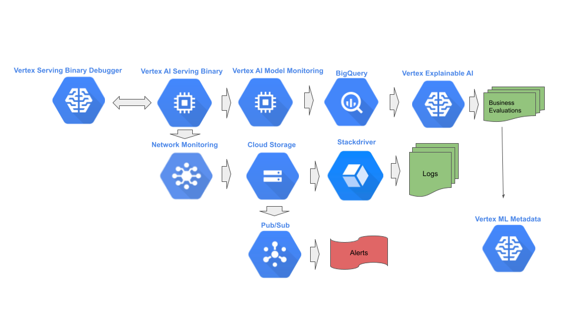

# Stage 7: Monitoring

## Purpose

Monitor predict requests to detect model degradation and alert or trigger degradation response procedures. 

## Recommendations  

Degradation includes, but not limited to:

1. Health - deterioration in the operational performance of the serving binary.
2. Latency - deterioration in the elapsed time to transmit a prediction response from the serving binary.
3. Serving skew - detection of a distribution difference between the training data and the data seen at serving. This may be either or both the features of the input or the prediction of the output.
4. Data drift - detection of a change of distribution in the input features of the serving data over time.
5. Concept drift - degradation of the business objective.

For cases of skew and drift, random samples of the serving requests/responses are collected in the serving binary. Another process continuously inspects the distribution of the random collected samples. This process may either alter or initiate retraining of the model once skew or drift exceeds pre-specified thresholds.

In the case of concept drift, one may initiate a rollback of the blessed model and/or renewed A/B testing of the blessed model and previous blessed models.

This stage may be done entirely by MLOps. We recommend:

- When manually inspecting the operation of the serving binary, attach to the serving binary using the Vertex Serving Binary Debugger.
- Use Google Cloud network monitoring to monitor the operational health of the serving binary.
- Store network monitoring logs in Cloud Storage and view logs using StackDriver.
- Use Vertex AI Model Monitoring to random sample prediction requests/responses and to measure distributions for skew and drift.
- Store sampled prediction requests/responses in Big Query.
- Use Vertex ML Metadata to periodically record serving distribution statistics.
- Use Vertex Explainable AI to manually inspect for concept drift in business objectives.
- Use Cloud Pub/Sub to automatically trigger re-training pipeline.

## Notebooks

### Get Started

[Vertex AI Model Monitoring for custom tabular models with TensorFlow Serving container](community/ml_ops/stage7/get_started_with_model_monitoring_custom_tf_serving.ipynb)

In this notebook, you learn to use the `Vertex AI Model Monitoring` service to detect feature skew and drift in the input predict requests, for custom tabular models, using a custom deployment container. 

The steps performed include:

- Download a pre-trained custom tabular model.
- Upload the pre-trained model as a `Model` resource.
- Deploying the `Model` resource to an `Endpoint` resource with `TensorFlow Serving` serving binary.
- Configure the `Endpoint` resource for model monitoring.
- Generate synthetic prediction requests for skew.
- Wait for email alert notification.
- Generate synthetic prediction requests for drift.
- Wait for email alert notification.

[Vertex AI Model Monitoring for AutoML tabular models](community/ml_ops/stage7/get_started_with_model_monitoring_automl.ipynb)

In this notebook, you learn to use the `Vertex AI Model Monitoring` service to detect feature skew and drift in the input predict requests, for AutoML tabular models.

The steps performed include:

- Train an `AutoML` model.
- Deploy the `Model` resource to the `Endpoint` resource.
- Configure the `Endpoint` resource for model monitoring.
- Generate synthetic prediction requests for skew.
- Wait for email alert notification.
- Generate synthetic prediction requests for drift.
- Wait for email alert notification.

[Vertex AI Model Monitoring for custom tabular models](community/ml_ops/stage7/get_started_with_model_monitoring_custom.ipynb)

In this notebook, you learn to use the `Vertex AI Model Monitoring` service to detect feature skew and drift in the input predict requests, for custom tabular models.

The steps performed include:

- Download a pre-trained custom tabular model.
- Upload the pre-trained model as a `Model` resource.
- Deploy the `Model` resource to the `Endpoint` resource.
- Configure the `Endpoint` resource for model monitoring.
- Generate synthetic prediction requests for skew.
- Wait for email alert notification.
- Generate synthetic prediction requests for drift.
- Wait for email alert notification.

[Vertex AI Model Monitoring for setup for tabular models](community/ml_ops/stage7/get_started_with_model_monitoring_setup.ipynb)

In this notebook, you learn to setup the `Vertex AI Model Monitoring` service to detect feature skew and drift in the input predict requests.

The steps performed include:

- Download a pre-trained custom tabular model.
- Upload the pre-trained model as a `Model` resource.
- Deploy the `Model` resource to the `Endpoint` resource.
- Configure the `Endpoint` resource for model monitoring.
    - Skew and drift detection for feature inputs.
    - Skew and drift detection for feature attributions.
- Automatic generation of the `input schema` by sending 1000 prediction request.
- List, pause, resume and delete monitoring jobs.
- Restart monitoring job with predefined `input schema`.
- View logged monitored data.
